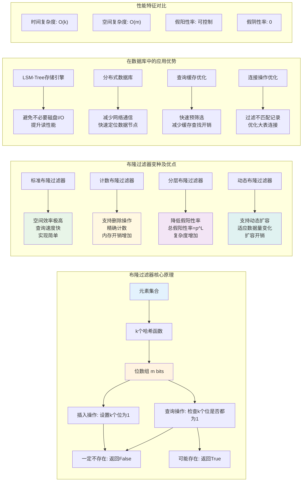
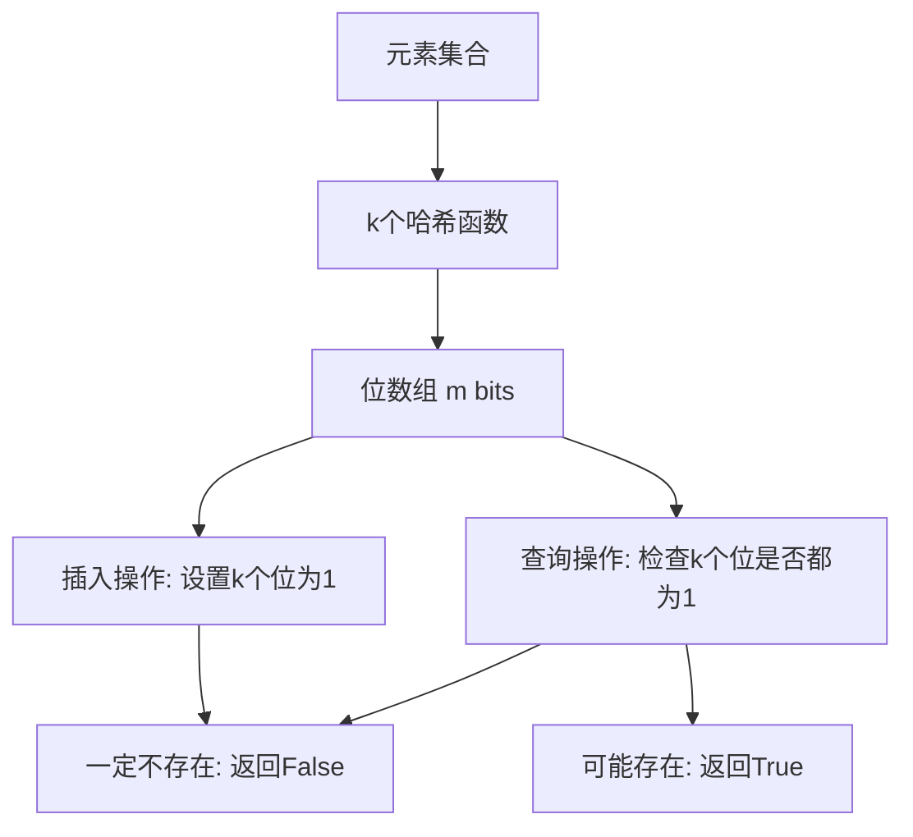
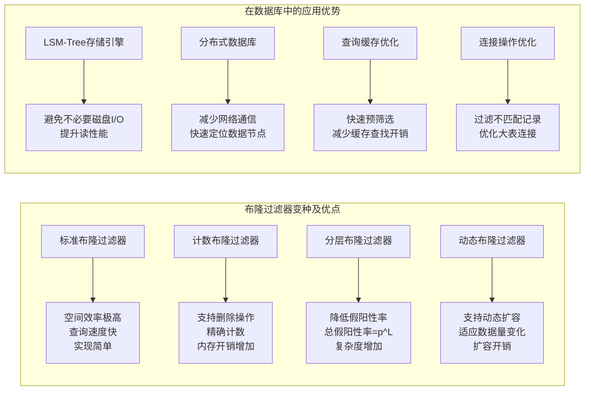

    

| 查询类型         | 10次测试 | 50次测试 | 100次测试 | 200次测试 |
|------------------|----------|----------|-----------|-----------|
| 简单聚合查询     | 0.33     | 0.30     | 0.29      | 0.30      |
| 多表连接查询     | 1.33     | 1.33     | 1.33      | 1.87      |
| 复杂分析查询     | 6.11     | 5.81     | 5.03      | 5.10      |
| 窗口函数查询     | 1.33     | 1.92     | 1.45      | 1.44      |

| 测试次数 | 无缓存 (s) | 有缓存 (s) |
|----------|------------|------------|
| 10次     | 0.203      | 0.086      |
| 50次     | 0.795      | 0.389      |
| 100次    | 1.646      | 0.524      |
| 200次    | 2.998      | 1.186      |