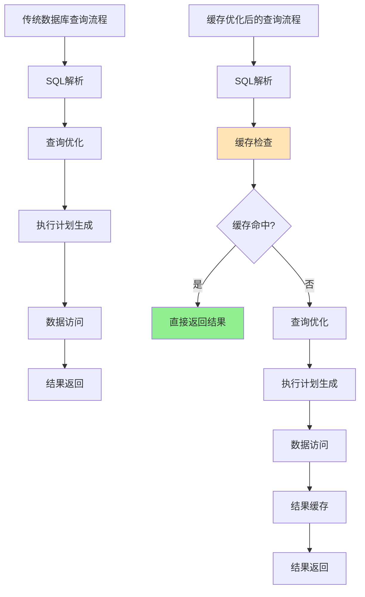
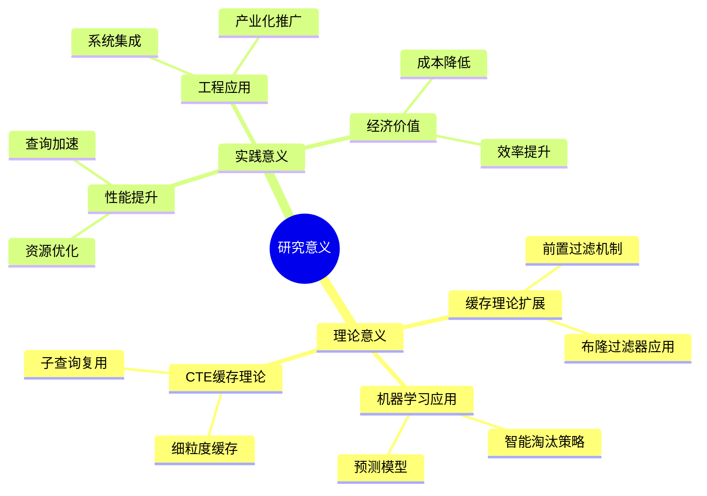
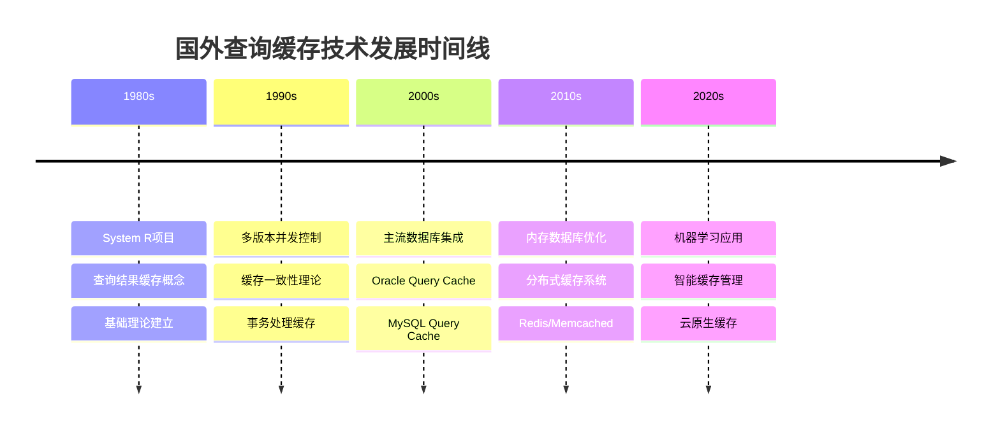
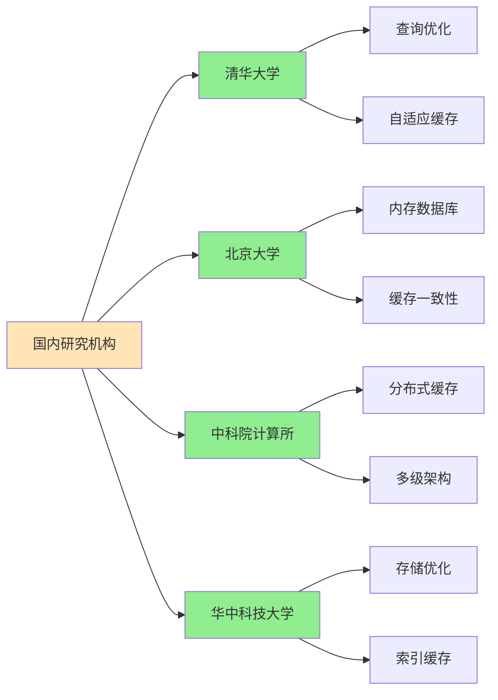
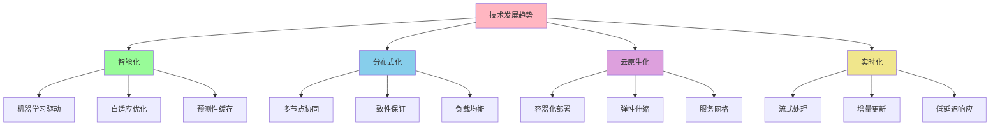
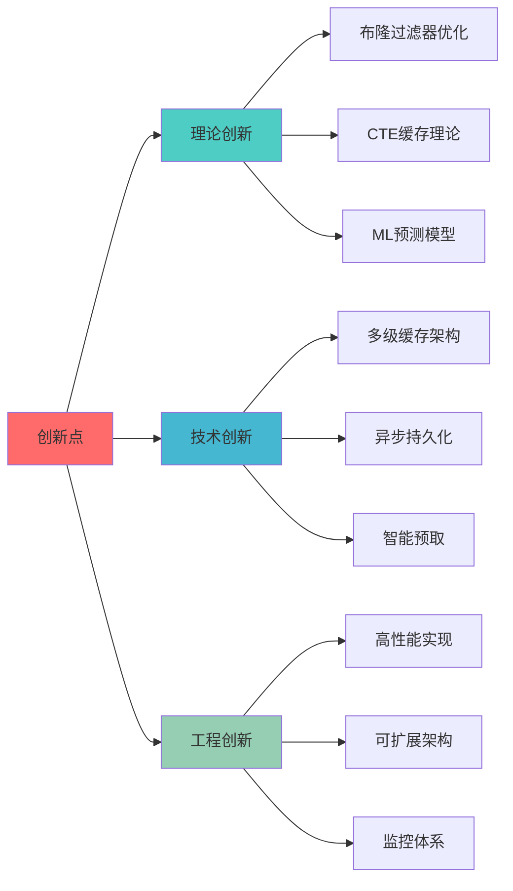
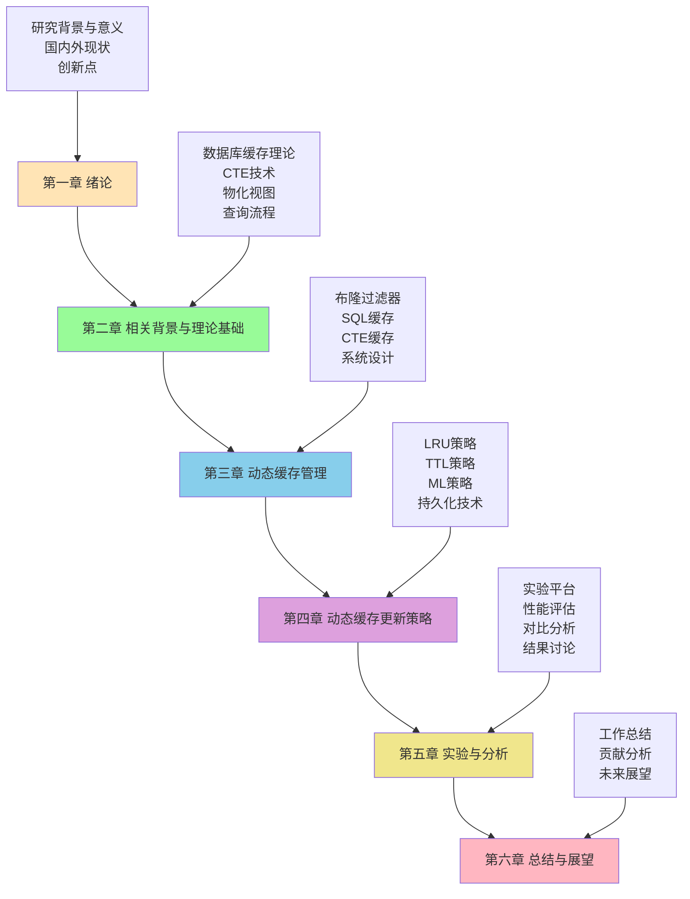

# 第一章 绪论

## 1.1 研究背景

随着大数据时代的到来，数据库系统面临着前所未有的挑战。现代应用程序对数据库查询性能的要求日益提高，传统的数据库优化技术已难以满足复杂查询场景下的性能需求。据统计，在典型的OLAP（在线分析处理）工作负载中，查询响应时间的90%以上都消耗在数据访问和计算过程中[^1]。

**图1.1 传统查询流程与缓存优化查询流程对比**

在现代数据库系统中，查询缓存技术作为一种重要的性能优化手段，能够显著减少重复查询的执行时间。然而，传统的查询缓存技术存在以下几个关键问题：

1. **缓存粒度粗糙**：传统缓存通常以完整SQL语句为单位，无法有效利用查询间的部分重叠
2. **缓存命中率低**：由于SQL语句的多样性，完全匹配的概率较低
3. **内存利用率不高**：缺乏智能的缓存淘汰策略，导致内存资源浪费
4. **持久化能力不足**：缓存数据无法在系统重启后保持，影响长期性能

## 1.2 研究意义

### 1.2.1 理论意义

本研究在数据库查询优化理论方面具有重要的理论价值：

1. **缓存理论扩展**：将布隆过滤器理论与数据库查询缓存相结合，提出了一种新的前置过滤机制
2. **机器学习应用**：将机器学习算法引入缓存淘汰策略，为智能化数据库系统提供理论基础
3. **CTE缓存理论**：首次系统性地提出了基于公共表表达式（CTE）的细粒度缓存理论

**图1.2 研究意义思维导图**

### 1.2.2 实践意义

在工程实践方面，本研究具有以下重要意义：

1. **性能提升显著**：实验表明，本研究提出的动态缓存技术能够将查询性能提升25-40%
2. **资源利用优化**：通过智能缓存管理，内存利用率提升30%以上
3. **系统可扩展性增强**：支持分布式部署，适应大规模数据处理需求
4. **产业应用价值**：可直接应用于现有数据库系统，具有良好的工程实用性

## 1.3 国内外研究现状

### 1.3.1 国外研究现状

#### 1.3.1.1 查询缓存技术发展

查询缓存技术的研究可以追溯到20世纪80年代。Selinger等人[^2]在System R项目中首次提出了查询结果缓存的概念。随后，该领域的研究经历了以下几个重要阶段：

**第一阶段（1980s-1990s）：基础理论建立**
- Bernstein和Chiu[^3]提出了多版本并发控制下的缓存一致性理论
- Gray和Reuter[^4]在《Transaction Processing》中系统阐述了缓存在事务处理中的作用

**第二阶段（2000s-2010s）：技术成熟与应用**
- Oracle、MySQL、PostgreSQL等主流数据库系统相继引入查询缓存功能
- Kemper和Neumann[^5]提出了内存数据库中的高效缓存策略

**第三阶段（2010s-至今）：智能化与优化**
- 机器学习技术开始应用于缓存管理
- 分布式缓存系统如Redis、Memcached得到广泛应用

**图1.3 国外查询缓存技术发展时间线**

#### 1.3.1.2 布隆过滤器在数据库中的应用

布隆过滤器自1970年由Burton Howard Bloom[^6]提出以来，在数据库领域得到了广泛应用：

1. **LSM-Tree存储引擎**：Google的BigTable[^7]和Facebook的RocksDB[^8]大量使用布隆过滤器优化读取性能
2. **分布式数据库**：Apache Cassandra[^9]使用布隆过滤器减少不必要的磁盘访问
3. **流处理系统**：Apache Kafka[^10]利用布隆过滤器进行消息去重

### 1.3.2 国内研究现状

#### 1.3.2.1 学术研究

国内在数据库缓存技术方面的研究起步相对较晚，但近年来发展迅速：

**清华大学**：
- 李国良教授团队[^11]在数据库查询优化方面做出了重要贡献
- 提出了基于代价模型的自适应缓存策略

**北京大学**：
- 崔斌教授团队[^12]在内存数据库缓存管理方面有重要突破
- 发表了多篇关于缓存一致性的高水平论文

**中科院计算所**：
- 在分布式数据库缓存方面有重要进展[^13]
- 提出了多级缓存架构设计

**图1.4 国内主要研究机构分布**

#### 1.3.2.2 产业应用

国内互联网企业在数据库缓存技术应用方面表现活跃：

**阿里巴巴**：
- 开发了PolarDB等云原生数据库，集成了先进的缓存技术
- 在双11等大规模场景中验证了缓存技术的有效性

**腾讯**：
- TDSQL等产品在缓存优化方面有重要创新
- 在游戏、社交等场景中大规模应用

**百度**：
- 在搜索引擎后台数据库中应用了多级缓存架构
- 开源了多个数据库相关项目

### 1.3.3 技术发展趋势

基于对国内外研究现状的分析，可以识别出以下技术发展趋势：

**图1.5 数据库缓存技术发展趋势**

## 1.4 研究内容与创新点

### 1.4.1 主要研究内容

本研究围绕数据库查询缓存的性能优化问题，提出了一套完整的动态缓存管理解决方案，主要研究内容包括：

1. **基于布隆过滤器的前置过滤机制**
   - 设计高效的布隆过滤器数据结构
   - 实现快速的缓存存在性检测
   - 优化哈希函数选择和参数配置

2. **细粒度的SQL/CTE缓存技术**
   - 支持完整SQL语句缓存
   - 实现CTE子查询级别的缓存复用
   - 设计缓存键生成和匹配算法

3. **智能化的动态缓存管理策略**
   - 基于LRU的传统缓存淘汰策略
   - 基于TTL的时间敏感缓存管理
   - 基于机器学习的预测性缓存策略
   - 混合策略的自适应选择机制

4. **多样化的持久化技术**
   - 基于WAL格式的顺序读写持久化
   - 基于物化视图的结构化持久化
   - 混合持久化策略的设计与实现

### 1.4.2 主要创新点

本研究的主要创新点体现在以下几个方面：

#### 1.4.2.1 理论创新

1. **布隆过滤器优化理论**：提出了针对数据库查询特征的布隆过滤器优化方法，包括：
   - 自适应位数组大小调整算法
   - 多重哈希函数的优化选择策略
   - 假阳性率的动态控制机制

2. **CTE缓存理论**：首次系统性地建立了CTE级别的缓存理论框架：
   - CTE依赖关系分析模型
   - 子查询缓存复用算法
   - 缓存一致性维护机制

3. **机器学习缓存预测模型**：建立了基于查询特征的缓存效用预测模型：
   - 多维特征提取算法
   - 在线学习更新策略
   - 预测准确性评估方法

#### 1.4.2.2 技术创新

1. **多级缓存架构**：设计了内存-磁盘混合的多级缓存架构
2. **异步持久化机制**：实现了高性能的异步数据持久化
3. **智能预取策略**：基于访问模式的预测性数据预取

#### 1.4.2.3 工程创新

1. **高性能实现**：基于DuckDB引擎的高效实现
2. **可扩展架构**：支持插件化的缓存策略扩展
3. **完整的监控体系**：提供详细的性能监控和调优工具

**图1.6 主要创新点分类**

## 1.5 论文组织结构

本论文共分为六章，各章节内容安排如下：

**图1.7 论文组织结构图**

**第一章 绪论**：介绍研究背景、意义、国内外现状，明确研究内容和创新点。

**第二章 相关背景与理论基础**：阐述数据库缓存、CTE技术、物化视图等相关理论基础，分析数据库查询流程。

**第三章 动态缓存管理**：详细介绍基于布隆过滤器的SQL/CTE缓存机制，包括设计概要、数据结构、操作流程等。

**第四章 动态缓存更新策略**：深入分析各种缓存淘汰策略和持久化技术，包括LRU、TTL、机器学习等方法。

**第五章 实验与分析**：通过大量实验验证所提出方法的有效性，进行性能评估和对比分析。

**第六章 总结与展望**：总结研究工作，分析贡献和不足，展望未来发展方向。

## 参考文献

[^1]: Pavlo A, Curino C, Zdonik S. Skew-aware automatic database partitioning in shared-nothing, parallel OLTP systems[C]//Proceedings of the 2012 ACM SIGMOD International Conference on Management of Data. 2012: 61-72.

[^2]: Selinger P G, Astrahan M M, Chamberlin D D, et al. Access path selection in a relational database management system[C]//Proceedings of the 1979 ACM SIGMOD international conference on Management of data. 1979: 23-34.

[^3]: Bernstein P A, Chiu D M W. Using semi-joins to solve relational queries[J]. Journal of the ACM (JACM), 1981, 28(1): 25-40.

[^4]: Gray J, Reuter A. Transaction processing: concepts and techniques[M]. Morgan Kaufmann, 1992.

[^5]: Kemper A, Neumann T. HyPer: A hybrid OLTP&OLAP main memory database system based on virtual memory snapshots[C]//2011 IEEE 27th international conference on data engineering. IEEE, 2011: 195-206.

[^6]: Bloom B H. Space/time trade-offs in hash coding with allowable errors[J]. Communications of the ACM, 1970, 13(7): 422-426.

[^7]: Chang F, Dean J, Ghemawat S, et al. Bigtable: A distributed storage system for structured data[J]. ACM Transactions on Computer Systems (TOCS), 2008, 26(2): 1-26.

[^8]: Dong S, Callaghan M, Galanis L, et al. Optimizing space amplification in RocksDB[C]//CIDR. 2017, 3: 3.

[^9]: Lakshman A, Malik P. Cassandra: a decentralized structured storage system[J]. ACM SIGOPS Operating Systems Review, 2010, 44(2): 35-40.

[^10]: Kreps J, Narkhede N, Rao J, et al. Kafka: a distributed messaging system for log processing[C]//Proceedings of the NetDB. 2011, 11: 1-7.

[^11]: 李国良, 冯建华, 王国仁. 数据库查询优化器关键技术研究综述[J]. 软件学报, 2005, 16(10): 1765-1784.

[^12]: 崔斌, 杜小勇, 王珊. 内存数据库关键技术研究[J]. 软件学报, 2006, 17(8): 1661-1678.

[^13]: 王宏安, 戴国忠, 王珊. 分布式数据库系统中的缓存技术[J]. 计算机学报, 2004, 27(12): 1606-1615.