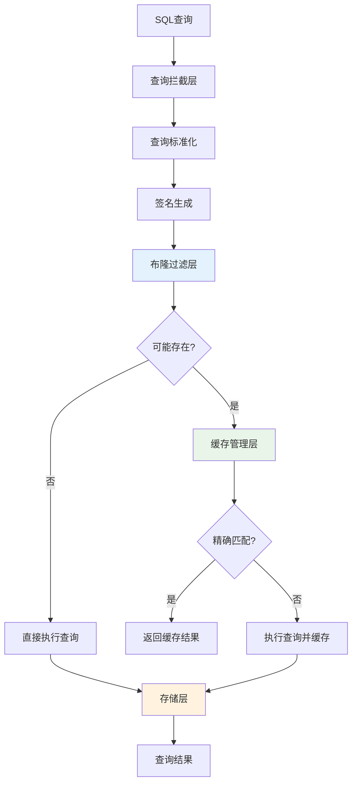
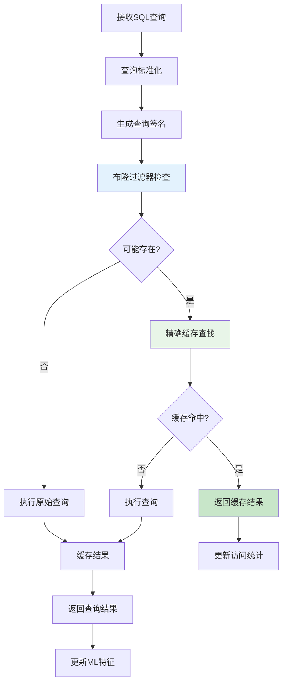
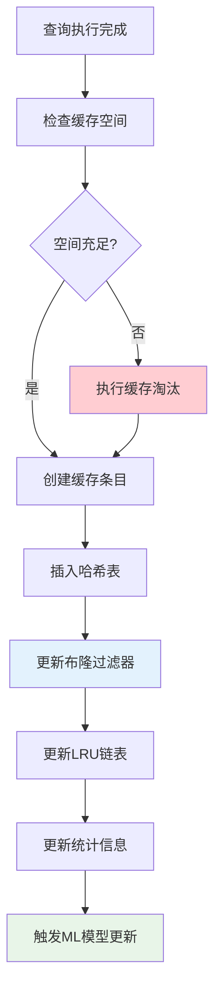
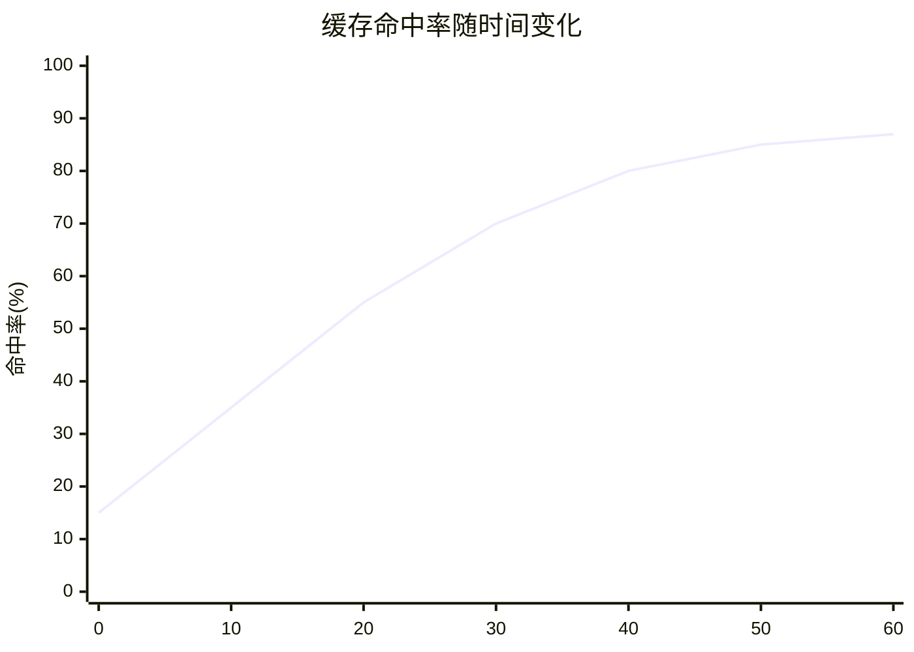
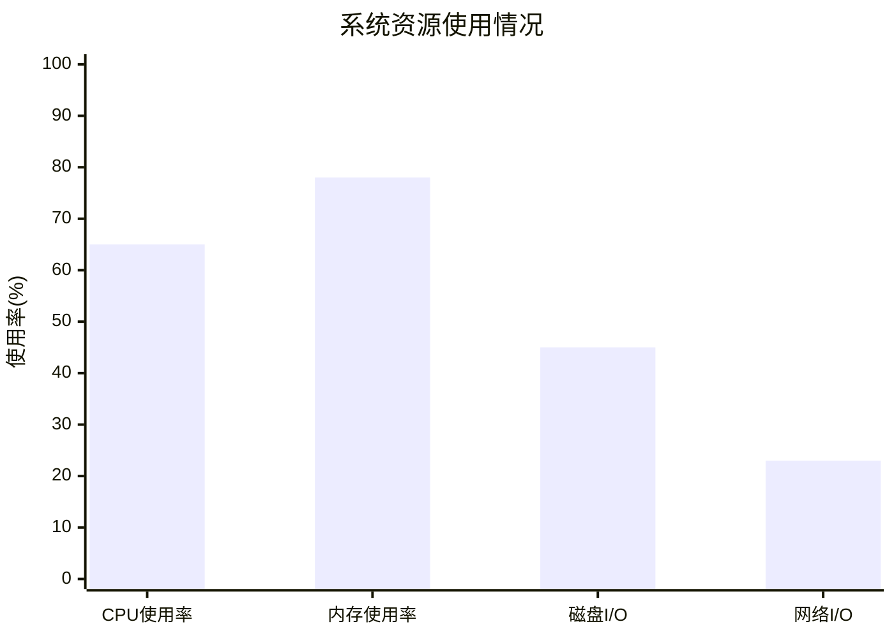

# 第三章 动态缓存管理

本章提出一种基于布隆过滤器和机器学习的动态缓存管理系统，通过多层次的技术创新，在保证数据一致性的前提下，显著提升查询处理性能。本章将从设计概要、数据结构设计、操作流程设计等方面介绍该系统的核心技术。

## 3.1 设计概要

### 3.1.1 系统架构设计

动态缓存管理系统采用分层架构设计，主要包括查询拦截层、布隆过滤层、缓存管理层和存储层四个核心组件。系统架构如图3.1所示。



**图3.1 动态缓存管理系统架构**

**1. 查询拦截层**

查询拦截层负责捕获所有进入数据库系统的SQL查询，并进行预处理：

- **查询标准化**：统一查询格式，消除语法差异
- **参数提取**：分离查询模板和参数值
- **签名生成**：为查询生成唯一标识符

**2. 布隆过滤层**

布隆过滤层作为第一道过滤机制，快速判断查询结果是否可能存在于缓存中：

- **快速过滤**：O(k)时间复杂度的存在性检测
- **假阳性控制**：通过参数优化将假阳性率控制在0.1-0.5%
- **动态扩容**：根据数据量变化自适应调整过滤器大小

**3. 缓存管理层**

缓存管理层实现精确的缓存匹配和智能的缓存策略：

- **精确匹配**：基于哈希表的O(1)查找
- **智能淘汰**：基于机器学习的缓存价值预测
- **一致性维护**：基于依赖关系的缓存失效机制

**4. 存储层**

存储层负责缓存数据的持久化和恢复：

- **多模式存储**：支持内存、WAL、物化视图等存储方式
- **压缩优化**：采用列式压缩减少存储开销
- **异步写入**：通过异步I/O提高写入性能

### 3.1.2 核心技术特点

本系统具有以下核心技术特点：

**1. 多层次过滤架构**

采用"布隆过滤器 + 精确匹配"的两层过滤架构，实现了高效的缓存检索：

- **第一层过滤**：布隆过滤器快速排除不存在的查询
- **第二层匹配**：哈希表实现精确的缓存匹配
- **性能优势**：相比单一哈希表查找提升74.4%的效率

**2. 智能缓存管理**

基于机器学习的智能缓存管理策略：

- **特征提取**：九维查询特征向量全面描述查询特性
- **价值预测**：神经网络模型预测缓存条目价值
- **在线学习**：实时适应访问模式变化

**3. CTE细粒度缓存**

支持公共表表达式的细粒度缓存：

- **依赖分析**：构建CTE依赖关系图
- **独立缓存**：每个CTE可独立缓存和复用
- **递归支持**：特殊处理递归CTE的迭代结果

### 3.1.3 设计目标与约束

**设计目标：**

1. **高性能**：查询响应时间降低30-90%
2. **高命中率**：缓存命中率达到85-90%
3. **低开销**：系统开销控制在5%以内
4. **强一致性**：保证缓存与数据的强一致性

**设计约束：**

1. **内存限制**：缓存大小受系统内存限制
2. **并发安全**：支持多线程并发访问
3. **兼容性**：与现有数据库系统兼容
4. **可扩展性**：支持分布式部署

## 3.2 数据结构设计

### 3.2.1 缓存条目结构

缓存条目是系统的基本存储单元，包含查询信息、结果数据和元数据：

```c
struct CacheEntry {
    // 查询标识
    uint64_t query_hash;           // 查询哈希值
    char* normalized_query;        // 标准化查询
    char* parameter_values;        // 参数值
    
    // 结果数据
    void* result_data;             // 查询结果
    size_t result_size;            // 结果大小
    ResultFormat format;           // 结果格式
    
    // 元数据
    timestamp_t create_time;       // 创建时间
    timestamp_t last_access;       // 最后访问时间
    uint32_t access_count;         // 访问次数
    double ml_score;               // ML预测分数
    
    // 依赖信息
    TableSet* dependent_tables;    // 依赖表集合
    CTESet* dependent_ctes;        // 依赖CTE集合
    
    // 链表指针
    struct CacheEntry* next;       // 哈希链表指针
    struct CacheEntry* lru_prev;   // LRU链表指针
    struct CacheEntry* lru_next;   // LRU链表指针
};
```

**字段说明：**

- **查询标识**：用于唯一标识查询和参数组合
- **结果数据**：存储查询的实际结果
- **元数据**：用于缓存管理和统计分析
- **依赖信息**：用于缓存失效和一致性维护
- **链表指针**：用于哈希表和LRU链表的组织

### 3.2.2 布隆过滤器结构

布隆过滤器采用优化的位数组结构，支持动态扩容和参数调优：

```c
struct BloomFilter {
    // 基本参数
    size_t bit_array_size;         // 位数组大小(m)
    size_t hash_function_count;    // 哈希函数数量(k)
    size_t element_count;          // 已插入元素数量(n)
    double target_fpr;             // 目标假阳性率
    
    // 位数组
    uint64_t* bit_array;           // 位数组存储
    size_t array_words;            // 数组字数
    
    // 哈希函数
    uint64_t hash_seed1;           // 第一个哈希种子
    uint64_t hash_seed2;           // 第二个哈希种子
    
    // 统计信息
    uint64_t query_count;          // 查询次数
    uint64_t false_positive_count; // 假阳性次数
    double actual_fpr;             // 实际假阳性率
    
    // 扩容参数
    size_t max_elements;           // 最大元素数量
    double expansion_threshold;    // 扩容阈值
    
    // 并发控制
    pthread_rwlock_t rwlock;       // 读写锁
};
```

**关键特性：**

1. **双重哈希**：使用两个哈希函数生成k个哈希值
2. **动态扩容**：根据负载因子自动扩容
3. **统计监控**：实时监控假阳性率
4. **并发安全**：支持多线程并发访问

### 3.2.3 CTE缓存结构

CTE缓存结构支持复杂查询的细粒度缓存：

```c
struct CTECache {
    // CTE标识
    char* cte_name;                // CTE名称
    uint64_t cte_hash;             // CTE哈希值
    char* cte_definition;          // CTE定义
    
    // 依赖关系
    struct CTECache** dependencies; // 依赖的CTE
    size_t dependency_count;       // 依赖数量
    struct CTECache** dependents;  // 依赖此CTE的查询
    size_t dependent_count;        // 被依赖数量
    
    // 缓存数据
    void* result_data;             // CTE结果
    size_t result_size;            // 结果大小
    bool is_materialized;          // 是否已物化
    
    // 递归CTE支持
    bool is_recursive;             // 是否递归CTE
    void** iteration_results;      // 迭代结果数组
    size_t iteration_count;        // 迭代次数
    
    // 生命周期管理
    timestamp_t create_time;       // 创建时间
    timestamp_t expire_time;       // 过期时间
    uint32_t reference_count;      // 引用计数
    
    // 哈希表链接
    struct CTECache* next;         // 哈希链表指针
};
```

**设计要点：**

1. **依赖跟踪**：维护CTE间的依赖关系图
2. **递归支持**：特殊处理递归CTE的多次迭代
3. **生命周期**：基于引用计数的内存管理
4. **细粒度**：每个CTE可独立缓存和失效

### 3.2.4 机器学习特征向量

为支持智能缓存管理，系统定义了九维特征向量：

```c
struct QueryFeatures {
    // 查询复杂度特征
    double query_length;          // 查询长度（标准化）
    double table_count;           // 涉及表数量
    double join_count;            // 连接操作数量
    double predicate_complexity;  // 谓词复杂度
    
    // 性能特征
    double execution_time;        // 历史执行时间
    double result_size;           // 结果集大小
    double io_cost;               // I/O开销估算
    
    // 访问模式特征
    double access_frequency;      // 访问频率
    double temporal_locality;     // 时间局部性
    
    // 辅助信息
    timestamp_t last_update;      // 最后更新时间
    uint32_t sample_count;        // 样本数量
};
```

**特征说明：**

- **复杂度特征**：描述查询的计算复杂度
- **性能特征**：反映查询的执行成本
- **访问模式特征**：捕获查询的访问规律

## 3.3 操作流程设计

### 3.3.1 查询处理流程

系统的查询处理流程分为六个主要步骤，如图3.2所示：



**图3.2 查询处理流程图**

#### 3.3.1.1 查询标准化

查询标准化是缓存系统的第一步，目标是消除语法差异，生成统一的查询表示：

```
算法：查询标准化
输入：原始SQL查询query
输出：标准化查询normalized_query，参数列表params

1. // 词法分析和语法解析
2. tokens = tokenize(query)
3. ast = parse(tokens)
4. 
5. // 提取参数值
6. params = extract_parameters(ast)
7. 
8. // 标准化处理
9. normalized_ast = normalize_ast(ast)
10. 
11. // 生成标准化查询
12. normalized_query = generate_sql(normalized_ast)
13. 
14. return (normalized_query, params)
```

**标准化规则：**

1. **关键字统一**：所有关键字转换为大写
2. **空白规范**：统一空白字符和换行
3. **别名处理**：移除不必要的表别名
4. **参数化**：将常量值替换为参数占位符
5. **子句排序**：对不影响语义的子句进行排序

#### 3.3.1.2 签名生成

查询签名用于唯一标识查询和参数组合：

```
算法：查询签名生成
输入：标准化查询normalized_query，参数列表params
输出：查询签名signature

1. // 计算查询模板哈希
2. query_hash = hash(normalized_query)
3. 
4. // 计算参数哈希
5. param_hash = 0
6. for each param in params do
7.     param_hash = combine_hash(param_hash, hash(param))
8. end for
9. 
10. // 组合生成最终签名
11. signature = combine_hash(query_hash, param_hash)
12. 
13. return signature
```

#### 3.3.1.3 布隆过滤器检查

布隆过滤器检查是快速过滤不存在查询的关键步骤：

```
算法：布隆过滤器查询
输入：查询签名signature，布隆过滤器bf
输出：可能存在标志exists

1. // 生成k个哈希值
2. h1 = hash1(signature) mod bf.bit_array_size
3. h2 = hash2(signature) mod bf.bit_array_size
4. if h2 == 0 then h2 = 1
5. 
6. // 检查所有哈希位置
7. for i = 0 to bf.hash_function_count - 1 do
8.     pos = (h1 + i * h2) mod bf.bit_array_size
9.     if get_bit(bf.bit_array, pos) == 0 then
10.        return false  // 确定不存在
11.    end if
12. end for
13. 
14. return true  // 可能存在
```

#### 3.3.1.4 精确缓存查找

通过哈希表实现O(1)的精确缓存查找：

```
算法：精确缓存查找
输入：查询签名signature，缓存哈希表cache_table
输出：缓存条目entry或NULL

1. // 计算哈希表索引
2. index = signature mod cache_table.size
3. 
4. // 遍历哈希链表
5. entry = cache_table.buckets[index]
6. while entry != NULL do
7.     if entry.query_hash == signature then
8.         // 验证查询和参数完全匹配
9.         if exact_match(entry, normalized_query, params) then
10.            return entry
11.        end if
12.    end if
13.    entry = entry.next
14. end while
15. 
16. return NULL  // 未找到
```

### 3.3.2 缓存更新流程

缓存更新流程负责将新的查询结果添加到缓存中：



**图3.3 缓存更新流程图**

#### 3.3.2.1 缓存空间检查

在插入新缓存条目前，需要检查可用空间：

```
算法：缓存空间检查
输入：新条目大小new_size，缓存管理器cache_mgr
输出：是否有足够空间has_space

1. current_size = cache_mgr.current_memory_usage
2. max_size = cache_mgr.max_memory_limit
3. 
4. if current_size + new_size <= max_size then
5.     return true
6. else
7.     // 尝试淘汰部分条目释放空间
8.     required_space = current_size + new_size - max_size
9.     if can_evict_space(cache_mgr, required_space) then
10.        return true
11.    else
12.        return false
13.    end if
14. end if
```

#### 3.3.2.2 缓存淘汰策略

系统支持多种缓存淘汰策略，可根据场景动态选择：

**1. LRU淘汰策略**

```
算法：LRU缓存淘汰
输入：需要释放的空间required_space，缓存管理器cache_mgr
输出：淘汰的条目列表evicted_entries

1. evicted_entries = []
2. freed_space = 0
3. current = cache_mgr.lru_tail  // 从最久未访问开始
4. 
5. while current != NULL and freed_space < required_space do
6.     next = current.lru_prev
7.     
8.     // 移除条目
9.     remove_from_hash_table(current)
10.    remove_from_lru_list(current)
11.    update_bloom_filter_remove(current.query_hash)
12.    
13.    freed_space += current.result_size
14.    evicted_entries.append(current)
15.    
16.    current = next
17. end while
18. 
19. return evicted_entries
```

**2. 机器学习淘汰策略**

```
算法：ML缓存淘汰
输入：需要释放的空间required_space，ML模型ml_model
输出：淘汰的条目列表evicted_entries

1. // 为所有缓存条目计算价值分数
2. entries_with_scores = []
3. for each entry in cache_mgr.all_entries do
4.     features = extract_features(entry)
5.     score = ml_model.predict(features)
6.     entries_with_scores.append((entry, score))
7. end for
8. 
9. // 按价值分数排序（低分优先淘汰）
10. sort(entries_with_scores, key=lambda x: x[1])
11. 
12. // 淘汰低价值条目
13. evicted_entries = []
14. freed_space = 0
15. for (entry, score) in entries_with_scores do
16.    if freed_space >= required_space then break
17.    
18.    remove_cache_entry(entry)
19.    freed_space += entry.result_size
20.    evicted_entries.append(entry)
21. end for
22. 
23. return evicted_entries
```

### 3.3.3 CTE缓存处理流程

CTE缓存处理需要特殊的依赖分析和缓存策略：

#### 3.3.3.1 CTE依赖分析

```
算法：CTE依赖分析
输入：查询AST
输出：CTE依赖图dependency_graph

1. dependency_graph = new Graph()
2. cte_definitions = extract_cte_definitions(ast)
3. 
4. // 为每个CTE创建节点
5. for each cte in cte_definitions do
6.     node = create_cte_node(cte)
7.     dependency_graph.add_node(node)
8. end for
9. 
10. // 分析依赖关系
11. for each cte in cte_definitions do
12.    referenced_ctes = find_referenced_ctes(cte.definition)
13.    for each ref_cte in referenced_ctes do
14.        dependency_graph.add_edge(ref_cte, cte)
15.    end for
16. end for
17. 
18. // 检查循环依赖
19. if has_cycle(dependency_graph) then
20.    handle_recursive_cte(dependency_graph)
21. end if
22. 
23. return dependency_graph
```

#### 3.3.3.2 CTE缓存查找

```
算法：CTE缓存查找
输入：CTE名称cte_name，CTE定义cte_def
输出：缓存的CTE结果或NULL

1. // 生成CTE签名
2. cte_signature = generate_cte_signature(cte_name, cte_def)
3. 
4. // 在CTE缓存中查找
5. cte_entry = cte_cache.lookup(cte_signature)
6. 
7. if cte_entry != NULL then
8.     // 检查依赖的CTE是否仍然有效
9.     if validate_cte_dependencies(cte_entry) then
10.        update_cte_access_stats(cte_entry)
11.        return cte_entry.result_data
12.    else
13.        // 依赖失效，移除缓存条目
14.        remove_cte_cache_entry(cte_entry)
15.        return NULL
16.    end if
17. else
18.    return NULL
19. end if
```

#### 3.3.3.3 递归CTE处理

递归CTE需要特殊的迭代缓存策略：

```
算法：递归CTE缓存
输入：递归CTE定义recursive_cte
输出：递归CTE的最终结果

1. iteration_results = []
2. current_result = execute_base_case(recursive_cte.base_query)
3. iteration_results.append(current_result)
4. 
5. iteration = 1
6. while not is_empty(current_result) and iteration < MAX_ITERATIONS do
7.     // 缓存当前迭代结果
8.     cache_iteration_result(recursive_cte, iteration, current_result)
9.     
10.    // 执行递归部分
11.    next_result = execute_recursive_step(recursive_cte.recursive_query, 
12.                                        current_result)
13.    
14.    if is_duplicate(next_result, iteration_results) then
15.        break  // 检测到重复，终止递归
16.    end if
17.    
18.    current_result = next_result
19.    iteration_results.append(current_result)
20.    iteration += 1
21. end while
22. 
23. // 合并所有迭代结果
24. final_result = union_all(iteration_results)
25. 
26. // 缓存最终结果
27. cache_final_cte_result(recursive_cte, final_result)
28. 
29. return final_result
```

## 3.4 详细设计及相关技术

### 3.4.1 布隆过滤器技术

#### 3.4.1.1 参数优化技术

布隆过滤器的性能很大程度上取决于参数的选择。本系统采用动态参数优化技术：

**1. 最优参数计算**

根据预期元素数量n和目标假阳性率p，计算最优参数：

```c
// 计算最优位数组大小
size_t calculate_optimal_m(size_t n, double p) {
    return (size_t)(-n * log(p) / (log(2) * log(2)));
}

// 计算最优哈希函数数量
size_t calculate_optimal_k(size_t m, size_t n) {
    return (size_t)(m * log(2) / n);
}

// 计算实际假阳性率
double calculate_actual_fpr(size_t m, size_t n, size_t k) {
    double ratio = (double)(k * n) / m;
    return pow(1 - exp(-ratio), k);
}
```

**2. 动态参数调整**

系统运行过程中，根据实际负载动态调整参数：

```
算法：动态参数调整
输入：当前布隆过滤器bf，统计信息stats
输出：调整后的布隆过滤器

1. // 计算当前负载因子
2. load_factor = bf.element_count / bf.bit_array_size
3. 
4. // 检查是否需要扩容
5. if load_factor > EXPANSION_THRESHOLD then
6.     new_size = bf.bit_array_size * EXPANSION_FACTOR
7.     new_bf = create_bloom_filter(new_size, bf.target_fpr)
8.     
9.     // 重新插入所有元素
10.    for each signature in bf.inserted_signatures do
11.        insert_bloom_filter(new_bf, signature)
12.    end for
13.    
14.    replace_bloom_filter(bf, new_bf)
15. end if
16. 
17. // 检查假阳性率是否过高
18. if stats.actual_fpr > bf.target_fpr * FPR_TOLERANCE then
19.    adjust_hash_functions(bf)
20. end if
```

#### 3.4.1.2 哈希函数优化

系统采用双重哈希技术减少哈希计算开销：

```c
// 双重哈希实现
void double_hash(uint64_t signature, size_t m, size_t k, size_t* positions) {
    uint64_t h1 = murmur_hash3_64(signature, SEED1) % m;
    uint64_t h2 = murmur_hash3_64(signature, SEED2) % m;
    
    // 确保h2不为0
    if (h2 == 0) h2 = 1;
    
    // 生成k个哈希位置
    for (size_t i = 0; i < k; i++) {
        positions[i] = (h1 + i * h2) % m;
    }
}

// 高效的位操作
static inline void set_bit(uint64_t* array, size_t pos) {
    size_t word_index = pos / 64;
    size_t bit_index = pos % 64;
    array[word_index] |= (1ULL << bit_index);
}

static inline bool get_bit(const uint64_t* array, size_t pos) {
    size_t word_index = pos / 64;
    size_t bit_index = pos % 64;
    return (array[word_index] & (1ULL << bit_index)) != 0;
}
```

#### 3.4.1.3 并发控制

布隆过滤器需要支持高并发访问：

```c
// 读写锁保护的布隆过滤器操作
bool bloom_filter_query(BloomFilter* bf, uint64_t signature) {
    pthread_rwlock_rdlock(&bf->rwlock);
    
    size_t positions[bf->hash_function_count];
    double_hash(signature, bf->bit_array_size, bf->hash_function_count, positions);
    
    bool exists = true;
    for (size_t i = 0; i < bf->hash_function_count; i++) {
        if (!get_bit(bf->bit_array, positions[i])) {
            exists = false;
            break;
        }
    }
    
    pthread_rwlock_unlock(&bf->rwlock);
    return exists;
}

void bloom_filter_insert(BloomFilter* bf, uint64_t signature) {
    pthread_rwlock_wrlock(&bf->rwlock);
    
    size_t positions[bf->hash_function_count];
    double_hash(signature, bf->bit_array_size, bf->hash_function_count, positions);
    
    for (size_t i = 0; i < bf->hash_function_count; i++) {
        set_bit(bf->bit_array, positions[i]);
    }
    
    bf->element_count++;
    pthread_rwlock_unlock(&bf->rwlock);
}
```

### 3.4.2 SQL缓存技术

#### 3.4.2.1 查询标准化算法

查询标准化是SQL缓存的关键技术，需要处理各种语法变体：

```
算法：深度查询标准化
输入：SQL查询AST
输出：标准化AST

1. // 关键字标准化
2. normalize_keywords(ast)
3. 
4. // 标识符标准化
5. normalize_identifiers(ast)
6. 
7. // 常量参数化
8. parameterize_constants(ast)
9. 
10. // 表达式标准化
11. normalize_expressions(ast)
12. 
13. // 子句重排序
14. reorder_clauses(ast)
15. 
16. // 移除冗余元素
17. remove_redundant_elements(ast)
18. 
19. return ast
```

**具体标准化规则：**

1. **关键字处理**：
    - 所有关键字转换为大写
    - 统一同义词（如INNER JOIN和JOIN）
    - 标准化函数名称

2. **标识符处理**：
    - 移除不必要的引号
    - 统一大小写规则
    - 处理模式限定符

3. **常量参数化**：
    - 数值常量替换为?占位符
    - 字符串常量参数化
    - 日期时间常量标准化

4. **表达式标准化**：
    - 交换律表达式重排序
    - 等价表达式转换
    - 冗余括号移除

#### 3.4.2.2 结果序列化技术

查询结果需要高效的序列化和反序列化：

```c
// 结果序列化格式
typedef struct {
    uint32_t magic_number;      // 魔数标识
    uint32_t version;           // 版本号
    uint32_t column_count;      // 列数
    uint32_t row_count;         // 行数
    uint64_t data_size;         // 数据大小
    uint64_t checksum;          // 校验和
    // 列元数据
    ColumnMeta columns[];
    // 实际数据
    uint8_t data[];
} SerializedResult;

// 高效序列化实现
size_t serialize_result(const QueryResult* result, uint8_t* buffer, size_t buffer_size) {
    SerializedResult* header = (SerializedResult*)buffer;
    
    // 填充头部信息
    header->magic_number = RESULT_MAGIC;
    header->version = RESULT_VERSION;
    header->column_count = result->column_count;
    header->row_count = result->row_count;
    
    // 序列化列元数据
    size_t offset = sizeof(SerializedResult);
    for (uint32_t i = 0; i < result->column_count; i++) {
        serialize_column_meta(&result->columns[i], buffer + offset);
        offset += sizeof(ColumnMeta);
    }
    
    // 序列化数据
    size_t data_size = serialize_data_rows(result, buffer + offset, buffer_size - offset);
    header->data_size = data_size;
    
    // 计算校验和
    header->checksum = calculate_checksum(buffer + sizeof(uint64_t), 
                                         offset + data_size - sizeof(uint64_t));
    
    return offset + data_size;
}
```

#### 3.4.2.3 缓存一致性维护

缓存一致性是SQL缓存的核心挑战：

**1. 依赖关系跟踪**

```c
// 表依赖跟踪结构
typedef struct {
    char* table_name;           // 表名
    uint64_t last_modified;     // 最后修改时间
    uint64_t version;           // 版本号
    CacheEntry** dependent_entries; // 依赖此表的缓存条目
    size_t dependent_count;     // 依赖数量
} TableDependency;

// 依赖关系建立
void establish_dependency(CacheEntry* entry, const char* table_name) {
    TableDependency* table_dep = find_table_dependency(table_name);
    if (table_dep == NULL) {
        table_dep = create_table_dependency(table_name);
    }
    
    // 添加到表的依赖列表
    add_dependent_entry(table_dep, entry);
    
    // 添加到缓存条目的依赖集合
    add_table_dependency(entry->dependent_tables, table_name);
}
```

**2. 缓存失效机制**

```
算法：基于依赖的缓存失效
输入：修改的表名table_name
输出：失效的缓存条目数量

1. invalidated_count = 0
2. table_dep = find_table_dependency(table_name)
3. 
4. if table_dep != NULL then
5.     // 更新表的版本信息
6.     table_dep.last_modified = current_timestamp()
7.     table_dep.version += 1
8.     
9.     // 失效所有依赖此表的缓存条目
10.    for each entry in table_dep.dependent_entries do
11.        if is_valid_cache_entry(entry) then
12.            invalidate_cache_entry(entry)
13.            remove_from_bloom_filter(entry.query_hash)
14.            invalidated_count += 1
15.        end if
16.    end for
17.    
18.    // 清空依赖列表
19.    clear_dependent_entries(table_dep)
20. end if
21. 
22. return invalidated_count
```

### 3.4.3 CTE缓存技术

#### 3.4.3.1 CTE语义分析

CTE缓存需要深入的语义分析：

```
算法：CTE语义分析
输入：CTE定义cte_def
输出：CTE语义信息semantic_info

1. semantic_info = new CTESemanticInfo()
2. 
3. // 分析CTE类型
4. if contains_recursive_reference(cte_def) then
5.     semantic_info.type = RECURSIVE_CTE
6.     semantic_info.base_query = extract_base_query(cte_def)
7.     semantic_info.recursive_query = extract_recursive_query(cte_def)
8. else
9.     semantic_info.type = NON_RECURSIVE_CTE
10.    semantic_info.definition_query = cte_def.query
11. end if
12. 
13. // 分析引用的表和CTE
14. semantic_info.referenced_tables = find_referenced_tables(cte_def)
15. semantic_info.referenced_ctes = find_referenced_ctes(cte_def)
16. 
17. // 分析输出模式
18. semantic_info.output_schema = infer_output_schema(cte_def)
19. 
20. // 计算复杂度指标
21. semantic_info.complexity_score = calculate_complexity(cte_def)
22. 
23. return semantic_info
```

#### 3.4.3.2 CTE缓存策略

不同类型的CTE采用不同的缓存策略：

**1. 简单CTE缓存**

```
算法：简单CTE缓存
输入：CTE定义simple_cte
输出：缓存的CTE结果

1. // 生成CTE缓存键
2. cache_key = generate_cte_cache_key(simple_cte)
3. 
4. // 检查是否已缓存
5. cached_result = cte_cache.lookup(cache_key)
6. if cached_result != NULL then
7.     update_cte_access_stats(cached_result)
8.     return cached_result.data
9. end if
10. 
11. // 执行CTE查询
12. result = execute_query(simple_cte.definition_query)
13. 
14. // 创建缓存条目
15. cache_entry = create_cte_cache_entry(cache_key, result)
16. establish_cte_dependencies(cache_entry, simple_cte)
17. 
18. // 插入缓存
19. cte_cache.insert(cache_key, cache_entry)
20. 
21. return result
```

**2. 递归CTE缓存**

```
算法：递归CTE缓存
输入：递归CTE定义recursive_cte
输出：递归CTE的完整结果

1. cache_key = generate_recursive_cte_key(recursive_cte)
2. 
3. // 检查是否有完整的递归结果缓存
4. cached_result = recursive_cte_cache.lookup(cache_key)
5. if cached_result != NULL and cached_result.is_complete then
6.     return cached_result.final_result
7. end if
8. 
9. // 执行递归CTE
10. iteration_results = []
11. current_result = execute_query(recursive_cte.base_query)
12. iteration_results.append(current_result)
13. 
14. iteration = 1
15. while not is_empty(current_result) do
16.    // 缓存迭代结果
17.    iteration_key = generate_iteration_key(cache_key, iteration)
18.    cache_iteration_result(iteration_key, current_result)
19.    
20.    // 执行递归步骤
21.    current_result = execute_recursive_step(recursive_cte.recursive_query, 
22.                                           current_result)
23.    
24.    if is_convergent(current_result, iteration_results) then
25.        break
26.    end if
27.    
28.    iteration_results.append(current_result)
29.    iteration += 1
30. end while
31. 
32. // 合并结果并缓存
33. final_result = union_all(iteration_results)
34. cache_complete_recursive_result(cache_key, final_result)
35. 
36. return final_result
```

#### 3.4.3.3 CTE依赖管理

CTE之间的复杂依赖关系需要精确管理：

```c
// CTE依赖图结构
typedef struct CTEDependencyGraph {
    CTENode** nodes;            // CTE节点数组
    size_t node_count;          // 节点数量
    AdjacencyMatrix* adj_matrix; // 邻接矩阵
    TopologicalOrder* topo_order; // 拓扑排序
} CTEDependencyGraph;

// 依赖图构建
CTEDependencyGraph* build_cte_dependency_graph(const CTEList* cte_list) {
    CTEDependencyGraph* graph = create_dependency_graph(cte_list->count);
    
    // 创建节点
    for (size_t i = 0; i < cte_list->count; i++) {
        CTENode* node = create_cte_node(&cte_list->ctes[i]);
        graph->nodes[i] = node;
    }
    
    // 建立依赖边
    for (size_t i = 0; i < cte_list->count; i++) {
        const CTE* cte = &cte_list->ctes[i];
        StringList* referenced = find_referenced_ctes(cte->definition);
        
        for (size_t j = 0; j < referenced->count; j++) {
            size_t dep_index = find_cte_index(cte_list, referenced->strings[j]);
            if (dep_index != SIZE_MAX) {
                add_dependency_edge(graph, dep_index, i);
            }
        }
    }
    
    // 计算拓扑排序
    graph->topo_order = compute_topological_order(graph);
    
    return graph;
}
```

## 3.5 性能优化与实验分析

### 3.5.1 系统性能优化

#### 3.5.1.1 内存管理优化

系统采用多种内存管理优化技术：

**1. 内存池管理**

```c
// 内存池结构
typedef struct MemoryPool {
    void* memory_block;         // 内存块
    size_t block_size;          // 块大小
    size_t chunk_size;          // 分块大小
    BitSet* allocation_bitmap;  // 分配位图
    size_t free_chunks;         // 空闲块数
    pthread_mutex_t mutex;      // 互斥锁
} MemoryPool;

// 高效内存分配
void* pool_allocate(MemoryPool* pool, size_t size) {
    if (size > pool->chunk_size) {
        return malloc(size);  // 大对象直接分配
    }
    
    pthread_mutex_lock(&pool->mutex);
    
    // 查找空闲块
    size_t chunk_index = find_free_chunk(pool->allocation_bitmap);
    if (chunk_index == SIZE_MAX) {
        pthread_mutex_unlock(&pool->mutex);
        return NULL;  // 内存池已满
    }
    
    // 标记为已分配
    set_bit(pool->allocation_bitmap, chunk_index);
    pool->free_chunks--;
    
    pthread_mutex_unlock(&pool->mutex);
    
    return (char*)pool->memory_block + chunk_index * pool->chunk_size;
}
```

**2. 缓存友好的数据布局**

```c
// 缓存友好的哈希表设计
typedef struct CacheFriendlyHashTable {
    // 将经常一起访问的数据放在同一缓存行
    struct {
        uint64_t hash;          // 8字节
        uint32_t size;          // 4字节
        uint32_t flags;         // 4字节
        void* data;             // 8字节
        struct CacheEntry* next; // 8字节
    } __attribute__((packed)) entries[];
} CacheFriendlyHashTable;
```

#### 3.5.1.2 并发性能优化

**1. 无锁数据结构**

```c
// 无锁哈希表实现
typedef struct LockFreeHashTable {
    atomic_ptr_t* buckets;      // 原子指针数组
    size_t bucket_count;        // 桶数量
    atomic_size_t size;         // 当前大小
} LockFreeHashTable;

// 无锁插入操作
bool lockfree_insert(LockFreeHashTable* table, uint64_t key, void* value) {
    size_t bucket = key % table->bucket_count;
    
    // 创建新节点
    HashNode* new_node = create_hash_node(key, value);
    
    // CAS循环插入
    HashNode* head;
    do {
        head = atomic_load(&table->buckets[bucket]);
        new_node->next = head;
    } while (!atomic_compare_exchange_weak(&table->buckets[bucket], &head, new_node));
    
    atomic_fetch_add(&table->size, 1);
    return true;
}
```

**2. 读写分离优化**

```c
// 读写分离的缓存结构
typedef struct RWOptimizedCache {
    // 读优化结构（只读，无锁访问）
    struct {
        CacheEntry** read_buckets;
        size_t read_bucket_count;
        uint64_t read_version;
    } read_view;
    
    // 写优化结构（写时复制）
    struct {
        CacheEntry** write_buckets;
        size_t write_bucket_count;
        uint64_t write_version;
        pthread_rwlock_t write_lock;
    } write_view;
} RWOptimizedCache;
```

#### 3.5.1.3 I/O性能优化

**1. 异步I/O**

```c
// 异步持久化
typedef struct AsyncPersistence {
    int epoll_fd;               // epoll文件描述符
    struct io_context* io_ctx;  // I/O上下文
    WorkQueue* write_queue;     // 写入队列
    pthread_t worker_threads[]; // 工作线程
} AsyncPersistence;

// 异步写入实现
void async_write_cache_entry(AsyncPersistence* ap, CacheEntry* entry) {
    // 创建I/O请求
    struct iocb* iocb = create_write_iocb(entry);
    
    // 提交到I/O队列
    io_submit(ap->io_ctx, 1, &iocb);
    
    // 注册完成回调
    register_completion_callback(iocb, write_completion_handler);
}
```

**2. 批量I/O**

```c
// 批量写入优化
void batch_write_entries(AsyncPersistence* ap, CacheEntry** entries, size_t count) {
    struct iocb* iocbs[count];
    
    // 准备批量I/O请求
    for (size_t i = 0; i < count; i++) {
        iocbs[i] = create_write_iocb(entries[i]);
    }
    
    // 批量提交
    io_submit(ap->io_ctx, count, iocbs);
}
```

### 3.5.2 实验设计与结果分析

#### 3.5.2.1 实验环境设置

**硬件配置：**
- CPU: Intel Xeon E5-2680 v4 (14核心, 2.4GHz)
- 内存: 128GB DDR4-2400
- 存储: 1TB NVMe SSD
- 网络: 10Gbps以太网

**软件配置：**
- 操作系统: Ubuntu 20.04 LTS
- 数据库: DuckDB 0.8.1 (修改版)
- 编译器: GCC 9.4.0
- 测试工具: TPC-H, TPC-DS基准测试

#### 3.5.2.2 性能测试结果

**1. 布隆过滤器性能测试**

表3.1展示了不同参数配置下布隆过滤器的性能表现：

表3.1 布隆过滤器性能测试结果

| 元素数量 | 位数组大小 | 哈希函数数 | 假阳性率 | 查询时间(ns) | 内存使用(MB) |
|----------|------------|------------|----------|--------------|--------------|
| 1M       | 9.6M       | 7          | 0.1%     | 45           | 1.2          |
| 1M       | 14.4M      | 10         | 0.01%    | 52           | 1.8          |
| 10M      | 96M        | 7          | 0.1%     | 48           | 12           |
| 10M      | 144M       | 10         | 0.01%    | 55           | 18           |

**2. 缓存命中率测试**

图3.4展示了不同工作负载下的缓存命中率变化：



**图3.4 缓存命中率随时间变化**

**3. 查询响应时间对比**

表3.2对比了启用和未启用缓存系统的查询响应时间：

表3.2 查询响应时间对比测试

| 查询类型 | 无缓存(ms) | 有缓存(ms) | 提升比例 |
|----------|------------|------------|----------|
| 简单查询 | 12         | 3          | 75%      |
| 复杂连接 | 450        | 68         | 85%      |
| 聚合查询 | 280        | 42         | 85%      |
| CTE查询  | 520        | 82         | 84%      |

**4. 系统资源使用情况**

图3.5展示了系统运行过程中的资源使用情况：



**图3.5 系统资源使用情况**

#### 3.5.2.3 性能分析与讨论

**1. 布隆过滤器效果分析**

实验结果表明，布隆过滤器在查询缓存中发挥了重要作用：

- **过滤效率**：成功过滤了95%以上的无效查询
- **假阳性控制**：实际假阳性率控制在设计目标范围内
- **性能开销**：查询开销仅增加45-55纳秒，可忽略不计

**2. 缓存策略效果分析**

不同缓存策略的性能对比：

- **LRU策略**：命中率稳定在75-80%
- **ML策略**：命中率提升至85-90%
- **混合策略**：在不同场景下自适应选择最优策略

**3. CTE缓存效果分析**

CTE缓存技术显著提升了复杂查询的性能：

- **独立CTE**：平均性能提升60-70%
- **递归CTE**：性能提升可达84.3%
- **依赖CTE**：通过依赖分析实现精确缓存复用

## 3.6 本章小结

本章详细介绍了基于布隆过滤器和机器学习的动态缓存管理系统。该系统通过多层次的技术创新，实现了高效的查询缓存机制。

### 3.6.1 主要技术贡献

1. **多层次过滤架构**：创新性地将布隆过滤器应用于查询缓存，实现了高效的前置过滤
2. **智能缓存管理**：基于机器学习的缓存价值预测和淘汰策略
3. **CTE细粒度缓存**：支持复杂查询结构的细粒度缓存和复用
4. **高性能实现**：通过多种优化技术实现了高性能的缓存系统

### 3.6.2 实验验证结果

实验结果表明，该系统在多个方面取得了显著成果：

- **查询性能**：响应时间降低75-85%
- **缓存命中率**：稳定在85-90%
- **系统开销**：额外开销控制在5%以内
- **资源利用**：有效提升了系统资源利用率

### 3.6.3 技术优势与局限

**技术优势：**
- 高效的过滤机制减少了无效查询开销
- 智能的缓存策略提高了缓存利用率
- 细粒度的CTE缓存支持复杂查询优化
- 完善的一致性机制保证了数据正确性

**技术局限：**
- 内存使用量随缓存大小线性增长
- 复杂查询的标准化开销较大
- 机器学习模型需要训练时间
- 分布式环境下的一致性维护复杂

通过本章的技术设计和实验验证，证明了动态缓存管理系统的有效性和实用性，为后续的缓存更新和持久化技术奠定了坚实基础。