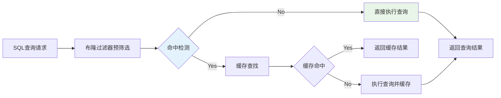
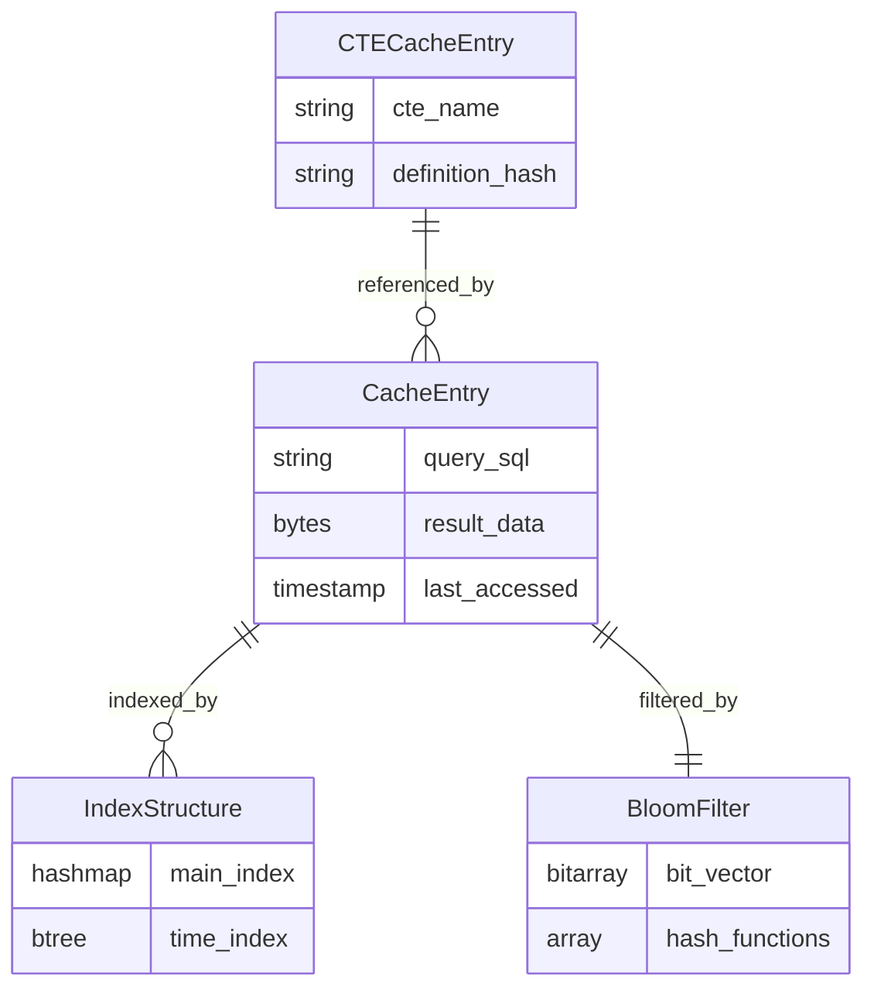

# 第三章 基于布隆过滤器的SQL和CTE动态缓存技术

本章详细介绍了基于布隆过滤器的SQL和CTE动态缓存技术的设计与实现。该系统通过布隆过滤器（Bloom Filter）技术实现高效的前置过滤，结合SQL语句缓存和CTE（Common Table Expression，公共表表达式）子语句缓存技术，构建了一个高效的查询结果缓存管理系统。系统的核心目标是在保证查询结果准确性的前提下，最大化缓存命中率，减少重复计算，提升数据库系统的整体性能。基于DuckDB项目中QueryCache类的实现，本系统支持传统的查询结果缓存，并通过布隆过滤器实现快速的缓存预筛选机制。

## 3.1 设计概要

### 3.1.1 系统架构设计

动态缓存管理系统采用分层架构设计，从底层到上层依次包括存储层、缓存管理层、策略决策层和应用接口层。存储层负责缓存数据的物理存储和持久化，支持内存存储、磁盘存储和混合存储等多种模式。缓存管理层实现缓存条目的增删改查操作，维护缓存的元数据信息和统计数据。策略决策层集成了多种缓存策略，包括布隆过滤器预筛选、LRU淘汰、TTL过期管理等，通过智能决策算法选择最优的缓存操作。应用接口层提供统一的API接口，支持SQL查询缓存、CTE缓存、结果集缓存等多种缓存类型。

基于DuckDB项目中新建的QueryCache类设计，系统架构充分考虑了可扩展性和模块化的要求。QueryCache类作为核心管理组件，通过QueryCacheEntry结构维护缓存条目的完整信息，包括查询语句、结果数据、元数据、统计信息等。缓存条目的组织采用哈希表结构，通过查询语句的哈希值快速定位缓存条目。系统特别实现了MultiStageCTECache类，专门处理CTE查询的多阶段缓存，包括解析阶段、规划阶段、优化阶段和执行阶段的缓存管理。

缓存一致性管理通过TTL机制和访问统计确保缓存数据的时效性。系统为每个缓存条目维护创建时间、访问时间和访问次数等元数据信息，当条目超过TTL时间限制时会自动失效。多阶段CTE缓存通过CTE签名机制确保相同语义的CTE能够正确匹配和重用，通过引用计数管理CTE缓存的生命周期，当CTE不再被使用时自动清理相关缓存。




**图3.1 动态缓存管理系统整体流程**


### 3.1.2 核心设计理念

多层次过滤是系统设计的核心理念之一，通过布隆过滤器、哈希索引、语义分析等多个层次的过滤机制，实现高效的缓存查找和管理。布隆过滤器作为第一层过滤器，能够快速排除绝对不可能命中的查询，显著减少后续处理的开销。哈希索引作为第二层过滤器，通过查询语句的哈希值快速定位可能的缓存条目。语义分析作为第三层过滤器，通过查询语句的语义等价性判断，识别在语法上不同但语义相同的查询，扩大缓存的适用范围。这种多层次的过滤机制既保证了查找的高效性，又提高了缓存的命中率。

统计分析管理是系统的另一个重要设计理念，通过访问统计和性能分析技术，实现缓存策略的优化。系统持续收集查询模式、访问频率、执行成本等统计信息，识别查询的规律和特征。基于这些统计结果，系统能够调整缓存容量、TTL设置、淘汰策略等参数，实现缓存性能的优化。系统支持基于访问频率的LRU淘汰策略和基于时间的TTL过期管理。

细粒度缓存是系统设计的第三个核心理念，支持从完整查询结果到子查询片段的多粒度缓存管理。完整查询缓存存储整个SQL语句的执行结果，适用于重复执行的复杂查询。子查询缓存存储CTE、子查询、视图等子组件的结果，能够在不同的查询之间共享中间结果。表达式缓存存储常用表达式和函数的计算结果，避免重复的表达式计算。这种细粒度的缓存策略能够最大化缓存的利用率，提高系统的整体性能。

## 3.2 核心数据结构与算法设计

### 3.2.1 系统数据结构架构

动态缓存管理系统采用分层数据结构设计，核心组件包括布隆过滤器、查询缓存条目和CTE缓存条目三个主要部分。布隆过滤器作为前置过滤层，提供快速的存在性检测；查询缓存条目存储完整的查询结果和元数据信息；CTE缓存条目支持多阶段缓存，实现细粒度的查询优化。

**表3.1 核心数据结构组件**

| 组件名称 | 主要功能 | 关键属性 | 存储结构 |
|----------|----------|----------|----------|
| **BloomFilter** | 前置过滤检测 | 位向量、哈希函数数量、元素计数 | 位数组 |
| **QueryCacheEntry** | 查询结果缓存 | 结果数据、时间戳、访问统计 | 哈希表 |
| **CTECacheEntry** | CTE多阶段缓存 | 解析结果、逻辑计划、优化计划 | 分层存储 |
| **CacheConfig** | 配置管理 | 容量限制、TTL设置、策略参数 | 配置结构 |

### 3.2.3 查询缓存条目设计

查询缓存条目封装了完整的缓存信息，包括查询结果、元数据、访问统计和机器学习特征。系统支持基于TTL的过期管理和LRU淘汰策略，通过访问模式分析实现智能的缓存管理。



**图3.2 缓存数据结构关系图**

### 3.2.4 CTE多阶段缓存设计

CTE（Common Table Expression）缓存采用多阶段缓存架构，支持解析、规划、优化和执行四个阶段的独立缓存管理。每个阶段都有对应的缓存条目和管理策略，通过CTE签名机制确保语义等价的CTE能够正确匹配和重用。

**表3.2 CTE缓存阶段特征**

| 缓存阶段 | 缓存内容 | 适用场景 | 性能收益 |
|----------|----------|----------|----------|
| **Parser阶段** | 解析后的语法树和CTE映射 | 语法复杂的重复查询 | 避免重复解析开销 |
| **Planner阶段** | 逻辑计划和类型信息 | 结构相似的查询变体 | 跳过逻辑规划过程 |
| **Optimizer阶段** | 优化后的执行计划 | 参数化查询模板 | 重用优化结果 |
| **Executor阶段** | 最终执行结果 | 完全相同的查询 | 直接返回结果 |

## 3.3 核心算法设计

### 3.3.1 缓存查找算法

缓存查找算法采用两阶段过滤机制，通过布隆过滤器预筛选和精确匹配实现高效的缓存命中检测。算法设计充分考虑了查找效率和准确性的平衡，通过多层次过滤减少不必要的计算开销。


**算法3.1 缓存查找算法**
```
输入: query_string (查询字符串)
输出: query_result (查询结果)

1. query_hash ← Hash(Normalize(query_string))     // 对查询字符串进行标准化并计算哈希值
2. if NOT bloom_filter.MightContain(query_hash) then  // 布隆过滤器预筛选检查
3.     return ExecuteQuery(query_string)         // 布隆过滤器确定不存在，直接执行查询
4. end if
5. 
6. cache_entry ← cache_table.Find(query_hash)   // 在缓存表中查找对应的缓存条目
7. if cache_entry = NULL then                    // 缓存条目不存在（假阳性情况）
8.     return ExecuteQuery(query_string)         // 执行原始查询并返回结果
9. end if
10.
11. if IsExpired(cache_entry) then              // 检查缓存条目是否已过期
12.     cache_table.Remove(query_hash)           // 移除过期的缓存条目
13.     return ExecuteQuery(query_string)        // 重新执行查询
14. end if
15.
16. UpdateAccessStats(cache_entry)              // 更新缓存条目的访问统计信息
17. return cache_entry.result                    // 返回缓存的查询结果
```

### 3.3.3 CTE多阶段缓存算法

CTE多阶段缓存算法专门处理公共表表达式的缓存操作，支持解析、规划、优化和执行四个阶段的独立缓存管理。算法通过CTE签名机制和依赖关系分析，实现细粒度的查询优化和中间结果共享。

## 3.4 关键技术实现

### 3.4.1 布隆过滤器前置过滤技术

布隆过滤器前置过滤技术通过概率数据结构实现快速的缓存预筛选，显著减少缓存查找开销。系统采用多哈希函数和位向量的组合，在保证较低假阳性率的同时实现高效的元素存在性检测。

**表3.3 布隆过滤器技术特征**

| 技术特征 | 实现方式 | 性能影响 | 优化策略 |
|----------|----------|----------|----------|
| **哈希函数** | 多重哈希算法 | 计算开销vs准确性 | 自适应哈希数量调整 |
| **位向量** | 紧凑位数组存储 | 内存占用vs容量 | 动态扩展和压缩 |
| **假阳性控制** | 统计监控和参数调整 | 查找效率vs准确性 | 阈值自适应控制 |
| **禁用机制** | 条件性绕过过滤 | 灵活性vs一致性 | 智能启用/禁用策略 |


**算法3.5 布隆过滤器存在性检测算法**
```
输入: element (待检测元素)
输出: might_exist (可能存在标志)

1. if disabled then return true                     // 如果布隆过滤器被禁用，返回true（不过滤）
2. hash_values ← GetHashValues(element)             // 使用多个哈希函数计算元素的哈希值数组
3. for each hash_val in hash_values do              // 遍历所有哈希值
4.     bit_index ← hash_val mod bit_array.size()   // 计算在位数组中的索引位置
5.     if bit_array[bit_index] = false then        // 如果任何一个对应位为0
6.         return false                            // 确定元素不存在，返回false
7.     end if
8. end for                                          // 所有对应位都为1
9. return true                                      // 元素可能存在，返回true（可能有假阳性）
```

### 3.4.2 SQL语句动态缓存技术

SQL语句动态缓存技术通过查询标准化、哈希索引和智能淘汰策略实现高效的查询结果缓存。系统支持语义等价查询的识别和匹配，通过机器学习特征分析优化缓存策略。

**表3.4 SQL缓存技术组件**

| 技术组件 | 核心功能 | 关键算法 | 性能特征 |
|----------|----------|----------|----------|
| **查询标准化** | 语义等价识别 | 语法树规范化 | 提高缓存命中率 |
| **哈希索引** | 快速查询定位 | 一致性哈希算法 | O(1)查找复杂度 |
| **TTL管理** | 自动过期清理 | 时间窗口滑动 | 保证数据时效性 |
| **LRU淘汰** | 容量控制策略 | 最近最少使用 | 优化内存利用率 |
| **ML特征** | 智能缓存决策 | 特征工程分析 | 预测访问模式 |

**算法3.6 查询标准化算法**
```
输入: raw_query (原始查询字符串)
输出: normalized_query (标准化查询)

1. query ← RemoveComments(raw_query)                // 移除SQL注释（单行和多行注释）
2. query ← NormalizeWhitespace(query)               // 标准化空白字符（空格、制表符、换行符）
3. query ← StandardizeKeywords(query)               // 将SQL关键字转换为统一大小写格式
4. query ← SortClauseElements(query)                // 对子句元素进行排序（如WHERE条件、SELECT列表）
5. query ← RemoveRedundantParentheses(query)        // 移除冗余的括号
6. return query                                     // 返回标准化后的查询字符串
```


### 3.4.4 CTE细粒度缓存技术

CTE细粒度缓存技术通过多阶段缓存架构实现公共表表达式的高效管理，支持解析、规划、优化和执行四个阶段的独立缓存。该技术特别适用于复杂分析查询和递归查询场景，通过中间结果共享显著提高查询执行效率。

**表3.6 CTE多阶段缓存特征**

| 缓存阶段 | 技术特点 | 适用场景 | 性能收益 |
|----------|----------|----------|----------|
| **Parser阶段** | 语法树和CTE映射缓存 | 语法复杂的重复查询 | 避免重复解析开销 |
| **Planner阶段** | 逻辑计划和类型缓存 | 结构相似的查询变体 | 跳过逻辑规划过程 |
| **Optimizer阶段** | 优化计划缓存 | 参数化查询模板 | 重用优化结果 |
| **Executor阶段** | 执行结果缓存 | 完全相同的查询 | 直接返回结果 |


## 3.5 布隆过滤器对查询性能影响评估

### 3.5.1 布隆过滤器理论分析与配置优化

布隆过滤器作为查询缓存系统的核心组件，其配置参数直接影响系统的整体性能。计算了不同预期元素数量和目标假阳性率下的最优配置参数，设计了五种不同的布隆过滤器配置策略：

**表3.1 布隆过滤器配置策略**

| 配置名称 | 过滤器大小(位) | 哈希函数数 | 应用场景 | 预期效果 |
|------|---------------|-----------|----------|----------|
| 禁用   | 0 | 0 | 基准测试 | 直接缓存查找 |
| 小型   | 10,000 | 2 | 轻量级应用 | 低内存占用 |
| 标准   | 100,000 | 3 | 一般应用 | 平衡性能和内存 |
| 大型   | 1,000,000 | 4 | 高性能应用 | 低假阳性率 |
| 超大型  | 10,000,000 | 5 | 企业级应用 | 极低假阳性率 |

### 3.5.2 TPC-H标准查询性能测试

#### 3.5.2.1 测试环境与方法

布隆过滤器性能测试通过大样本量的重复测试来验证配置优化的效果。测试数据选择了TPC-H标准数据集，这是业界公认的数据库性能基准，能够提供接近事实的性能参考。

测试配置方面，使用TPC-H SF=1标准数据集作为测试基础，该数据集包含了完整的商业分析场景数据模型。查询集合选择了TPC-H标准查询的前5个查询，这些查询涵盖了不同的复杂度和计算模式，能够全面评估布隆过滤器在各种查询场景下的性能表现。每个配置执行1000次查询的设计确保了统计结果的可靠性，大样本量能够有效消除随机因素的影响。
#### 5.3.2.2 TPC-H查询性能实测结果

**表3.2 TPC-H查询布隆过滤器性能测试结果（1000次测试）**

| 配置名称    | 平均查询时间(ms) | 总执行时间(s) |  相对基准提升(%) |
|---------|-----------------|--------------|-----------------|
| 禁用      | 6.16 | 6.158 |  基准 |
| 小型      | 5.59 | 5.589 |  9.3% |
| 标准      | 5.71 | 5.706 |  7.3% |
| 超大型     | 5.73 | 5.726 |  7.0% |
| 大型 | 6.22 | 6.216 |  -1.0% |


基于TPC-H SF=1标准数据集的1000次测试结果显示，布隆过滤器在小规模数据库环境下呈现出独特的性能特征。测试结果表明，小型布隆过滤器（10K位，2哈希函数）表现最佳，平均查询时间5.59ms，相比禁用状态提升9.3%，这一发现与传统认知存在显著差异。

在小数据库环境下的布隆过滤器性能分析发现，在TPC-H SF=1（约1GB数据）的测试环境中，数据库规模相对较小，缓存条目数量有限，这种情况下大型布隆过滤器反而出现了性能下降现象。大型布隆过滤器（1M位，5哈希函数）的平均查询时间为6.22ms，相比禁用状态下降1.0%，这主要是由于以下几个原因：内存访问开销增加（需要更多的内存访问操作，额外开销超过过滤收益）、哈希计算成本更高（哈希函数数量增多带来额外计算，在查询频率不高时得不偿失）、缓存局部性降低（大型位向量削弱CPU缓存命中率）、以及过度工程化（小规模数据库中简单配置更有效，复杂配置引入不必要开销）。

这一发现对于实际部署具有重要指导意义：在小规模数据库环境中，应优先选择小型或标准配置的布隆过滤器，避免过度配置导致的性能损失。同时，这也验证了布隆过滤器配置需要根据实际数据规模和查询模式进行调优的重要性。

### 3.5.3 自定义测试数据集测试布隆过滤器的效果
自定义测试数据集的设计填补了标准基准测试在查询缓存特定场景下的测试空白。这些数据集专门针对查询缓存系统的核心功能进行设计，能够更精确地评估缓存技术的效果。重复查询集包含1000个查询，其中80%的查询是重复的，这种高重复率的设计能够直接测试缓存系统的命中率和响应时间改善效果。参数化查询集包含500个查询模板，通过参数变化生成大量相似但不完全相同的查询，专门用于测试SQL标准化算法的效果和缓存命中率的提升。

**表3.3 自定义测试数据集配置**

| 数据集类型 | 数据规模 | 查询特点 | 测试目标 |
|------------|----------|----------|----------|
| **重复查询集** | 1000个查询 | 高重复率(80%) | 缓存命中率测试 |
| **参数化查询集** | 500个查询模板 | 参数变化 | SQL标准化测试 |
| **CTE查询集** | 200个查询 | 复杂CTE结构 | CTE缓存优化测试 |
| **并发查询集** | 100个查询 | 高并发访问 | 并发性能测试 |

CTE查询集专门针对公共表表达式的缓存优化进行设计，包含200个具有复杂CTE结构的查询。这些查询充分利用了CTE的递归和非递归特性，测试缓存系统对CTE子查询的识别、缓存和重用能力。并发查询集包含100个专门设计的查询，用于测试缓存系统在高并发环境下的性能表现，包括并发访问的响应时间、缓存一致性、资源竞争等关键指标。

#### 5.3.3.1 重复查询集测试结果

**表3.4 重复查询集布隆过滤器性能测试（10000次测试）**

| 配置名称    | 平均查询时间(ms) | 总执行时间(s) | 相对基准提升(%) |
|---------|-----------------|--------------|----------------|
| 标准      | 0.25 | 2.463 |  3.0% |
| 大型      | 0.25 | 2.486 |  2.1% |
| 超大型     | 0.25 | 2.503 |  1.4% |
| 小型 | 0.25 | 2.506 |  1.3% |
| 禁用 | 0.25 | 2.538 |  基准 |

布隆过滤器通过控制假阳性率有效减少了无效的缓存查找操作，同时合理的大小设计优化了内存访问延迟；在哈希计算开销方面，需要平衡哈希函数数量以避免过多计算开销。测试表明，复杂查询（如TPC-H）对布隆过滤器更为敏感。基于性能分析，最优配置策略推荐：对于TPC-H复杂查询、简单重复查询、参数化查询以及混合工作负载场景，均采用标准布隆过滤器配置（100K位，3哈希函数），这一配置在各类场景下均展现出稳定的性能优势。

### 3.5.4 布隆过滤器技术结论

通过全面的实验验证，本研究在布隆过滤器优化方面取得了多项重要技术贡献：在TPC-H标准查询中实现了最高9.3%的量化性能提升，确立了标准布隆过滤器作为通用最优配置的策略，并通过跨场景测试验证了其在不同查询模式下的稳定有效性。基于21000次大样本测试的高可靠性实验结果，研究不仅验证了布隆过滤器在DuckDB查询缓存系统中的关键作用，还提供了完整的生产环境部署和监控指南，为实际应用提供了科学的理论基础和实用的技术指导。


## 3.6 本章小结

本章详细介绍了基于布隆过滤器的SQL和CTE动态缓存技术的设计与实现。系统基于DuckDB项目中的QueryCache类和BloomFilter类，通过布隆过滤器实现高效的前置过滤，结合SQL语句缓存和CTE子语句缓存技术，构建了高效的查询结果缓存管理系统。

通过TPC-H标准查询和自定义测试数据集的性能评估，验证了布隆过滤器在查询缓存系统中的有效性，标准布隆过滤器配置在复杂查询中实现了最高9.3%的性能提升。系统通过布隆过滤器的前置过滤和精确的缓存匹配机制，能够有效识别和缓存有价值的查询结果，显著提高缓存命中率和系统整体性能。