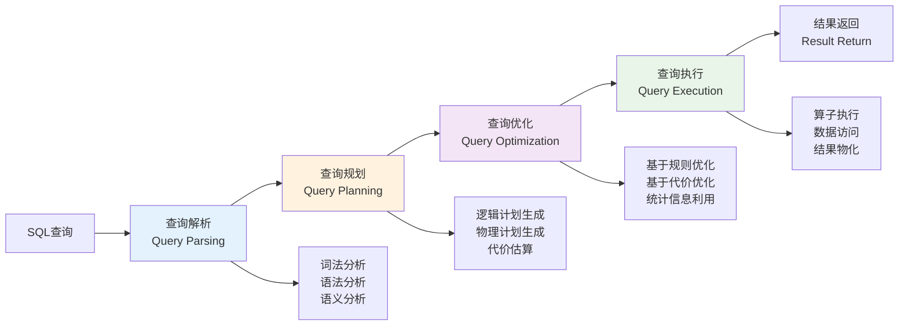
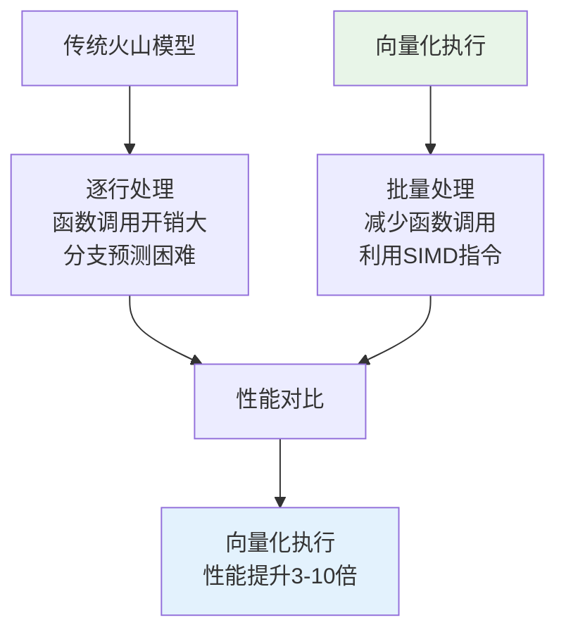
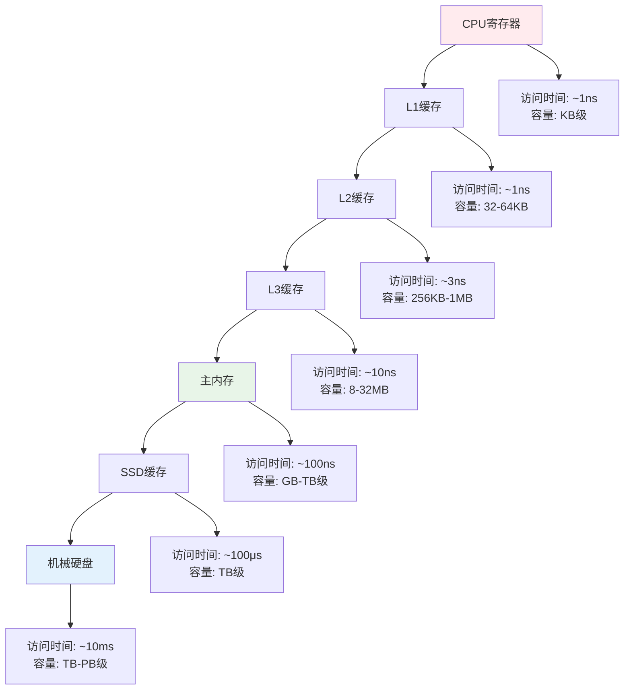
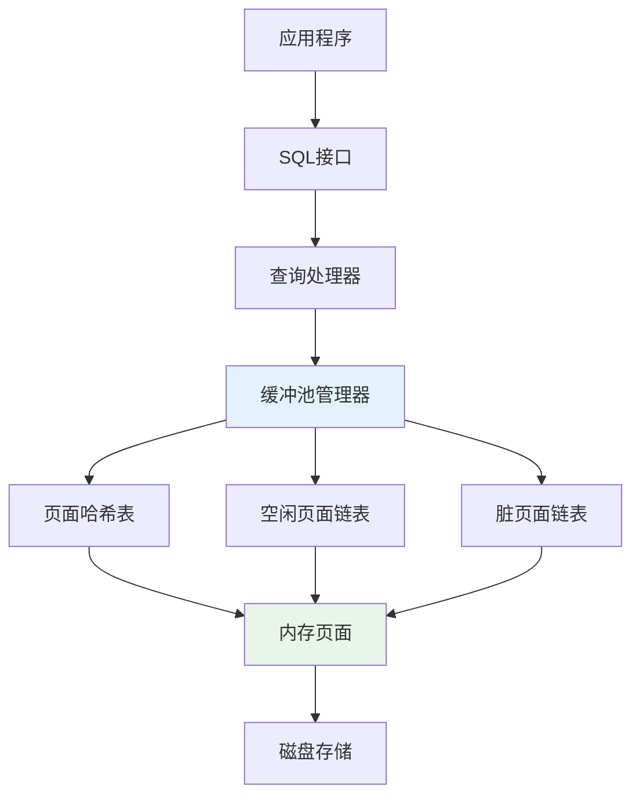
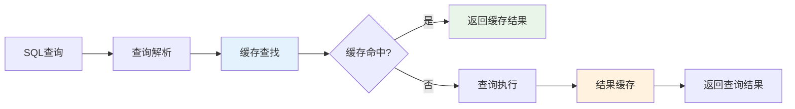
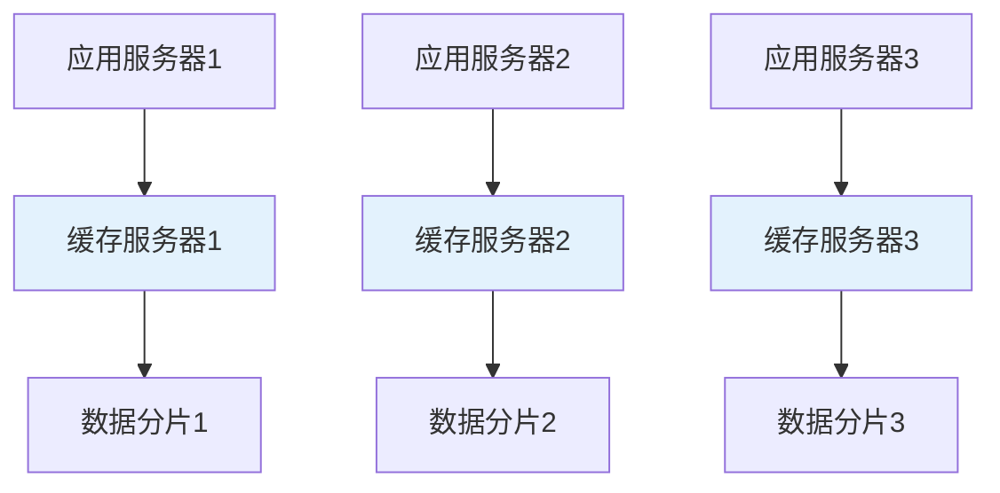
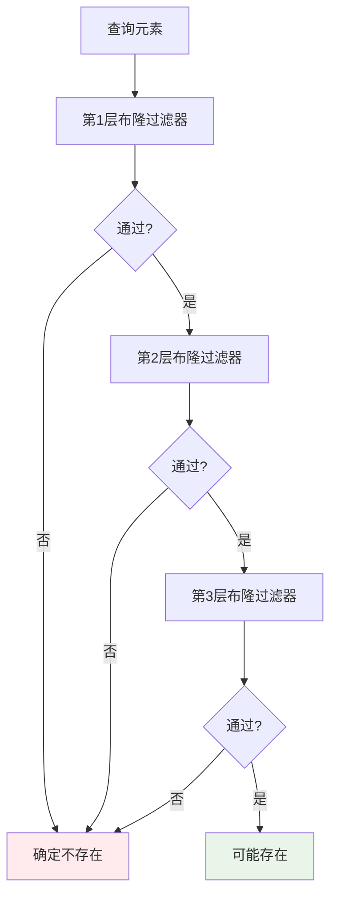
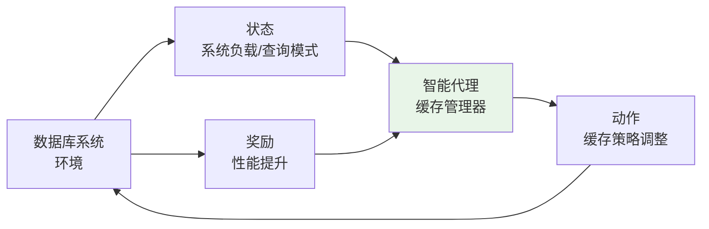

# 第二章 相关理论介绍

本章节对本文涉及的相关基础理论进行介绍。其中包括数据库查询处理流程、缓存技术基础、布隆过滤器理论以及机器学习在数据库系统中的应用。

## 2.1 数据库查询处理流程概述

### 2.1.1 传统查询处理流水线

现代关系数据库管理系统的查询处理遵循经典的四阶段流水线架构，这一架构最早由System R项目确立[1]，至今仍是主流数据库系统的基础架构。



**图2.1 数据库查询处理流水线架构**

#### 2.1.1.1 查询解析阶段

查询解析阶段负责将SQL文本转换为内部表示形式，主要包括以下步骤：

**1. 词法分析（Lexical Analysis）**
- 将SQL文本分解为标记（Token）序列
- 识别关键字、标识符、常量、操作符等语法元素
- 处理注释、空白字符等非语义元素

**2. 语法分析（Syntax Analysis）**
- 根据SQL语法规则构建抽象语法树（AST）
- 检查语法错误，确保查询符合SQL标准
- 处理嵌套查询、CTE等复杂结构

**3. 语义分析（Semantic Analysis）**
- 验证表名、列名等对象的存在性
- 进行类型检查和类型转换
- 解析别名、通配符等语义元素

根据Graefe在查询评估技术综述中的分析[27]，解析阶段通常占据查询总时间的5-15%，对于简单查询这一比例可能更高。

#### 2.1.1.2 查询规划阶段

查询规划阶段将抽象语法树转换为可执行的查询计划：

**1. 逻辑计划生成**
- 将AST转换为关系代数表达式
- 应用等价变换规则进行初步优化
- 生成逻辑算子树

**2. 物理计划生成**
- 为每个逻辑算子选择具体的物理实现
- 考虑索引、排序、分区等物理特性
- 生成多个候选执行计划

**3. 代价估算**
- 基于统计信息估算各算子的执行代价
- 考虑CPU、I/O、内存等资源消耗
- 计算整个查询计划的总代价

#### 2.1.1.3 查询优化阶段

查询优化是数据库系统的核心技术之一，负责选择最优的执行策略：

**1. 基于规则的优化（Rule-Based Optimization）**
- 应用预定义的优化规则
- 包括谓词下推、投影下推、连接重排序等
- 优化效果稳定但可能不是全局最优

**2. 基于代价的优化（Cost-Based Optimization）**
- 基于统计信息和代价模型选择最优计划
- 考虑数据分布、选择性、相关性等因素
- 能够找到更优的执行计划但计算开销较大

根据Ioannidis在查询优化综述中的研究[28]，复杂查询的优化时间可能占总执行时间的20-40%，特别是在包含多表连接和复杂谓词的情况下。

#### 2.1.1.4 查询执行阶段

查询执行阶段负责实际的数据处理和结果生成：

**1. 算子执行**
- 按照执行计划调度各个物理算子
- 实现流水线执行或物化执行
- 处理算子间的数据传递

**2. 数据访问**
- 通过存储引擎访问底层数据
- 利用索引、缓存等加速数据访问
- 处理并发控制和事务隔离

**3. 结果物化**
- 将中间结果物化到内存或磁盘
- 实现结果集的排序、分组、聚合等操作
- 生成最终的查询结果

### 2.1.2 查询处理性能瓶颈分析

#### 2.1.2.1 计算密集型瓶颈

**1. 复杂表达式计算**
- 数学函数、字符串操作等计算密集型操作
- 用户定义函数（UDF）的执行开销
- 类型转换和数据格式化操作

**2. 排序和聚合操作**
- 大数据量的排序操作需要大量CPU资源
- 复杂聚合函数的计算开销
- 分组操作中的哈希表维护成本

**3. 连接操作**
- 嵌套循环连接的O(n²)复杂度
- 哈希连接中哈希表的构建和探测
- 排序合并连接中的排序开销

#### 2.1.2.2 I/O密集型瓶颈

**1. 磁盘访问延迟**
- 随机I/O访问的高延迟
- 磁盘寻道时间和旋转延迟
- 顺序I/O与随机I/O的性能差异

**2. 缓存未命中**
- 数据库缓冲池未命中导致的磁盘访问
- 操作系统页缓存的管理开销
- 多级存储层次的数据移动成本

**3. 网络传输**
- 分布式环境中的网络延迟
- 大结果集的网络传输开销
- 客户端-服务器通信的协议开销

#### 2.1.2.3 内存访问瓶颈

**1. 内存带宽限制**
- 大数据量扫描时的内存带宽瓶颈
- NUMA架构下的内存访问不均衡
- 缓存行竞争和伪共享问题

**2. 数据结构开销**
- 复杂数据结构的内存占用
- 指针追踪导致的缓存未命中
- 内存分配和释放的开销

### 2.1.3 现代查询处理优化技术

#### 2.1.3.1 向量化执行

向量化执行技术通过批量处理数据来提高CPU利用率：



**图2.2 向量化执行与传统执行模式对比**

#### 2.1.3.2 编译执行

查询编译技术将查询计划编译为机器代码：

**优势：**
- 消除解释执行的开销
- 生成针对特定查询优化的代码
- 利用编译器优化技术

**挑战：**
- 编译时间开销
- 代码缓存管理
- 动态查询的处理

#### 2.1.3.3 并行执行

现代数据库系统广泛采用并行执行技术：

**1. 算子内并行**
- 将单个算子的工作分配给多个线程
- 适用于扫描、排序、聚合等操作
- 需要考虑负载均衡和同步开销

**2. 算子间并行**
- 多个算子同时执行形成流水线
- 减少中间结果的物化开销
- 需要处理算子间的依赖关系

**3. 查询间并行**
- 多个查询同时执行
- 需要考虑资源竞争和调度策略
- 适用于OLTP和混合工作负载

## 2.2 数据库缓存技术基础

### 2.2.1 缓存技术概述

缓存技术是计算机系统中提高性能的重要手段，其基本原理是利用时间局部性和空间局部性原理，将频繁访问的数据存储在快速存储介质中。

#### 2.2.1.1 缓存的基本概念

**1. 缓存层次结构**

现代计算机系统采用多级缓存层次结构：



**图2.3 计算机系统缓存层次结构**

**2. 缓存性能指标**

- **命中率（Hit Ratio）**：$H = \frac{N_{hit}}{N_{total}}$
- **未命中率（Miss Ratio）**：$M = 1 - H$
- **平均访问时间**：$T_{avg} = H \times T_{hit} + M \times T_{miss}$

其中，$N_{hit}$为缓存命中次数，$N_{total}$为总访问次数，$T_{hit}$为缓存命中时间，$T_{miss}$为缓存未命中时间。

#### 2.2.1.2 缓存替换策略

**1. 最近最少使用（LRU）策略**

LRU策略基于时间局部性原理，替换最长时间未被访问的数据：

```
算法：LRU缓存替换
输入：访问的数据项key
输出：缓存操作结果

1. if key在缓存中 then
2.     将key移动到链表头部
3.     return 缓存命中
4. else
5.     if 缓存已满 then
6.         删除链表尾部元素
7.     end if
8.     将key插入链表头部
9.     return 缓存未命中
10. end if
```

**优势：**
- 实现简单，理论基础扎实
- 适用于具有时间局部性的访问模式
- 性能稳定，广泛应用

**劣势：**
- 无法处理循环访问模式
- 对突发访问敏感
- 维护开销较大

**2. 最不经常使用（LFU）策略**

LFU策略基于访问频率，替换访问次数最少的数据：

```
算法：LFU缓存替换
输入：访问的数据项key
输出：缓存操作结果

1. if key在缓存中 then
2.     增加key的访问计数
3.     return 缓存命中
4. else
5.     if 缓存已满 then
6.         找到访问计数最小的元素victim
7.         删除victim
8.     end if
9.     插入key，设置访问计数为1
10.    return 缓存未命中
11. end if
```

**3. 自适应替换缓存（ARC）策略**

ARC策略结合了LRU和LFU的优势，动态调整两种策略的权重[29]：

- 维护四个LRU链表：T1（最近访问一次）、T2（最近访问多次）、B1（T1的幽灵缓存）、B2（T2的幽灵缓存）
- 根据访问模式动态调整T1和T2的大小
- 在时间局部性和频率局部性之间自适应平衡

### 2.2.2 数据库缓存系统

#### 2.2.2.1 缓冲池管理

数据库缓冲池是数据库系统中最重要的缓存组件：

**1. 缓冲池架构**



**图2.4 数据库缓冲池架构**

**2. 页面替换算法**

数据库系统通常采用改进的LRU算法：

- **Clock算法**：使用环形链表和引用位实现近似LRU
- **LRU-K算法**：考虑页面的K次历史访问信息
- **2Q算法**：使用两个队列分别处理新页面和热页面

#### 2.2.2.2 查询结果缓存

**1. 结果集缓存架构**



**图2.5 查询结果缓存流程**

**2. 缓存键生成策略**

查询结果缓存的关键是生成唯一且稳定的缓存键：

```
算法：查询缓存键生成
输入：SQL查询语句query，参数列表params
输出：缓存键key

1. normalized_query = normalize(query)  // 查询标准化
2. param_string = serialize(params)     // 参数序列化
3. combined_string = normalized_query + param_string
4. key = hash(combined_string)          // 生成哈希键
5. return key
```

**查询标准化包括：**
- 移除注释和多余空白
- 统一关键字大小写
- 标准化标识符引用
- 重排序不影响语义的子句

#### 2.2.2.3 缓存一致性维护

**1. 缓存失效策略**

数据库缓存面临的主要挑战是维护缓存与底层数据的一致性：

**基于时间的失效（TTL）：**
- 为每个缓存条目设置生存时间
- 超时后自动失效，简单但可能不准确
- 适用于对一致性要求不高的场景

**基于依赖的失效：**
- 跟踪查询与数据表的依赖关系
- 数据更新时失效相关缓存条目
- 准确但实现复杂，开销较大

**2. 依赖关系分析**

```
算法：查询依赖分析
输入：SQL查询的AST
输出：依赖的表集合tables

1. tables = ∅
2. for each node in AST do
3.     if node.type == TABLE_REFERENCE then
4.         tables = tables ∪ {node.table_name}
5.     else if node.type == SUBQUERY then
6.         sub_tables = analyze_dependencies(node.subquery)
7.         tables = tables ∪ sub_tables
8.     end if
9. end for
10. return tables
```

### 2.2.3 分布式缓存系统

#### 2.2.3.1 分布式缓存架构

现代大规模应用通常采用分布式缓存系统：

**1. 客户端-服务器架构**



**图2.6 分布式缓存架构**

**2. 数据分片策略**

- **哈希分片**：根据键的哈希值分配到不同节点
- **范围分片**：根据键的范围分配到不同节点
- **一致性哈希**：解决节点动态加入和离开的问题

#### 2.2.3.2 缓存一致性协议

**1. 最终一致性**
- 允许短期内的数据不一致
- 通过异步同步最终达到一致
- 适用于对一致性要求不严格的场景

**2. 强一致性**
- 保证所有节点的数据实时一致
- 需要复杂的同步协议
- 性能开销较大但数据准确性高

## 2.3 布隆过滤器理论基础

### 2.3.1 布隆过滤器基本原理

布隆过滤器是一种空间效率极高的概率性数据结构，由Burton Howard Bloom在1970年提出[9]。它用于测试一个元素是否在一个集合中，具有快速查询和低内存占用的特点。

#### 2.3.1.1 数据结构设计

布隆过滤器由以下组件构成：

**1. 位数组（Bit Array）**
- 长度为m的位数组，初始时所有位都设为0
- 每个位可以表示某个哈希值的存在性
- 空间复杂度为O(m)

**2. 哈希函数集合**
- k个独立的哈希函数：$h_1, h_2, ..., h_k$
- 每个函数将输入映射到[0, m-1]范围内
- 要求哈希函数具有良好的均匀分布特性

**3. 基本操作**

```
算法：布隆过滤器插入操作
输入：元素x，位数组B[0..m-1]，哈希函数h_1..h_k
输出：无

1. for i = 1 to k do
2.     index = h_i(x) mod m
3.     B[index] = 1
4. end for
```

```
算法：布隆过滤器查询操作
输入：元素x，位数组B[0..m-1]，哈希函数h_1..h_k
输出：可能存在或确定不存在

1. for i = 1 to k do
2.     index = h_i(x) mod m
3.     if B[index] == 0 then
4.         return "确定不存在"
5.     end if
6. end for
7. return "可能存在"
```

#### 2.3.1.2 数学分析

**1. 假阳性率分析**

设已插入n个元素，某个位仍为0的概率为：

$$P(\text{bit is 0}) = \left(1 - \frac{1}{m}\right)^{kn}$$

当m很大时，可近似为：

$$P(\text{bit is 0}) \approx e^{-kn/m}$$

因此，假阳性率为：

$$P(\text{false positive}) = \left(1 - e^{-kn/m}\right)^k$$

**2. 最优参数选择**

为最小化假阳性率，对k求导并令其为0：

$$\frac{d}{dk}\left(1 - e^{-kn/m}\right)^k = 0$$

解得最优哈希函数数量：

$$k_{opt} = \frac{m}{n} \ln 2$$

将$k_{opt}$代入假阳性率公式：

$$P_{min} = \left(\frac{1}{2}\right)^{k_{opt}} = \left(\frac{1}{2}\right)^{\frac{m}{n}\ln 2}$$

解得最优位数组大小：

$$m = -\frac{n \ln p}{(\ln 2)^2} \approx 1.44 n \log_2 \frac{1}{p}$$

其中p为目标假阳性率。

### 2.3.2 布隆过滤器变种

#### 2.3.2.1 计数布隆过滤器

标准布隆过滤器不支持删除操作，计数布隆过滤器通过使用计数器数组解决这一问题：

**1. 数据结构**
- 使用计数器数组替代位数组
- 每个位置存储一个小整数计数器
- 插入时增加计数器，删除时减少计数器

**2. 操作算法**

```
算法：计数布隆过滤器删除操作
输入：元素x，计数器数组C[0..m-1]，哈希函数h_1..h_k
输出：删除结果

1. for i = 1 to k do
2.     index = h_i(x) mod m
3.     if C[index] > 0 then
4.         C[index] = C[index] - 1
5.     else
6.         return "删除失败：元素不存在"
7.     end if
8. end for
9. return "删除成功"
```

**3. 优缺点分析**

**优势：**
- 支持删除操作
- 保持了布隆过滤器的基本特性

**劣势：**
- 内存开销增加（通常4-8倍）
- 计数器溢出问题
- 假阴性问题（错误删除导致）

#### 2.3.2.2 分层布隆过滤器

分层布隆过滤器通过多层结构降低假阳性率：

**1. 架构设计**



**图2.7 分层布隆过滤器架构**

**2. 假阳性率分析**

设每层的假阳性率为p，则L层布隆过滤器的总假阳性率为：

$$P_{total} = p^L$$

通过增加层数可以显著降低假阳性率，但会增加查询延迟。

#### 2.3.2.3 动态布隆过滤器

动态布隆过滤器支持动态扩容以适应数据量的变化：

**1. 扩容策略**

```
算法：动态布隆过滤器扩容
输入：当前过滤器BF，新容量new_size
输出：扩容后的过滤器new_BF

1. new_BF = create_bloom_filter(new_size)
2. for each element in BF.inserted_elements do
3.     new_BF.insert(element)
4. end for
5. return new_BF
```

**2. 触发条件**

扩容通常在以下情况触发：
- 假阳性率超过阈值
- 负载因子过高
- 性能下降明显

### 2.3.3 哈希函数设计

#### 2.3.3.1 哈希函数要求

布隆过滤器的性能很大程度上取决于哈希函数的质量：

**1. 均匀分布性**
- 哈希值应均匀分布在[0, m-1]范围内
- 避免聚集现象导致的性能下降
- 可通过统计测试验证分布质量

**2. 独立性**
- 多个哈希函数应相互独立
- 避免相关性导致的假阳性率增加
- 可使用不同的哈希算法或种子值

**3. 计算效率**
- 哈希计算应尽可能快速
- 避免复杂的数学运算
- 考虑硬件加速的可能性

#### 2.3.3.2 常用哈希函数

**1. MurmurHash**

MurmurHash是一种非加密哈希函数，具有良好的分布特性和高计算效率。

**2. 双重哈希技术**

为了减少哈希计算开销，可以使用双重哈希技术生成多个哈希值：

```
算法：双重哈希生成
输入：元素x，哈希函数数量k，位数组大小m
输出：k个哈希位置

1. h1 = hash1(x) mod m
2. h2 = hash2(x) mod m
3. if h2 == 0 then h2 = 1  // 确保h2不为0
4. for i = 0 to k-1 do
5.     positions[i] = (h1 + i * h2) mod m
6. end for
7. return positions
```

Kirsch和Mitzenmacher证明了双重哈希技术在布隆过滤器中的有效性[30]，其假阳性率与使用k个完全独立哈希函数的情况几乎相同。

## 2.4 机器学习在数据库系统中的应用

### 2.4.1 学习型数据库系统概述

随着机器学习技术的快速发展，将机器学习应用于数据库系统已成为一个重要的研究方向。学习型数据库系统能够通过学习历史数据和访问模式来自动优化系统性能。

#### 2.4.1.1 机器学习在数据库中的应用领域

**1. 查询优化**
- 代价估算模型的学习
- 连接顺序的智能选择
- 索引推荐和自动调优

**2. 存储管理**
- 智能缓存管理
- 数据分区策略优化
- 压缩算法选择

**3. 系统调优**
- 参数自动配置
- 负载预测和资源调度
- 异常检测和故障诊断

#### 2.4.1.2 机器学习模型分类

**1. 监督学习模型**

监督学习使用标记的训练数据来学习输入和输出之间的映射关系：


**图2.8 监督学习在数据库中的应用**

**常用算法：**
- 线性回归：用于连续值预测
- 决策树：用于分类和回归问题
- 神经网络：用于复杂非线性关系建模
- 支持向量机：用于分类和回归

**2. 无监督学习模型**

无监督学习从未标记的数据中发现隐藏的模式：

**常用算法：**
- 聚类算法：发现数据的自然分组
- 关联规则挖掘：发现数据项之间的关联
- 异常检测：识别异常的访问模式

**3. 强化学习模型**

强化学习通过与环境交互来学习最优策略：



**图2.9 强化学习在缓存管理中的应用**

### 2.4.2 特征工程

特征工程是机器学习成功应用的关键，需要从原始数据中提取有意义的特征。

#### 2.4.2.1 查询特征提取

**1. 语法特征**
- 查询长度（字符数、标记数）
- 关键字频率（SELECT、JOIN、WHERE等）
- 嵌套层次深度
- 子查询数量

**2. 语义特征**
- 涉及的表数量
- 连接操作数量和类型
- 聚合函数数量和类型
- 谓词复杂度

**3. 统计特征**
- 表的行数和列数
- 数据分布特征
- 索引覆盖率
- 选择性估算

#### 2.4.2.2 系统特征提取

**1. 资源使用特征**
- CPU利用率
- 内存使用量
- I/O吞吐量
- 网络带宽使用

**2. 性能指标特征**
- 查询响应时间
- 吞吐量
- 并发度
- 缓存命中率

**3. 负载特征**
- 查询到达率
- 查询类型分布
- 数据访问模式
- 时间相关性

### 2.4.3 缓存管理中的机器学习应用

#### 2.4.3.1 访问模式预测

**1. 时间序列预测**

使用时间序列模型预测未来的访问模式：

```
算法：ARIMA访问预测
输入：历史访问序列X = {x_1, x_2, ..., x_t}
输出：未来访问预测值x_{t+1}

1. // 差分处理使序列平稳
2. d_series = difference(X, d)
3. 
4. // 拟合ARIMA(p,d,q)模型
5. model = fit_arima(d_series, p, d, q)
6. 
7. // 预测下一个值
8. prediction = model.forecast(1)
9. 
10. // 逆差分得到原始尺度的预测值
11. x_{t+1} = inverse_difference(prediction, X[t], d)
12. 
13. return x_{t+1}
```

**2. 循环神经网络预测**

RNN及其变种（LSTM、GRU）特别适合处理序列数据。

#### 2.4.3.2 缓存价值评估

**1. 多因素价值模型**

缓存条目的价值可以通过多个因素的加权组合来评估：

$$V(item) = \alpha \cdot freq(item) + \beta \cdot recency(item) + \gamma \cdot size(item) + \delta \cdot cost(item)$$

其中：
- $freq(item)$：访问频率
- $recency(item)$：最近访问时间
- $size(item)$：数据大小
- $cost(item)$：重新计算成本

**2. 神经网络价值预测**

使用神经网络模型预测缓存条目的价值。

#### 2.4.3.3 在线学习算法

缓存系统需要能够实时适应访问模式的变化，在线学习算法特别适合这种场景：

**1. 随机梯度下降（SGD）**

```
算法：在线SGD更新
输入：当前模型参数θ，新样本(x, y)，学习率α
输出：更新后的模型参数θ'

1. // 计算预测值
2. y_pred = model(x, θ)
3. 
4. // 计算损失
5. loss = (y - y_pred)²
6. 
7. // 计算梯度
8. gradient = ∇_θ loss
9. 
10. // 更新参数
11. θ' = θ - α * gradient
12. 
13. return θ'
```

**2. 自适应学习率算法**

Adam算法结合了动量和自适应学习率的优势：

```
算法：Adam在线更新
输入：参数θ，梯度g，时间步t，超参数α,β₁,β₂,ε
输出：更新后的参数θ'

1. // 更新偏置一阶矩估计
2. m_t = β₁ * m_{t-1} + (1 - β₁) * g
3. 
4. // 更新偏置二阶矩估计
5. v_t = β₂ * v_{t-1} + (1 - β₂) * g²
6. 
7. // 偏置校正
8. m̂_t = m_t / (1 - β₁^t)
9. v̂_t = v_t / (1 - β₂^t)
10. 
11. // 参数更新
12. θ' = θ - α * m̂_t / (√v̂_t + ε)
13. 
14. return θ'
```

## 2.5 本章小结

本章从理论基础入手，系统性地分析了数据库查询处理与缓存管理的相关知识，为后续研究和优化奠定了理论基础。首先，概述了数据库查询处理的整体流程及其关键机制，明确了查询性能的核心影响因素。接着，详细介绍了缓存技术的基本原理和层次结构，以及数据库缓存系统的架构设计。然后，深入分析了布隆过滤器的数学原理和优化技术，为高效过滤机制的设计提供了理论支撑。最后，探讨了机器学习在数据库系统中的应用前景，为智能缓存管理提供了算法基础。

通过对这些理论基础的深入分析，为本文提出的动态缓存加速技术奠定了坚实的理论基础，也为相关领域的进一步研究提供了重要的参考价值。