# 第二章 相关背景与理论基础

## 2.1 数据库查询处理流程

### 2.1.1 传统查询处理流程

数据库查询处理是一个复杂的多阶段过程，涉及SQL解析、查询优化、执行计划生成和结果返回等多个环节。理解这一流程对于设计高效的缓存机制至关重要。

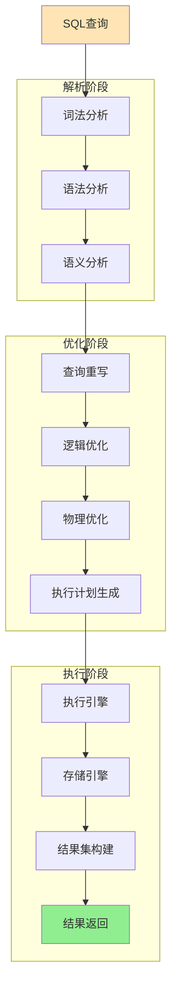

**图2.1 传统数据库查询处理流程**

#### 2.1.1.1 解析阶段

**词法分析（Lexical Analysis）**：将SQL字符串分解为标记（Token）序列，识别关键字、标识符、操作符等基本元素。

**语法分析（Syntax Analysis）**：根据SQL语法规则，将标记序列构建为抽象语法树（AST）。AST是查询的结构化表示，为后续处理提供基础。

**语义分析（Semantic Analysis）**：验证查询的语义正确性，包括表名、列名的存在性检查，数据类型兼容性验证等。

#### 2.1.1.2 优化阶段

**查询重写（Query Rewriting）**：应用各种重写规则优化查询，如子查询展开、视图展开、谓词下推等。

**逻辑优化（Logical Optimization）**：基于关系代数的等价变换规则，生成逻辑上等价但效率更高的查询计划。

**物理优化（Physical Optimization）**：选择具体的物理操作符和访问路径，如索引选择、连接算法选择等。

#### 2.1.1.3 执行阶段

**执行引擎（Execution Engine）**：按照执行计划调度各个操作符的执行。

**存储引擎（Storage Engine）**：负责数据的实际读取和写入操作。

### 2.1.2 查询处理性能瓶颈分析

传统查询处理流程存在多个性能瓶颈，这些瓶颈为缓存技术的应用提供了优化空间：

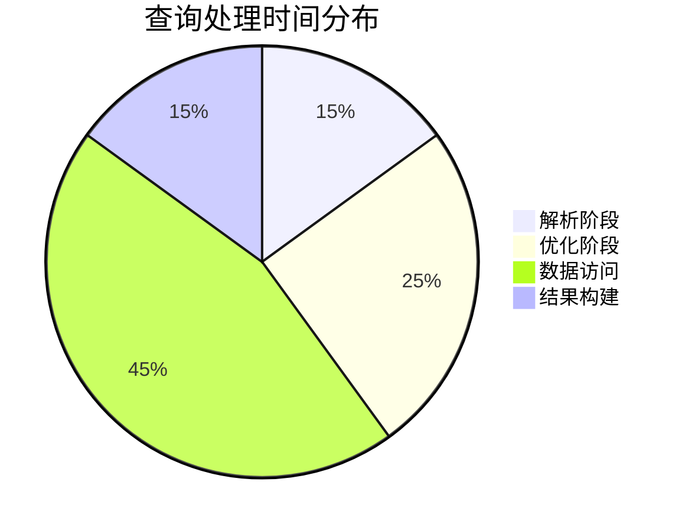

**图2.2 典型OLAP查询处理时间分布**

根据相关研究[^1]，在典型的OLAP工作负载中：
- **数据访问占比最高（45%）**：磁盘I/O和网络传输是主要瓶颈
- **优化阶段耗时较长（25%）**：复杂查询的优化计算开销显著
- **解析和结果构建（各15%）**：虽然占比相对较小，但在高并发场景下影响明显

### 2.1.3 缓存在查询流程中的作用

缓存技术可以在查询处理的多个阶段发挥作用，显著提升整体性能：

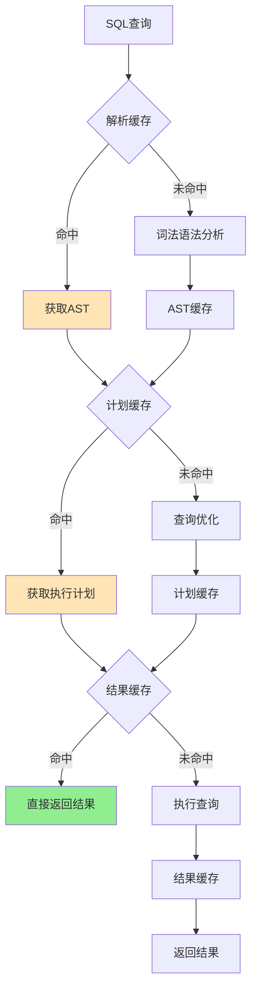

**图2.3 多级缓存在查询流程中的应用**

## 2.2 数据库缓存技术基础

### 2.2.1 缓存的基本概念

缓存（Cache）是一种存储技术，通过将频繁访问的数据存储在高速存储介质中，减少对低速存储介质的访问，从而提升系统整体性能。

#### 2.2.1.1 缓存的基本原理

缓存技术基于**局部性原理（Principle of Locality）**：

1. **时间局部性（Temporal Locality）**：最近被访问的数据很可能在不久的将来再次被访问
2. **空间局部性（Spatial Locality）**：与最近被访问数据相邻的数据很可能被访问

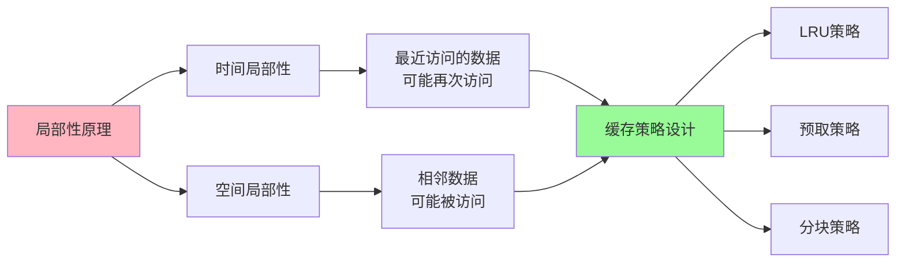

**图2.4 局部性原理与缓存策略的关系**

#### 2.2.1.2 缓存性能指标

**命中率（Hit Ratio）**：
$$\text{Hit Ratio} = \frac{\text{Cache Hits}}{\text{Cache Hits} + \text{Cache Misses}}$$

**平均访问时间（Average Access Time）**：
$$\text{AAT} = \text{Hit Ratio} \times \text{Cache Access Time} + (1 - \text{Hit Ratio}) \times \text{Memory Access Time}$$

**缓存效率（Cache Efficiency）**：
$$\text{Efficiency} = \frac{\text{Performance with Cache} - \text{Performance without Cache}}{\text{Performance without Cache}}$$

### 2.2.2 数据库中的缓存层次

现代数据库系统采用多级缓存架构，在不同层次提供缓存服务：

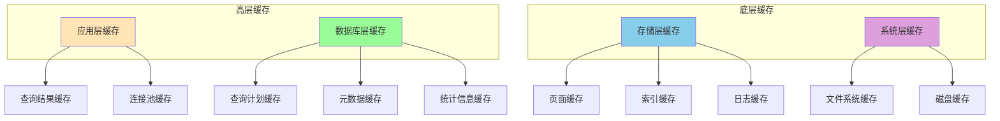

**图2.5 数据库多级缓存架构**

#### 2.2.2.1 应用层缓存

**查询结果缓存**：缓存完整的查询结果，适用于读多写少的场景。

**连接池缓存**：复用数据库连接，减少连接建立和销毁的开销。

#### 2.2.2.2 数据库层缓存

**查询计划缓存**：缓存已优化的执行计划，避免重复的优化计算。

**元数据缓存**：缓存表结构、索引信息等元数据，加速查询解析。

**统计信息缓存**：缓存表和索引的统计信息，支持基于代价的优化。

#### 2.2.2.3 存储层缓存

**页面缓存（Buffer Pool）**：缓存数据页面，是数据库系统最重要的缓存。

**索引缓存**：专门缓存索引页面，加速索引查找。

**日志缓存**：缓存事务日志，提升事务处理性能。

### 2.2.3 缓存一致性与更新策略

#### 2.2.3.1 缓存一致性问题

在数据更新时，如何保证缓存与底层数据的一致性是一个关键问题：

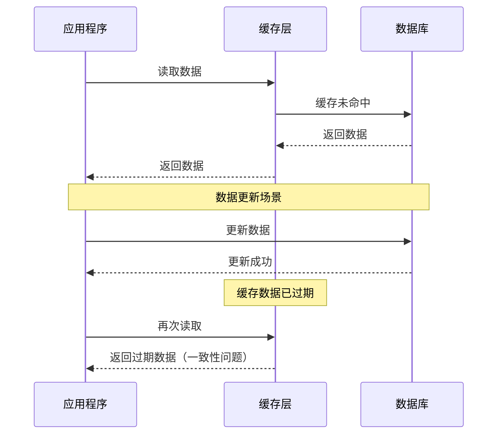

**图2.6 缓存一致性问题示例**

#### 2.2.3.2 缓存更新策略

**写直达（Write-Through）**：
- 同时更新缓存和数据库
- 保证强一致性，但写性能较差

**写回（Write-Back）**：
- 只更新缓存，延迟写入数据库
- 写性能好，但存在数据丢失风险

**写绕过（Write-Around）**：
- 直接写入数据库，不更新缓存
- 避免缓存污染，但可能导致缓存未命中

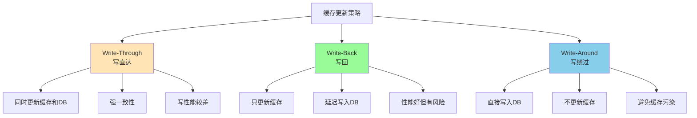

**图2.7 三种主要的缓存更新策略对比**

## 2.3 公共表表达式（CTE）技术

### 2.3.1 CTE基本概念

公共表表达式（Common Table Expression，CTE）是SQL标准中定义的一种临时命名结果集，可以在单个SQL语句中被多次引用。CTE提供了一种结构化的方式来组织复杂查询，提高了SQL的可读性和可维护性。

#### 2.3.1.1 CTE语法结构

```sql
WITH cte_name [(column_list)] AS (
    -- CTE查询定义
    SELECT ...
)
-- 主查询，可以引用CTE
SELECT ... FROM cte_name ...
```

#### 2.3.1.2 CTE类型分类

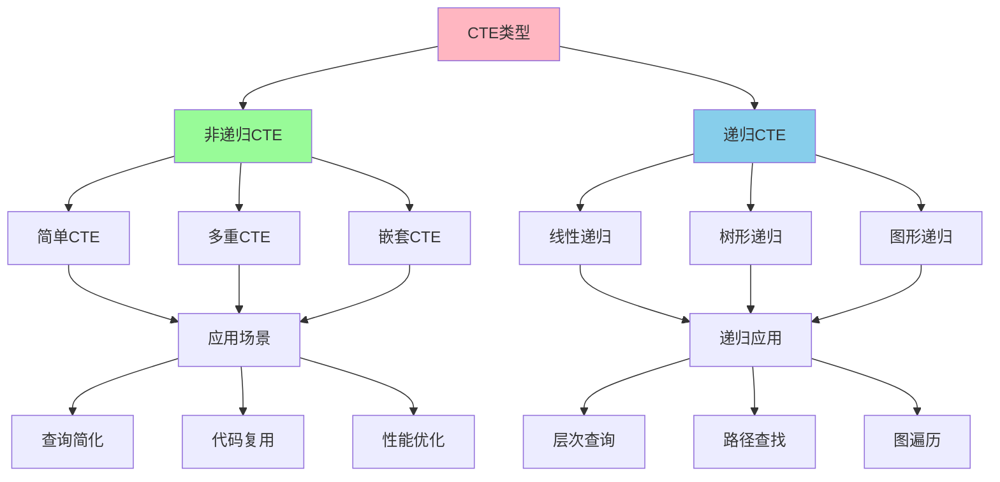

**图2.8 CTE类型分类与应用场景**

### 2.3.2 CTE执行机制

#### 2.3.2.1 CTE物化策略

数据库系统对CTE的处理有两种主要策略：

**内联展开（Inline Expansion）**：
- 将CTE定义直接替换到引用位置
- 适用于简单CTE，避免物化开销
- 可能导致重复计算

**物化执行（Materialization）**：
- 先计算CTE结果并存储
- 适用于复杂CTE或多次引用的场景
- 需要额外的存储空间

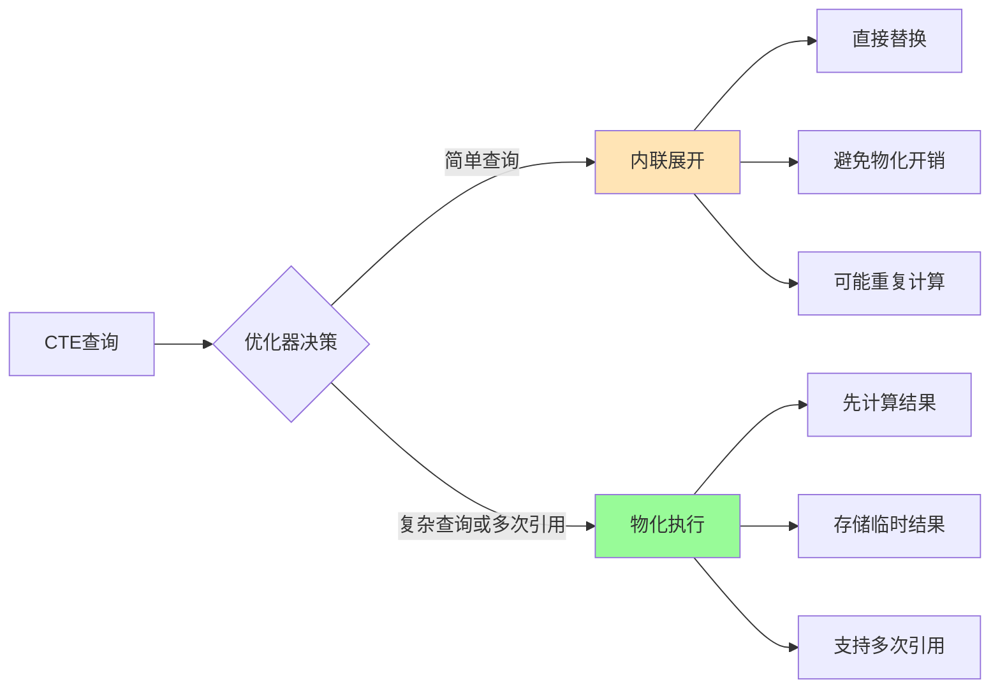

**图2.9 CTE执行策略选择**

#### 2.3.2.2 CTE优化技术

**谓词下推（Predicate Pushdown）**：
将主查询中的过滤条件推送到CTE内部，减少中间结果集大小。

```sql
-- 优化前
WITH sales_data AS (
    SELECT customer_id, product_id, amount, sale_date
    FROM sales
)
SELECT * FROM sales_data 
WHERE sale_date >= '2023-01-01';

-- 优化后（谓词下推）
WITH sales_data AS (
    SELECT customer_id, product_id, amount, sale_date
    FROM sales
    WHERE sale_date >= '2023-01-01'  -- 谓词下推
)
SELECT * FROM sales_data;
```

**投影下推（Projection Pushdown）**：
只选择主查询中实际需要的列，减少数据传输量。

**连接消除（Join Elimination）**：
在某些情况下，可以消除不必要的连接操作。

### 2.3.3 CTE缓存的理论基础

#### 2.3.3.1 CTE缓存的必要性

CTE缓存的必要性源于以下几个方面：

1. **重复计算问题**：同一个CTE可能在不同查询中被重复计算
2. **中间结果复用**：CTE的中间结果具有复用价值
3. **查询优化空间**：缓存可以跳过CTE的重复优化过程

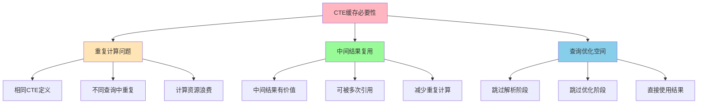

**图2.10 CTE缓存必要性分析**

#### 2.3.3.2 CTE缓存的挑战

**依赖关系复杂性**：
CTE之间可能存在复杂的依赖关系，需要正确处理依赖链。

**缓存粒度选择**：
需要在缓存粒度和缓存效率之间找到平衡点。

**一致性维护**：
当底层数据发生变化时，需要及时更新相关的CTE缓存。

**内存管理**：
CTE缓存可能占用大量内存，需要有效的内存管理策略。

## 2.4 物化视图技术

### 2.4.1 物化视图基本概念

物化视图（Materialized View）是一种特殊的数据库对象，它存储了查询结果的物理副本。与普通视图不同，物化视图将查询结果实际存储在磁盘上，可以像表一样被索引和查询。

#### 2.4.1.1 物化视图的特点

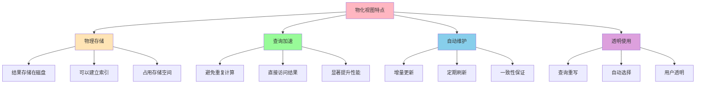

**图2.11 物化视图的主要特点**

#### 2.4.1.2 物化视图与普通视图的对比

| 特性 | 普通视图 | 物化视图 |
|------|----------|----------|
| 存储方式 | 仅存储查询定义 | 存储查询结果 |
| 查询性能 | 每次查询都需要计算 | 直接访问存储结果 |
| 存储开销 | 几乎无存储开销 | 需要额外存储空间 |
| 数据一致性 | 总是最新数据 | 可能存在延迟 |
| 维护成本 | 无维护成本 | 需要定期更新 |
| 适用场景 | 简单查询，实时性要求高 | 复杂查询，性能要求高 |

### 2.4.2 物化视图的维护策略

#### 2.4.2.1 更新时机分类

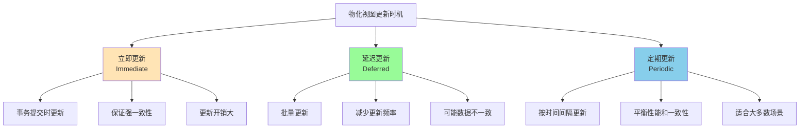

**图2.12 物化视图更新时机分类**

#### 2.4.2.2 增量更新算法

物化视图的增量更新是一个重要的研究领域，主要算法包括：

**基于日志的增量更新**：
通过分析数据库的更新日志，计算物化视图的增量变化。

$$\Delta MV = f(\Delta R_1, \Delta R_2, ..., \Delta R_n)$$

其中，$\Delta MV$表示物化视图的增量变化，$\Delta R_i$表示基表$R_i$的增量变化。

**基于触发器的增量更新**：
在基表上创建触发器，当数据发生变化时自动更新物化视图。

**基于时间戳的增量更新**：
通过比较时间戳确定需要更新的数据范围。

### 2.4.3 物化视图在缓存中的应用

#### 2.4.3.1 物化视图作为缓存存储

物化视图可以作为查询缓存的持久化存储方案：

**优势**：
1. **持久化存储**：数据在系统重启后仍然可用
2. **结构化存储**：保持原有的表结构和索引
3. **SQL兼容**：可以使用标准SQL查询
4. **自动维护**：数据库系统提供自动维护机制

**挑战**：
1. **存储开销**：需要额外的存储空间
2. **维护复杂性**：需要处理复杂的依赖关系
3. **命名冲突**：需要避免与现有对象的命名冲突

#### 2.4.3.2 物化视图缓存架构

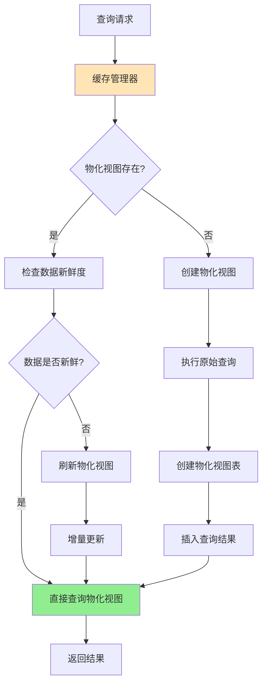

**图2.13 基于物化视图的缓存架构**

## 2.5 布隆过滤器理论基础

### 2.5.1 布隆过滤器基本原理

布隆过滤器是一种空间效率极高的概率型数据结构，用于测试一个元素是否在一个集合中。它由Burton Howard Bloom在1970年提出[^2]。

#### 2.5.1.1 基本结构

布隆过滤器由以下组件构成：
- **位数组**：长度为$m$的位数组，初始时所有位都设为0
- **哈希函数**：$k$个独立的哈希函数$h_1, h_2, ..., h_k$
- **集合元素**：要插入的元素集合

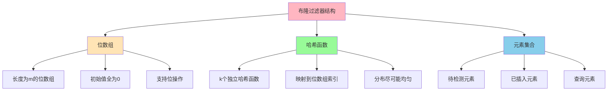

**图2.14 布隆过滤器基本结构**

#### 2.5.1.2 基本操作

**插入操作（Insert）**：
对于要插入的元素$x$，计算$k$个哈希值：
$$h_1(x), h_2(x), ..., h_k(x)$$
将位数组中对应位置设为1。

**查询操作（Query）**：
对于要查询的元素$y$，计算$k$个哈希值，检查对应位置是否都为1：
- 如果有任何一位为0，则$y$肯定不在集合中
- 如果所有位都为1，则$y$可能在集合中（存在假阳性）

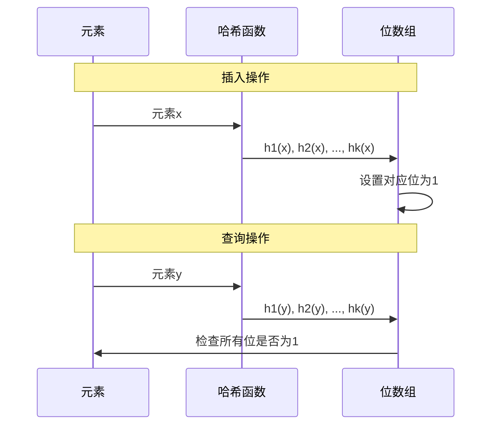

**图2.15 布隆过滤器基本操作序列**

### 2.5.2 布隆过滤器数学分析

#### 2.5.2.1 假阳性率分析

假阳性率（False Positive Rate）是布隆过滤器的关键性能指标。

设：
- $m$：位数组长度
- $k$：哈希函数个数
- $n$：已插入元素个数

插入$n$个元素后，位数组中某一位仍为0的概率为：
$$P(\text{bit is 0}) = \left(1 - \frac{1}{m}\right)^{kn}$$

当$m$很大时，可以近似为：
$$P(\text{bit is 0}) \approx e^{-kn/m}$$

因此，某一位为1的概率为：
$$P(\text{bit is 1}) = 1 - e^{-kn/m}$$

假阳性率为：
$$P(\text{false positive}) = \left(1 - e^{-kn/m}\right)^k$$

#### 2.5.2.2 最优参数选择

为了最小化假阳性率，需要选择最优的$k$值。

对假阳性率公式求导并令其为0：
$$\frac{d}{dk}\left(1 - e^{-kn/m}\right)^k = 0$$

解得最优哈希函数个数：
$$k_{opt} = \frac{m}{n} \ln 2$$

此时的最小假阳性率为：
$$P_{min} = \left(\frac{1}{2}\right)^{k_{opt}} = \left(\frac{1}{2}\right)^{\frac{m}{n}\ln 2}$$

#### 2.5.2.3 空间效率分析

布隆过滤器的空间效率可以用每个元素所需的位数来衡量：

$$\text{Bits per element} = \frac{m}{n} = \frac{k_{opt}}{\ln 2} = 1.44 \times k_{opt}$$

对于给定的假阳性率$p$，所需的位数为：
$$\frac{m}{n} = -\frac{\log_2 p}{\ln 2} = -1.44 \log_2 p$$

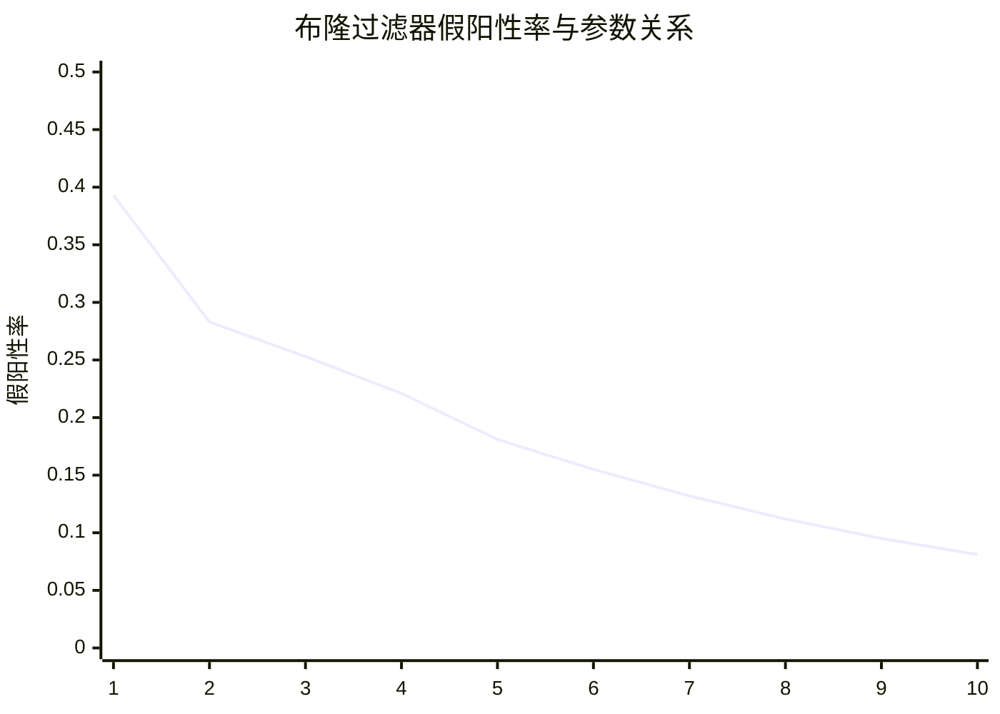

**图2.16 哈希函数个数与假阳性率的关系（m/n=10）**

### 2.5.3 布隆过滤器的变种

#### 2.5.3.1 计数布隆过滤器

标准布隆过滤器不支持删除操作，计数布隆过滤器通过将位数组替换为计数器数组来支持删除。

**优势**：
- 支持删除操作
- 可以统计元素插入次数

**劣势**：
- 空间开销增加
- 可能出现计数器溢出

#### 2.5.3.2 可扩展布隆过滤器

当元素数量超过预期时，标准布隆过滤器的假阳性率会急剧上升。可扩展布隆过滤器通过动态增加过滤器来解决这个问题。

**设计思路**：
1. 维护多个布隆过滤器
2. 当当前过滤器达到容量时，创建新的过滤器
3. 查询时需要检查所有过滤器

#### 2.5.3.3 布谷鸟过滤器

布谷鸟过滤器是布隆过滤器的一种替代方案，支持删除操作且空间效率更高。

**主要特点**：
- 支持删除操作
- 更好的空间效率
- 更好的局部性

## 2.6 相关技术对比分析

### 2.6.1 不同缓存技术对比

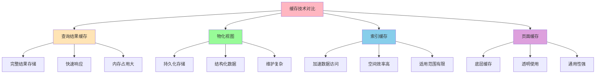

**图2.17 不同缓存技术特点对比**

### 2.6.2 技术选择决策矩阵

| 技术方案 | 性能提升 | 实现复杂度 | 内存开销 | 持久化 | 适用场景 |
|----------|----------|------------|----------|--------|----------|
| 查询结果缓存 | ★★★★★ | ★★★ | ★★★★ | ★ | 重复查询多 |
| 物化视图 | ★★★★ | ★★★★ | ★★★ | ★★★★★ | 复杂分析查询 |
| CTE缓存 | ★★★★ | ★★★★ | ★★★ | ★★ | 包含CTE的查询 |
| 布隆过滤器 | ★★ | ★★ | ★ | ★★★ | 存在性检测 |
| 混合方案 | ★★★★★ | ★★★★★ | ★★★ | ★★★★ | 综合场景 |

**表2.1 不同缓存技术决策矩阵**（★越多表示程度越高）

## 2.7 本章小结

本章系统地介绍了数据库查询缓存相关的理论基础，主要内容包括：

1. **数据库查询处理流程**：详细分析了传统查询处理的各个阶段，识别了性能瓶颈，为缓存技术的应用提供了理论依据。

2. **数据库缓存技术基础**：从缓存的基本概念出发，介绍了多级缓存架构、缓存一致性和更新策略等核心理论。

3. **CTE技术深入分析**：阐述了CTE的执行机制、优化技术和缓存应用的理论基础，为后续的CTE缓存设计奠定了基础。

4. **物化视图技术**：介绍了物化视图的基本概念、维护策略和在缓存中的应用，为持久化缓存方案提供了理论支撑。

5. **布隆过滤器理论**：深入分析了布隆过滤器的数学原理、参数优化和变种技术，为前置过滤机制提供了理论基础。

6. **技术对比分析**：通过对比不同缓存技术的特点和适用场景，为技术选择提供了决策依据。

这些理论基础为后续章节中动态缓存管理系统的设计和实现提供了坚实的理论支撑。下一章将基于这些理论基础，详细介绍基于布隆过滤器的SQL/CTE缓存机制的设计与实现。

## 参考文献

[^1]: Pavlo A, Curino C, Zdonik S. Skew-aware automatic database partitioning in shared-nothing, parallel OLTP systems[C]//Proceedings of the 2012 ACM SIGMOD International Conference on Management of Data. 2012: 61-72.

[^2]: Bloom B H. Space/time trade-offs in hash coding with allowable errors[J]. Communications of the ACM, 1970, 13(7): 422-426.