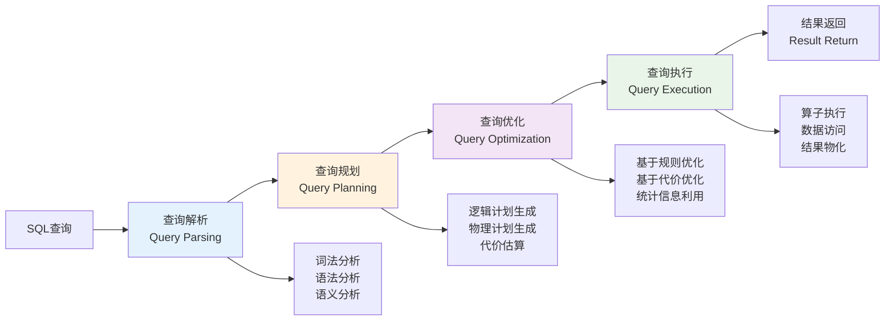
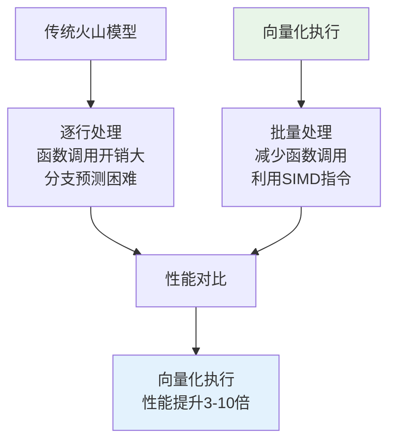

# 第二章 相关背景与理论基础

本章节对本文涉及的相关基础理论进行介绍。其中包括数据库查询处理流程、缓存技术基础、布隆过滤器理论以及机器学习在数据库系统中的应用。

## 2.1 数据库查询处理流程概述

### 2.1.1 传统查询处理流水线

现代关系数据库管理系统的查询处理遵循经典的四阶段流水线架构，这一架构最早由System R项目确立[1]，至今仍是主流数据库系统的基础架构。

**图2.1 数据库查询处理流水线架构**

#### 2.1.1.1 查询解析阶段

查询解析阶段负责将SQL文本转换为内部表示形式，主要包括以下步骤：

**1. 词法分析（Lexical Analysis）**
- 将SQL文本分解为标记（Token）序列
- 识别关键字、标识符、常量、操作符等语法元素
- 处理注释、空白字符等非语义元素

**2. 语法分析（Syntax Analysis）**
- 根据SQL语法规则构建抽象语法树（AST）
- 检查语法错误，确保查询符合SQL标准
- 处理嵌套查询、CTE等复杂结构

**3. 语义分析（Semantic Analysis）**
- 验证表名、列名等对象的存在性
- 进行类型检查和类型转换
- 解析别名、通配符等语义元素

根据Graefe在查询评估技术综述中的分析[27]，解析阶段通常占据查询总时间的5-15%，对于简单查询这一比例可能更高。

#### 2.1.1.2 查询规划阶段

查询规划阶段将抽象语法树转换为可执行的查询计划：

**1. 逻辑计划生成**
- 将AST转换为关系代数表达式
- 应用等价变换规则进行初步优化
- 生成逻辑算子树

**2. 物理计划生成**
- 为每个逻辑算子选择具体的物理实现
- 考虑索引、排序、分区等物理特性
- 生成多个候选执行计划

**3. 代价估算**
- 基于统计信息估算各算子的执行代价
- 考虑CPU、I/O、内存等资源消耗
- 计算整个查询计划的总代价

#### 2.1.1.3 查询优化阶段

查询优化是数据库系统的核心技术之一，负责选择最优的执行策略：

**1. 基于规则的优化（Rule-Based Optimization）**
- 应用预定义的优化规则
- 包括谓词下推、投影下推、连接重排序等
- 优化效果稳定但可能不是全局最优

**2. 基于代价的优化（Cost-Based Optimization）**
- 基于统计信息和代价模型选择最优计划
- 考虑数据分布、选择性、相关性等因素
- 能够找到更优的执行计划但计算开销较大

根据Ioannidis在查询优化综述中的研究[28]，复杂查询的优化时间可能占总执行时间的20-40%，特别是在包含多表连接和复杂谓词的情况下。

#### 2.1.1.4 查询执行阶段

查询执行阶段负责实际的数据处理和结果生成：

**1. 算子执行**
- 按照执行计划调度各个物理算子
- 实现流水线执行或物化执行
- 处理算子间的数据传递

**2. 数据访问**
- 通过存储引擎访问底层数据
- 利用索引、缓存等加速数据访问
- 处理并发控制和事务隔离

**3. 结果物化**
- 将中间结果物化到内存或磁盘
- 实现结果集的排序、分组、聚合等操作
- 生成最终的查询结果

### 2.1.2 查询处理性能瓶颈分析

#### 2.1.2.1 计算密集型瓶颈

**1. 复杂表达式计算**
- 数学函数、字符串操作等计算密集型操作
- 用户定义函数（UDF）的执行开销
- 类型转换和数据格式化操作

**2. 排序和聚合操作**
- 大数据量的排序操作需要大量CPU资源
- 复杂聚合函数的计算开销
- 分组操作中的哈希表维护成本

**3. 连接操作**
- 嵌套循环连接的O(n²)复杂度
- 哈希连接中哈希表的构建和探测
- 排序合并连接中的排序开销

#### 2.1.2.2 I/O密集型瓶颈

**1. 磁盘访问延迟**
- 随机I/O访问的高延迟
- 磁盘寻道时间和旋转延迟
- 顺序I/O与随机I/O的性能差异

**2. 缓存未命中**
- 数据库缓冲池未命中导致的磁盘访问
- 操作系统页缓存的管理开销
- 多级存储层次的数据移动成本

**3. 网络传输**
- 分布式环境中的网络延迟
- 大结果集的网络传输开销
- 客户端-服务器通信的协议开销

#### 2.1.2.3 内存访问瓶颈

**1. 内存带宽限制**
- 大数据量扫描时的内存带宽瓶颈
- NUMA架构下的内存访问不均衡
- 缓存行竞争和伪共享问题

**2. 数据结构开销**
- 复杂数据结构的内存占用
- 指针追踪导致的缓存未命中
- 内存分配和释放的开销

### 2.1.3 现代查询处理优化技术

#### 2.1.3.1 向量化执行

向量化执行技术通过批量处理数据来提高CPU利用率：

**图2.2 向量化执行与传统执行模式对比**

#### 2.1.3.2 编译执行

查询编译技术将查询计划编译为机器代码：

**优势：**
- 消除解释执行的开销
- 生成针对特定查询优化的代码
- 利用编译器优化技术

**挑战：**
- 编译时间开销
- 代码缓存管理
- 动态查询的处理

#### 2.1.3.3 并行执行

现代数据库系统广泛采用并行执行技术：

**1. 算子内并行**
- 将单个算子的工作分配给多个线程
- 适用于扫描、排序、聚合等操作
- 需要考虑负载均衡和同步开销

**2. 算子间并行**
- 多个算子同时执行形成流水线
- 减少中间结果的物化开销
- 需要处理算子间的依赖关系

**3. 查询间并行**
- 多个查询同时执行
- 需要考虑资源竞争和调度策略
- 适用于OLTP和混合工作负载

## 2.2 缓存技术与智能优化基础

### 2.2.1 数据库缓存系统概述

缓存技术是提高数据库性能的重要手段，其基本原理是利用时间局部性和空间局部性，将频繁访问的数据存储在快速存储介质中。

**缓存层次结构：**现代计算机系统采用多级缓存层次，从CPU寄存器到主内存再到磁盘存储，访问时间从纳秒级到毫秒级递增。

**缓存性能指标：**
- 命中率：$H = \frac{N_{hit}}{N_{total}}$
- 平均访问时间：$T_{avg} = H \times T_{hit} + M \times T_{miss}$

**缓存替换策略：**
- **LRU策略**：基于时间局部性，替换最长时间未访问的数据
- **LFU策略**：基于访问频率，替换访问次数最少的数据
- **ARC策略**：自适应结合LRU和LFU优势，动态调整策略权重

### 2.2.2 查询结果缓存机制

**缓存架构设计：**查询结果缓存通过缓存查找、命中判断、结果返回的流程，避免重复执行相同查询。

**缓存键生成：**通过查询标准化、参数序列化、哈希计算生成唯一稳定的缓存键。

**一致性维护：**
- 基于时间的失效（TTL）：简单但可能不准确
- 基于依赖的失效：准确但实现复杂，需要跟踪查询与数据表的依赖关系

### 2.2.3 机器学习在缓存管理中的应用

**智能缓存管理：**机器学习技术能够通过学习历史访问模式来优化缓存策略，主要应用于：
- 查询优化：代价估算、连接顺序选择、索引推荐
- 存储管理：智能缓存管理、数据分区优化
- 系统调优：参数配置、负载预测、异常检测

**访问模式预测：**
- 时间序列预测：使用ARIMA等模型预测未来访问模式
- 循环神经网络：LSTM、GRU等适合处理序列数据

**缓存价值评估：**通过多因素模型评估缓存条目价值：
$$V(item) = \alpha \cdot freq(item) + \beta \cdot recency(item) + \gamma \cdot size(item) + \delta \cdot cost(item)$$

**在线学习算法：**
- 随机梯度下降（SGD）：实时更新模型参数
- Adam算法：结合动量和自适应学习率的优势

**布隆过滤器技术：**作为概率性数据结构，布隆过滤器具有空间效率高、查询速度快的特点。其假阳性率为：
$$P(\text{false positive}) = \left(1 - e^{-kn/m}\right)^k$$

最优参数选择：$k_{opt} = \frac{m}{n} \ln 2$，$m = -\frac{n \ln p}{(\ln 2)^2}$

布隆过滤器变种包括计数布隆过滤器（支持删除）、分层布隆过滤器（降低假阳性率）、动态布隆过滤器（支持扩容）等，为不同应用场景提供了灵活的解决方案。

## 2.3 本章小结

本章从理论基础入手，系统性地介绍了数据库查询处理与缓存管理的相关知识，为后续研究奠定了理论基础。首先，概述了数据库查询处理的整体流程及其关键机制，明确了查询性能的核心影响因素。接着，介绍了缓存技术与智能优化的基础理论，包括数据库缓存系统、查询结果缓存机制、机器学习在缓存管理中的应用以及布隆过滤器技术等。

通过对这些理论基础的系统性介绍，为本文提出的动态缓存加速技术奠定了坚实的理论基础，也为相关领域的进一步研究提供了重要的参考价值。