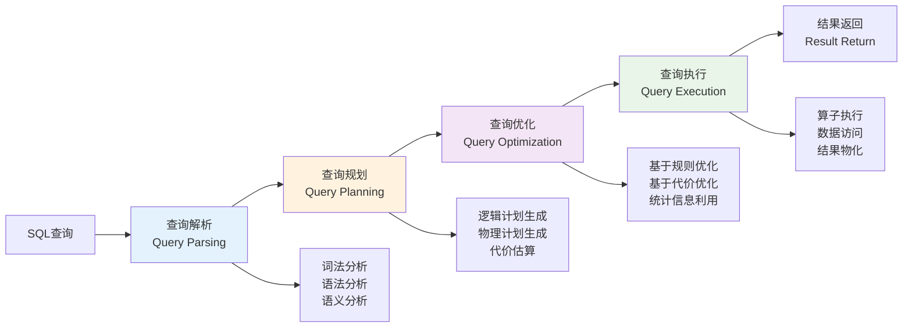

# 第二章 相关背景与理论基础

本章对本文涉及的相关基础理论进行介绍，包括数据库查询处理流程、缓存技术基础、布隆过滤器理论以及机器学习在数据库系统中的应用。

## 2.1 数据库查询处理流程概述

现代关系数据库管理系统的查询处理遵循经典的四阶段流水线架构，这一架构最早由System R项目确立[1]，至今仍是主流数据库系统的基础架构。查询处理流程包括查询解析、查询规划、查询优化和查询执行四个主要阶段。优化器的架构至今基本延续Goetz Graefe等提出的Volcano[82]和Cascades[81]的架构风格。查询解析阶段负责将SQL文本转换为内部表示形式，通过词法分析将SQL文本分解为标记序列，语法分析根据SQL语法规则构建抽象语法树，语义分析验证对象存在性并进行类型检查。根据Graefe在查询评估技术综述中的分析[27]，详细分析各类查询执行算子（如排序、连接、聚合等）的开销，强调了算法优化的重要性。郝小卫等验证了基于逻辑规则的语义缓存查询处理优化的有效性[74]。

查询规划阶段将抽象语法树转换为可执行的查询计划，包括逻辑计划生成、物理计划生成和代价估算三个步骤。查询优化是数据库系统的核心技术之一，负责选择最优的执行策略，主要采用基于规则的优化和基于代价的优化两种方法。查询执行阶段负责实际的数据处理和结果生成，通过算子执行、数据访问和结果物化完成最终的查询结果输出。

**图2.1 数据库查询处理流水线架构**
DuckDB是一款定位于本地分析的OLAP数据库，具有灵活扩展性[65]，针对固态存储特性优化了外部哈希聚合算法，显著提升了大规模数据分析的I/O效率[66]，使用了一种高吞吐量的排序算法，充分利用现代硬件并行性以加速分析查询中的排序操作[67]。该论文首次正式介绍了DuckDB作为一个嵌入式分析型数据库的系统设计与初始实现[70]，Raasveldt M提倡将数据库嵌入到数据科学工具当中[69]，借助WebAssembly的能力，使高性能OLAP能力可直接在浏览器中运行[68]。本文的所有算法及实现基于DuckDB v1.3.2版本进行开发和验证。
在查询处理性能瓶颈方面，主要存在计算密集型、I/O密集型和内存访问三类瓶颈。计算密集型瓶颈包括复杂表达式计算、排序聚合操作和连接操作的高计算开销。I/O密集型瓶颈主要体现在磁盘访问延迟、缓存未命中和网络传输开销。内存访问瓶颈则涉及内存带宽限制和复杂数据结构的管理开销。现代查询处理优化技术主要包括向量化执行、编译执行和并行执行等技术，这些技术通过批量处理数据、生成优化代码和多线程并行处理来显著提升查询性能。

## 2.2 缓存技术与智能优化基础

### 2.2.1 数据库缓存系统概述

缓存技术是计算机系统中提高性能的重要手段，其基本原理是利用时间局部性和空间局部性原理，将频繁访问的数据存储在快速存储介质中。现代计算机系统采用多级缓存层次结构，从CPU寄存器到机械硬盘形成了访问时间从纳秒级到毫秒级的存储层次。缓存性能主要通过命中率、未命中率和平均访问时间等指标来衡量[75]，其中命中率$H = \frac{N_{hit}}{N_{total}}$，平均访问时间$T_{avg} = H \times T_{hit} + M \times T_{miss}$。

**图2.2 计算机系统缓存层次结构**

缓存替换策略是缓存系统的核心技术，主要包括最近最少使用（LRU）策略、最不经常使用（LFU）策略和自适应替换缓存（ARC）策略。LRU策略基于时间局部性原理替换最长时间未被访问的数据，实现简单且性能稳定，但无法处理循环访问模式。LFU策略基于访问频率替换访问次数最少的数据，适合处理访问频率差异明显的场景。ARC策略结合了LRU和LFU的优势，通过维护四个LRU链表动态调整两种策略的权重[29]，在时间局部性和频率局部性之间实现自适应平衡。

数据库缓冲池是数据库系统中最重要的缓存组件，通过页面哈希表、空闲页面链表和脏页面链表等数据结构管理内存页面。数据库系统通常采用改进的LRU算法，包括Clock算法、LRU-K算法和2Q算法等，以适应数据库访问模式的特点。分布式缓存系统采用客户端-服务器架构，通过哈希分片、范围分片和一致性哈希等数据分片策略实现负载均衡，并通过最终一致性和强一致性协议保证数据一致性。

### 2.2.2 查询结果缓存机制

查询结果缓存通过缓存查询的最终结果来避免重复的查询执行开销，其架构包括查询解析、缓存查找、查询执行和结果缓存等环节。缓存键生成是查询结果缓存的关键技术，需要生成唯一且稳定的缓存键来标识查询结果。查询标准化过程包括移除注释和多余空白、统一关键字大小写、标准化标识符引用和重排序不影响语义的子句等步骤，确保语义相同的查询能够生成相同的缓存键。

缓存一致性维护是数据库缓存面临的主要挑战，需要在数据更新时保持缓存与底层数据的一致性。基于时间的失效（TTL）策略为每个缓存条目设置生存时间，超时后自动失效，实现简单但可能不够准确。基于依赖的失效策略通过跟踪查询与数据表的依赖关系，在数据更新时失效相关缓存条目，准确性高但实现复杂。依赖关系分析通过遍历查询的抽象语法树来识别查询涉及的数据表，为缓存失效提供依据。

### 2.2.3 机器学习在缓存管理中的应用

随着机器学习技术的发展，智能缓存管理成为提升缓存性能的重要方向。机器学习在缓存管理中的应用主要包括访问模式预测、缓存价值评估和自适应参数调优等方面。访问模式预测通过分析历史访问数据来预测未来的数据访问需求，常用的方法包括时间序列分析和循环神经网络等技术。缓存价值评估通过多维特征分析来评估缓存条目的价值，指导缓存淘汰决策，价值评估模型通常考虑访问频率、数据大小、计算成本等因素。

在线学习算法特别适合缓存系统的动态环境，能够实时适应访问模式的变化[77]。随机梯度下降（SGD）算法通过增量更新模型参数来适应新的访问模式，而Adam算法结合了动量和自适应学习率的优势，在缓存管理中表现出良好的性能。强化学习技术通过与环境交互来学习最优的缓存策略，将缓存管理建模为马尔可夫决策过程，通过奖励机制来优化缓存性能。这些智能技术的应用使得缓存系统能够自动适应不同的工作负载特征，显著提升缓存效率和系统性能。

## 2.3 布隆过滤器理论基础

布隆过滤器（Bloom Filter）是一种空间效率极高的概率性数据结构，由Burton Howard Bloom在1970年提出[9]，用于测试一个元素是否在一个集合中，具有快速查询和低内存占用的特点。布隆过滤器由长度为m的位数组和k个独立的哈希函数组成，通过将元素映射到位数组的多个位置来实现集合成员检测。插入操作将元素通过k个哈希函数映射到k个位置并将对应位设为1，查询操作检查这k个位置是否都为1来判断元素是否可能存在。

布隆过滤器的数学特性决定了其性能表现。设已插入n个元素，某个位仍为0的概率为$(1 - \frac{1}{m})^{kn}$，当m很大时可近似为$e^{-kn/m}$。因此假阳性率为$(1 - e^{-kn/m})^k$。通过数学推导可得最优哈希函数数量$k_{opt} = \frac{m}{n} \ln 2$，最优位数组大小$m = -\frac{n \ln p}{(\ln 2)^2}$，其中p为目标假阳性率。这些公式为布隆过滤器的参数配置提供了理论指导。

为了扩展布隆过滤器的功能，研究者提出了多种变种。计数布隆过滤器使用计数器数组替代位数组，支持删除操作但增加了内存开销。分层布隆过滤器通过多层结构降低假阳性率，总假阳性率为$P_{total} = p^L$，其中L为层数。动态布隆过滤器支持动态扩容以适应数据量变化，在假阳性率超过阈值或负载因子过高时触发扩容。哈希函数的设计对布隆过滤器性能至关重要，需要满足均匀分布性、独立性和计算效率等要求。双重哈希技术通过两个基础哈希函数生成多个哈希值，减少了计算开销，Kirsch和Mitzenmacher证明了其有效性[30]。

## 2.4 机器学习在数据库系统中的应用

随着机器学习技术的快速发展，将机器学习应用于数据库系统已成为一个重要的研究方向。学习型数据库系统能够通过学习历史数据和访问模式来自动优化系统性能，主要应用领域包括查询优化、存储管理和系统调优。在查询优化方面，机器学习技术用于代价估算模型学习、连接顺序智能选择和索引推荐等。在存储管理方面，主要应用于智能缓存管理、数据分区策略优化和压缩算法选择。在系统调优方面，则用于参数自动配置、负载预测和异常检测等。

机器学习[76]模型按学习方式可分为监督学习、无监督学习和强化学习三类。监督学习使用标记的训练数据学习输入输出映射关系，常用算法包括线性回归、决策树、神经网络和支持向量机等。无监督学习从未标记数据中发现隐藏模式，主要包括聚类算法、关联规则挖掘和异常检测等技术。强化学习通过与环境交互学习最优策略，特别适合动态优化场景，在缓存管理中通过智能代理根据系统状态调整缓存策略并根据性能反馈进行学习。

特征工程是机器学习成功应用的关键，需要从原始数据中提取有意义的特征。查询特征提取包括语法特征（查询长度、关键字频率、嵌套深度）、语义特征（表数量、连接类型、聚合函数）和统计特征（数据分布、索引覆盖率、选择性）。系统特征提取涵盖资源使用特征（CPU、内存、I/O使用率）、性能指标特征（响应时间、吞吐量、缓存命中率）和负载特征（查询到达率、访问模式、时间相关性）。

在缓存管理的机器学习应用中[77]，访问模式预测通过时间序列分析和线性回归等技术预测未来数据访问需求。缓存价值评估通过多因素模型$V(item) = \alpha \cdot freq(item) + \beta \cdot recency(item) + \gamma \cdot size(item) + \delta \cdot cost(item)$综合考虑访问频率、最近访问时间、数据大小和重新计算成本等因素。在线学习算法如随机梯度下降和Adam算法能够实时适应访问模式变化，通过增量更新模型参数来优化缓存性能。这些技术的应用使得数据库系统能够自动适应不同工作负载，显著提升系统性能和资源利用效率。

## 2.5 持久化数据库现状与技术难点

### 2.5.1 持久化数据库技术现状

持久化数据库技术作为现代数据管理系统的核心组成部分，经历了从传统磁盘存储到现代混合存储架构的演进过程。传统的持久化方案主要依赖机械硬盘和关系数据库管理系统，通过ACID事务特性保证数据的持久性和一致性。随着硬件技术的发展，特别是固态硬盘(SSD)和持久化内存(PM)技术的成熟，持久化数据库系统面临着新的机遇和挑战[91]。近年来，持久化内存技术的发展为数据库系统带来了新的存储层次，相关研究表明持久化内存在数据库应用中具有巨大潜力[92]。

现代持久化数据库系统呈现出多样化的技术路线。内存数据库如SAP HANA、Redis等通过将数据完全加载到内存中实现极致性能，但面临着数据持久化和系统重启后数据恢复的挑战[93]。NewSQL数据库如CockroachDB、TiDB等通过分布式架构和新型存储引擎，在保证ACID特性的同时实现了水平扩展能力[94]。NoSQL数据库如MongoDB、Cassandra等则通过放宽一致性要求，在特定场景下获得了更好的性能和可扩展性[95]。

持久化存储引擎的发展呈现出从传统的B+树结构向LSM-Tree(Log-Structured Merge-Tree)结构转变的趋势。LSM-Tree通过将随机写转换为顺序写，显著提高了写入性能，特别适合现代SSD存储设备的特性[96]。同时，混合存储架构通过将热数据保存在内存或SSD中，冷数据存储在传统磁盘上，实现了性能和成本的平衡[97]。

### 2.5.2 持久化技术面临的核心难点

**数据一致性与性能的平衡**是持久化数据库面临的首要挑战。传统的ACID事务虽然保证了数据的强一致性，但严格的锁机制和同步写入要求显著影响了系统性能[98]。现代应用对实时性的要求越来越高，如何在保证数据可靠性的前提下最大化系统性能，成为持久化技术发展的核心问题。异步写入、批量提交、多版本并发控制等技术虽然能够提高性能，但也增加了数据一致性管理的复杂性[99]。

**存储介质异构化带来的管理复杂性**是另一个重要挑战。现代数据库系统通常需要同时管理内存、SSD、机械硬盘等多种存储介质，每种介质都有其独特的性能特征和访问模式[100]。如何根据数据的访问频率、重要性和生命周期智能地选择存储介质，以及如何在不同介质之间高效地迁移数据，都需要复杂的算法和策略支持。存储介质的故障模式也各不相同，需要针对性的容错和恢复机制[101]。

**大规模数据的持久化效率**问题随着数据量的爆炸式增长而日益突出。传统的持久化方案在面对TB甚至PB级数据时，往往出现性能瓶颈[102]。数据的序列化和反序列化开销、大文件的I/O延迟、索引维护的复杂性等都成为制约系统性能的关键因素。如何设计高效的数据格式、优化I/O访问模式、实现增量持久化等技术问题，都需要深入的研究和创新[103]。

**分布式环境下的持久化一致性**是现代数据库系统必须解决的复杂问题。在分布式系统中，数据通常分布在多个节点上，如何保证所有节点上数据的一致性，特别是在网络分区、节点故障等异常情况下的数据一致性，是一个极具挑战性的问题[104]。CAP定理表明，在分布式系统中无法同时满足一致性、可用性和分区容错性，如何在这三者之间做出合适的权衡，需要根据具体的应用场景进行精心设计[105]。

### 2.5.3 新兴持久化技术发展趋势

**持久化内存技术**的发展为数据库持久化带来了新的可能性。Intel Optane、三星Z-NAND等持久化内存技术结合了内存的高速访问特性和传统存储的非易失性特点，为数据库系统提供了新的存储层次[106]。基于持久化内存的数据库系统可以实现接近内存速度的持久化操作，大幅减少传统磁盘I/O的延迟[107]。然而，持久化内存的编程模型、一致性保证、错误处理等方面都与传统存储有显著差异，需要重新设计数据库的存储引擎和事务处理机制[108]。

**智能化持久化策略**通过机器学习和人工智能技术，实现数据持久化策略的自动优化[109]。通过分析数据的访问模式、生命周期、重要性等特征，智能化系统可以自动选择最优的存储介质、持久化时机和数据格式[110]。预测性的数据迁移、自适应的压缩策略、智能化的缓存管理等技术，都有望显著提高持久化系统的效率和可靠性[111]。

**云原生持久化架构**适应了现代应用向云端迁移的趋势。云原生数据库通过容器化、微服务化的架构设计，实现了存储和计算的分离，提供了更好的弹性扩展能力[112]。对象存储、分布式文件系统等云存储服务为数据库持久化提供了新的基础设施[113]。然而，云环境的网络延迟、数据安全、成本控制等问题也给持久化技术带来了新的挑战[114]。

## 2.6 本章小结

本章从理论基础入手，系统性地分析了数据库查询处理与缓存管理的相关知识，为后续研究和优化奠定了理论基础。首先，概述了数据库查询处理的整体流程及其关键机制，明确了查询性能的核心影响因素。接着，详细介绍了缓存技术的基本原理和层次结构，以及数据库缓存系统的架构设计。然后，深入分析了布隆过滤器的数学原理和优化技术，为高效过滤机制的设计提供了理论支撑。随后，探讨了机器学习在数据库系统中的应用前景，为智能缓存管理提供了算法基础。最后，分析了持久化数据库技术的现状与发展趋势，识别了数据一致性与性能平衡、存储介质异构化管理、大规模数据持久化效率、分布式一致性等核心技术难点，为本文的持久化存储技术研究提供了重要的理论指导。

通过对这些理论基础的深入分析，为本文提出的动态缓存加速技术奠定了坚实的理论基础，也为相关领域的进一步研究提供了重要的参考价值。