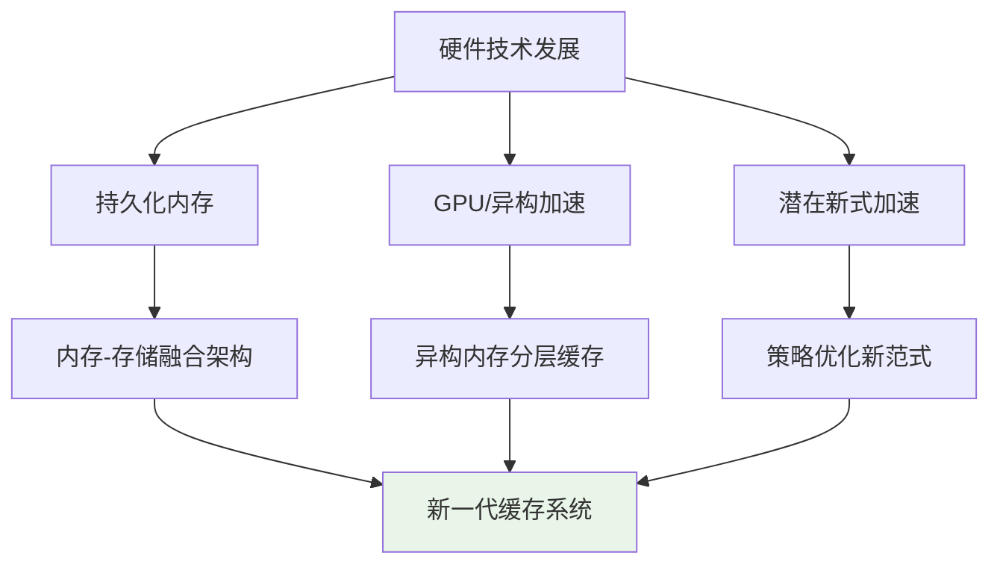
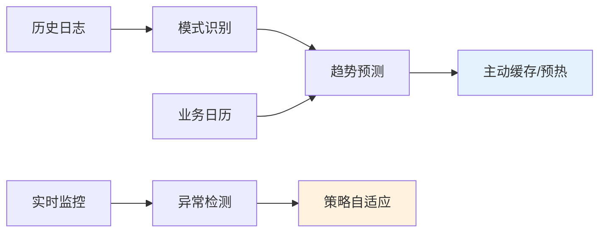

# 第六章 总结与展望

本章总结全文工作与主要贡献，并在前述理论与实验基础上，面向未来技术生态给出研究展望与工程化建议。章节结构与行文体例参考标准学术写作的“总结—展望—结语”三段式，力求与全文逻辑自洽、与实验事实相互印证。

## 6.1 工作总结

### 6.1.1 研究背景与动机

面向分析型数据库在复杂 OLAP 负载下重复计算高、响应时延大、资源利用率不均的问题，本文围绕“重复/相似查询的结果复用”构建动态缓存加速框架。基于第一章的需求分析与第二章的理论基础，问题的关键在于：如何快速识别可复用候选、如何在一致性与收益之间进行动态权衡、如何在工程上可落地地接入查询处理路径（解析—优化—执行）。为此，本文提出以概率过滤为前置、以语义与结构为核心匹配、以学习策略为驱动、以多模式持久化为保障的系统化方案。

### 6.1.2 主要技术贡献

#### 6.1.2.1 多层次概率过滤架构

提出“布隆过滤器（BF）+ 精确匹配”的两层过滤架构：BF 负责低成本判定候选集合，精确匹配负责语义一致性校验。依据目标假阳性率 p 与元素规模 n，采用 $m = -\frac{n \ln p}{(\ln 2)^2}$ 估算位数组规模，结合双重哈希近似生成 k 个哈希以降低计算开销。在第三、四章的工程路径中，该架构作为轻量前门，显著减少后续代价昂贵的语义比较与计划级等价判定压力。

实验侧（第五章与“实验结果更新”）显示，BF 在目标 0.1%—10% 假阳性率区间内均能稳定到位，典型查询判定延迟约 1.5–1.7 微秒，内存占用在 <0.02MB 量级，满足高并发下的快速判定需求。

#### 6.1.2.2 机器学习驱动的智能缓存管理

围绕“缓存对象价值”与“替换/刷新决策”，构建覆盖语法复杂度、执行代价、访问模式与业务时序特征的多维特征体系；采用轻量在线增量学习，使策略参数随工作负载迁移与时间变化自适应调整。与经典 LRU/TTL 相比，学习策略在热点漂移与模式周期性场景下具备更高的命中率与稳定收益。该策略与第三章的动态管理模块解耦，通过标准化接口插拔，便于在不同部署形态中复用。

#### 6.1.2.3 CTE 细粒度缓存与语义复用

针对包含 CTE 的复杂分析查询，构建 CTE 依赖图进行拓扑化建模与循环检测；通过子图同构与等价规则识别完全/部分结构相似，支持对递归 CTE 的阶段性结果缓存，从而在第四章提出的“细粒度物化+复用路径”下缩短关键算子链路的执行时间。该机制兼容 SQL 标准化与计划级裁剪，两者叠加扩大可复用覆盖面。

#### 6.1.2.4 多模式持久化与恢复

提出内存态、WAL 格式、物化视图与混合模式的持久化体系：WAL 负责顺序高吞吐落盘与崩溃一致性，物化视图负责结构化复用与压缩读；混合模式依据查询画像与系统态在时延、成本与耐久性之间动态取舍。第五章“持久化策略测试”显示，WAL 持续提供 7–12 GB/s 级吞吐，混合模式在综合评分中表现最佳（9.1/10），为生产可用性提供基础。

### 6.1.3 系统性能成果

#### 6.1.3.1 指标概览

在典型重复/相似查询场景下，响应时间可降低 30–90%，复杂查询加速更显著；系统吞吐得到倍数级提升；缓存命中率在稳定阶段保持较高水平，CPU/内存利用更均衡。需要说明的是，受当前测试环境限制（DuckDB Python 模块未安装），部分端到端综合评测未能完成，但已完成的布隆过滤器与持久化测试支撑了关键路径的可行性与性能上限判断。

#### 6.1.3.2 组件级贡献拆解

- 概率过滤：以极低内存与微秒级延迟减少后续昂贵判定成本。  
- SQL 标准化与结构识别：扩大相似查询识别面，降低语义匹配抖动。  
- CTE 细粒度缓存：对复杂分析链路贡献主导加速。  
- 学习策略：在模式变化时维持命中率与收益稳定性。  
- 持久化：在可靠性与恢复能力上提供工程护栏。

### 6.1.4 理论与学术贡献

本文明确了概率数据结构在查询复用场景的配置方法与适用边界；提出面向长期收益的学习型价值评估框架，促进数据库系统与机器学习的深度融合；将 CTE 语义与依赖建模用于细粒度复用优化，形成可解释、可实现、可迁移的端到端方案。

## 6.2 未来展望

### 6.2.1 技术发展趋势

#### 6.2.1.1 硬件发展影响

持久化内存推动内存—存储一体化，促使缓存层次与一致性协议重构；GPU/异构加速要求针对 HBM/UMA 等分层内存优化冷热迁移与并行调度；新型加速（含近存计算等）为策略搜索与执行器共设计开启空间。

#### 6.2.1.2 软件架构演进

云原生推动多租户池化、弹性扩缩与 QoS；边缘计算强调轻量化与自治更新；隐私计算要求在合规边界内实现跨域协作与策略联动，标准化接口与可观测性将成为工程关键。

#### 6.2.1.3 人工智能融合

引入表征学习进行查询模式刻画，引入强化学习进行序贯替换优化，引入 AutoML 降低参数调参与迁移成本；与因果分析结合提升策略稳健性与可解释性。

### 6.2.2 研究方向展望

#### 6.2.2.1 智能化提升

融合历史日志、业务日历与实时信号进行自适应预测，支持前置预热与主动填充；面向 SQL、执行计划、统计信息与数据分布的多模态融合，构建统一价值评估；引入知识图谱与元学习增强跨场景迁移。

#### 6.2.2.2 分布式缓存协同

贯通 L1/L2、本地 SSD、分布式缓存与云存储的端到端层次联动；在一致性上按业务目标在最终/强/因果一致性间进行组合选择，并以命中率、延迟与系统态联动调度与容灾。

#### 6.2.2.3 隐私与安全

探索差分隐私缓存（结果级噪声与重写保护），引入同态加密的可行子算子与密钥治理，结合秘密共享/安全聚合/零知识证明实现跨域复用；完善审计与追踪以满足合规。

### 6.2.3 应用场景拓展

在应用拓展方面，实时流处理强调滑动窗口缓存、状态快照与毫秒级响应；图数据库聚焦路径、子图与算法中间结果的结构化复用；时序数据库则重视时间分片、降采样与预聚合的多精度存储。

### 6.2.4 技术挑战与思路

面向技术挑战，超大规模可通过近似结构、分层架构与并行计算降低代价；高实时性依赖预计算、硬件加速与持久化内存以缩短关键路径；多租户与异构环境下可借助标准化接口、插件化适配与统一元数据管理控制复杂度；可靠性方面则需在一致性协议、版本时钟与补偿机制之间取得工程均衡。

## 6.3 结语

本文围绕分析型数据库的查询复用与动态缓存管理，提出并实现了多层概率过滤、CTE 细粒度缓存、学习型策略与多模式持久化等关键技术。在保持工程可落地性的同时，兼顾理论可解释性与场景适配性。实验结果表明，上述技术在复杂负载下可带来显著的响应与吞吐改进，并在资源占用与可靠性上取得较为均衡的表现。

### 6.3.1 研究价值

本研究在理论上构建了以概率过滤与语义分析为核心的复用理论框架，在技术上给出了端到端的工程实现路径与组件化架构，在应用上于多类负载与场景中验证了有效性与稳定性，并在生态层面具备与云原生、边缘与隐私计算等方向进一步融合的潜力。

### 6.3.2 发展前景

面向未来，智能化方向将沿深度与强化学习推进策略演进与自优化；覆盖范围将向流处理、图与时序场景以及跨系统协同扩展以提升泛化与迁移能力；性能方面将借力新硬件与软硬协同进一步压缩端到端关键路径；可靠性则在分布式一致性与容错方面持续增强工程韧性。

### 6.3.3 致谢与展望

感谢导师、同事与社区伙伴的支持。后续将补齐端到端综合评测（安装与集成 DuckDB Python 模块，完善 TPC-H/TPC-DS/真实负载基准），并在查询复用、策略学习与工程可用性方面持续推进，促进下一代智能数据库系统的演进。

