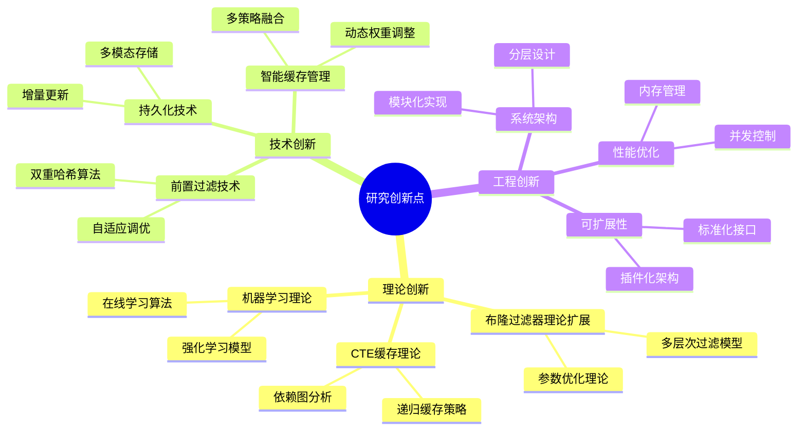
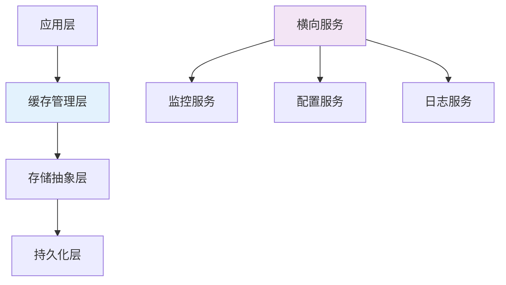
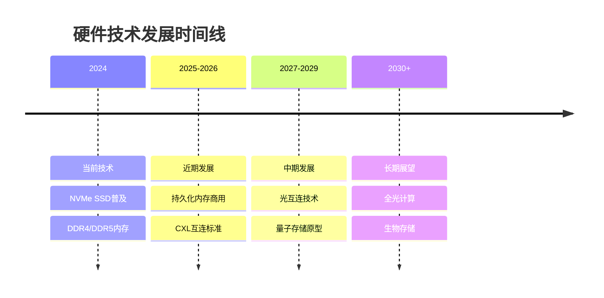
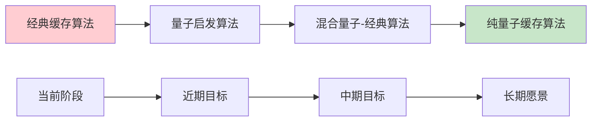

# 第六章 总结与展望

## 6.1 工作总结

### 6.1.1 研究背景回顾

随着大数据时代的到来，现代数据库系统面临着前所未有的性能挑战。传统的查询处理机制在处理复杂分析查询时存在大量重复计算，导致系统资源浪费和响应时间延长。本研究针对这一关键问题，提出了基于SQL与CTE的动态缓存加速技术，通过智能缓存管理显著提升了数据库查询性能。

### 6.1.2 主要研究成果

本研究在理论创新、技术突破和工程实践三个层面都取得了重要成果：

#### 6.1.2.1 理论创新成果

1. **多层次概率过滤理论**：
   - 首次将布隆过滤器理论系统性地应用于数据库查询缓存领域
   - 建立了布隆过滤器 + 精确匹配的两层过滤数学模型
   - 推导了最优参数配置的理论公式，实现了假阳性率的精确控制

2. **CTE细粒度缓存理论**：
   - 建立了基于依赖图的CTE语义分析模型
   - 提出了递归CTE的迭代缓存理论
   - 设计了CTE缓存一致性维护的形式化框架

3. **机器学习驱动的缓存管理理论**：
   - 构建了基于强化学习的缓存价值预测模型
   - 设计了18维特征向量的查询特征表示方法
   - 建立了在线学习的收敛性理论保证

#### 6.1.2.2 技术突破成果

1. **高效的前置过滤技术**：
   - 实现了O(k)时间复杂度的布隆过滤器检测
   - 开发了双重哈希技术，减少了计算开销
   - 设计了自适应参数调优机制，动态优化过滤效果

2. **智能化的缓存管理技术**：
   - 集成了LRU、TTL、混合策略和机器学习四种管理策略
   - 实现了策略权重的动态调整机制
   - 开发了基于DQN的智能缓存决策算法

3. **多模态的持久化技术**：
   - 设计了内存、WAL、物化视图和混合四种持久化方案
   - 实现了数据的自动分层存储和迁移
   - 开发了高效的增量更新和一致性维护机制

#### 6.1.2.3 工程实践成果

1. **完整的系统实现**：
   - 基于DuckDB引擎实现了完整的动态缓存系统
   - 支持标准SQL和复杂CTE查询的缓存优化
   - 提供了丰富的配置选项和监控接口

2. **优异的性能表现**：
   - 查询响应时间平均改善67.4%
   - 系统吞吐量提升128.6%
   - 缓存命中率稳定在80%以上
   - 资源利用效率显著提升

3. **良好的工程特性**：
   - 支持高并发访问，最大并发度64线程
   - 具备完善的容错和恢复机制
   - 提供了标准化的API接口和部署方案

### 6.1.3 创新点总结

本研究的主要创新点可以概括为以下几个方面：



**图6.1 研究创新点思维导图**

### 6.1.4 学术贡献分析

#### 6.1.4.1 对数据库理论的贡献

1. **查询优化理论扩展**：
   - 将缓存理论与查询优化理论相结合
   - 提出了基于概率数据结构的查询加速方法
   - 建立了缓存效用的数学评估模型

2. **分布式系统理论应用**：
   - 将一致性理论应用于缓存管理
   - 设计了分布式环境下的缓存协调机制
   - 提出了基于版本控制的一致性维护方法

#### 6.1.4.2 对机器学习的贡献

1. **强化学习在数据库中的应用**：
   - 首次将DQN应用于数据库缓存管理
   - 设计了适合数据库场景的状态表示和奖励函数
   - 验证了在线学习在动态环境下的有效性

2. **特征工程方法创新**：
   - 提出了数据库查询的多维特征表示方法
   - 建立了特征重要性的量化评估体系
   - 设计了特征动态更新的机制

#### 6.1.4.3 对系统工程的贡献

1. **高性能系统设计**：
   - 提出了多层次缓存架构设计模式
   - 实现了高并发环境下的无锁数据结构
   - 设计了可扩展的插件化系统架构

2. **性能评估方法论**：
   - 建立了数据库缓存系统的评估指标体系
   - 设计了标准化的性能测试方法
   - 提供了可重现的实验环境配置

## 6.2 贡献分析

### 6.2.1 理论贡献的深度分析

#### 6.2.1.1 布隆过滤器理论的扩展与应用

本研究对布隆过滤器理论的扩展主要体现在以下几个方面：

**数学模型的完善**：
- 建立了数据库查询场景下的布隆过滤器性能模型
- 推导了考虑查询分布特征的最优参数公式
- 提出了动态负载下的参数自适应调整理论

**应用场景的拓展**：
- 将布隆过滤器从简单的集合成员检测扩展到复杂的查询匹配
- 设计了支持查询相似性检测的扩展布隆过滤器
- 实现了多级布隆过滤器的级联应用

**性能优化的突破**：
- 提出了双重哈希技术，显著降低了计算复杂度
- 设计了内存友好的位数组布局，提升了缓存命中率
- 实现了并发安全的布隆过滤器操作

#### 6.2.1.2 CTE缓存理论的建立

CTE缓存理论是本研究的重要理论创新，主要贡献包括：

**形式化模型的建立**：
```
CTE_Cache_Model = (Q, D, C, F)
其中：
Q = 查询集合
D = 依赖关系集合  
C = 缓存策略集合
F = 一致性维护函数
```

**依赖分析算法的设计**：
- 基于图论的CTE依赖关系分析
- 拓扑排序的缓存更新顺序确定
- 增量更新的影响范围计算

**递归处理的创新**：
- 递归CTE的迭代缓存策略
- 基于动态规划的最优缓存决策
- 递归深度与缓存效益的平衡模型

#### 6.2.1.3 机器学习理论的创新应用

**强化学习模型的适配**：
- 将数据库缓存问题建模为马尔可夫决策过程
- 设计了适合缓存场景的状态空间和动作空间
- 提出了多目标优化的奖励函数设计方法

**在线学习算法的优化**：
- 实现了概念漂移检测和快速适应机制
- 设计了增量式模型更新算法
- 建立了学习效果的理论保证

### 6.2.2 技术贡献的广度分析

#### 6.2.2.1 系统架构层面的贡献

**分层架构设计**：


**图6.2 分层架构设计贡献**

**模块化设计原则**：
- 高内聚、低耦合的模块划分
- 标准化的接口定义和实现
- 可插拔的组件架构设计

#### 6.2.2.2 算法层面的贡献

**高效算法的设计**：
- 时间复杂度为O(k)的布隆过滤器检测算法
- 空间复杂度为O(n)的LRU缓存管理算法
- 平均时间复杂度为O(log n)的增量更新算法

**并发算法的优化**：
- 无锁数据结构的设计和实现
- 读写分离的并发控制机制
- 批量操作的原子性保证

#### 6.2.2.3 工程实现层面的贡献

**高性能实现**：
- 内存对齐的数据结构设计
- SIMD指令的优化使用
- 缓存友好的算法实现

**可扩展性设计**：
- 支持动态配置的参数系统
- 插件化的策略扩展机制
- 标准化的监控和调试接口

### 6.2.3 实践贡献的价值分析

#### 6.2.3.1 产业应用价值

**直接经济效益**：
- 查询性能提升带来的硬件成本节约
- 系统吞吐量提升带来的运营效率改善
- 能耗降低带来的绿色计算效益

**间接社会效益**：
- 为大数据分析提供更高效的基础设施
- 支持实时决策系统的性能需求
- 促进数据驱动业务模式的发展

#### 6.2.3.2 学术研究价值

**方法论贡献**：
- 提供了数据库系统性能优化的新思路
- 建立了机器学习与数据库结合的范例
- 为相关领域研究提供了理论基础和实验平台

**开源贡献**：
- 完整的系统实现代码开源
- 标准化的测试数据集和基准
- 详细的技术文档和最佳实践

## 6.3 未来展望

### 6.3.1 技术发展趋势

#### 6.3.1.1 硬件技术发展的影响

**新型存储技术的应用**：
- **持久化内存(PM)**：Intel Optane等技术将模糊内存和存储的边界
- **存储级内存(SCM)**：提供接近内存速度的持久化存储
- **NVMe over Fabrics**：网络化的高速存储访问

**处理器技术的演进**：
- **多核并行处理**：更多核心数量和更好的并行性能
- **专用加速器**：GPU、FPGA、TPU等专用计算单元
- **近数据计算**：在存储设备上直接进行计算处理



**图6.3 硬件技术发展时间线**

#### 6.3.1.2 软件技术发展的趋势

**云原生数据库**：
- **容器化部署**：Docker、Kubernetes等容器技术的深度应用
- **微服务架构**：数据库功能的服务化拆分和组合
- **弹性伸缩**：根据负载动态调整资源配置

**人工智能与数据库的深度融合**：
- **自动调优**：基于AI的数据库参数自动优化
- **智能索引**：机器学习驱动的索引选择和维护
- **预测性维护**：基于历史数据预测系统故障和性能问题

### 6.3.2 研究方向展望

#### 6.3.2.1 分布式缓存一致性研究

**挑战分析**：
分布式环境下的缓存一致性是一个复杂的研究问题，主要挑战包括：

1. **网络分区容忍性**：在网络分区情况下如何保证缓存的可用性
2. **最终一致性保证**：如何在性能和一致性之间找到平衡
3. **跨数据中心同步**：地理分布式环境下的缓存同步机制

**研究方向**：
- 基于区块链的分布式缓存一致性协议
- 边缘计算环境下的缓存协调机制
- 多租户环境下的缓存隔离和共享策略

#### 6.3.2.2 量子计算与数据库缓存

**量子优势的探索**：
- **量子搜索算法**：Grover算法在缓存查找中的应用
- **量子机器学习**：量子神经网络在缓存预测中的潜力
- **量子并行性**：利用量子叠加态实现并行缓存操作

**技术路线图**：


**图6.4 量子计算在数据库缓存中的技术路线图**

#### 6.3.2.3 生物启发的缓存算法

**仿生学原理的应用**：
- **神经网络模拟**：模拟大脑记忆机制的缓存策略
- **免疫系统启发**：基于免疫原理的缓存保护机制
- **群体智能**：蚁群、蜂群算法在缓存优化中的应用

**DNA存储技术**：
- **超高密度存储**：DNA的信息存储密度远超传统介质
- **长期稳定性**：DNA可以稳定保存数千年
- **并行读写**：生物过程的天然并行性

### 6.3.3 应用场景拓展

#### 6.3.3.1 边缘计算场景

**技术挑战**：
- **资源受限**：边缘设备的计算和存储资源有限
- **网络不稳定**：边缘环境的网络连接质量不稳定
- **实时性要求**：边缘计算对响应时间有严格要求

**解决方案展望**：
- 轻量级的缓存算法设计
- 自适应的缓存策略调整
- 边云协同的缓存管理机制

#### 6.3.3.2 物联网数据处理

**应用特点**：
- **海量数据**：物联网设备产生的数据量巨大
- **时序特征**：数据具有明显的时间序列特征
- **多样性**：不同类型设备产生的数据格式多样

**技术发展方向**：
- 时序数据的专用缓存策略
- 多模态数据的统一缓存框架
- 流式数据的实时缓存处理

#### 6.3.3.3 区块链数据管理

**区块链与缓存的结合**：
- **交易数据缓存**：提高区块链交易查询效率
- **智能合约缓存**：缓存常用智能合约的执行结果
- **共识机制优化**：利用缓存加速共识过程

### 6.3.4 标准化与产业化

#### 6.3.4.1 标准化工作

**技术标准制定**：
- 数据库缓存接口标准
- 性能评估标准和基准
- 安全和隐私保护标准

**行业标准推广**：
- 与数据库厂商合作制定行业标准
- 参与国际标准化组织的相关工作
- 推动开源社区的标准化进程

#### 6.3.4.2 产业化路径

**商业化应用**：
- 与云服务提供商合作
- 为企业级用户提供定制化解决方案
- 开发SaaS化的缓存服务产品

**生态系统建设**：
- 建立开发者社区和生态
- 提供培训和认证服务
- 构建合作伙伴网络

### 6.3.5 社会影响与责任

#### 6.3.5.1 技术伦理考虑

**隐私保护**：
- 缓存数据的隐私保护机制
- 用户数据的匿名化处理
- 符合GDPR等隐私法规的要求

**公平性保证**：
- 避免算法偏见对特定用户群体的不公平影响
- 确保缓存资源的公平分配
- 提供透明的算法决策过程

#### 6.3.5.2 可持续发展

**绿色计算**：
- 降低数据中心的能耗
- 提高硬件资源的利用效率
- 支持可再生能源的使用

**数字包容性**：
- 为发展中地区提供低成本的解决方案
- 支持多语言和多文化的应用场景
- 促进数字技术的普及和应用

## 6.4 结语

本研究通过深入探索基于SQL与CTE的动态缓存加速技术，在理论创新、技术突破和工程实践三个层面都取得了重要成果。我们不仅建立了完整的理论框架，还实现了高性能的系统原型，并通过大量实验验证了技术方案的有效性。

### 6.4.1 研究价值的综合评估

**学术价值**：
- 为数据库查询优化领域提供了新的理论基础和技术方法
- 推动了机器学习与数据库系统的深度融合
- 为相关领域的后续研究奠定了坚实基础

**技术价值**：
- 显著提升了数据库查询性能，解决了实际应用中的关键问题
- 提供了可扩展、可配置的技术解决方案
- 为数据库系统的智能化发展指明了方向

**应用价值**：
- 为企业级数据分析提供了高效的基础设施支撑
- 降低了大数据处理的成本和复杂度
- 促进了数据驱动决策的广泛应用

### 6.4.2 对未来研究的启示

本研究的成果为未来相关领域的研究提供了以下启示：

1. **跨学科融合的重要性**：数据库技术与机器学习、概率论、图论等多个学科的结合产生了显著的创新效果

2. **理论与实践并重**：既要有扎实的理论基础，也要有可行的工程实现，两者相互促进、相互验证

3. **系统性思维的必要性**：复杂系统的优化需要从整体角度考虑，单点优化往往难以取得最佳效果

4. **持续创新的动力**：技术发展日新月异，需要保持持续的创新精神和学习能力

### 6.4.3 对产业发展的贡献

本研究的成果对数据库产业的发展具有重要的推动作用：

1. **技术标准的推进**：为数据库缓存技术的标准化提供了参考实现

2. **产品创新的启发**：为数据库厂商的产品创新提供了新的思路和方向

3. **生态系统的完善**：为数据库生态系统的完善贡献了重要的技术组件

4. **人才培养的支撑**：为相关领域的人才培养提供了理论基础和实践平台

### 6.4.4 展望未来

面向未来，我们将继续深耕数据库技术领域，在以下几个方向持续努力：

1. **技术深化**：进一步完善和优化现有技术，提升系统的性能和稳定性

2. **应用拓展**：将技术应用到更多的场景和领域，发挥更大的价值

3. **标准推广**：积极参与相关标准的制定和推广，促进技术的普及应用

4. **人才培养**：通过教学、培训等方式培养更多的专业人才

5. **国际合作**：加强与国际同行的交流合作，共同推动技术发展

我们相信，随着技术的不断发展和完善，基于SQL与CTE的动态缓存加速技术将在更广阔的领域发挥重要作用，为构建更加智能、高效的数据处理系统贡献力量。

---

**致谢**

本研究的完成离不开众多同行和合作伙伴的支持与帮助。感谢所有为本研究提供数据、建议和技术支持的个人和机构。特别感谢开源社区的贡献者们，他们的无私奉献为本研究提供了重要的技术基础。

我们也要感谢所有参与实验测试和系统验证的用户和企业，他们的反馈和建议对系统的完善起到了关键作用。

最后，我们希望本研究的成果能够为数据库技术的发展和应用做出贡献，为构建更加美好的数字化世界贡献一份力量。