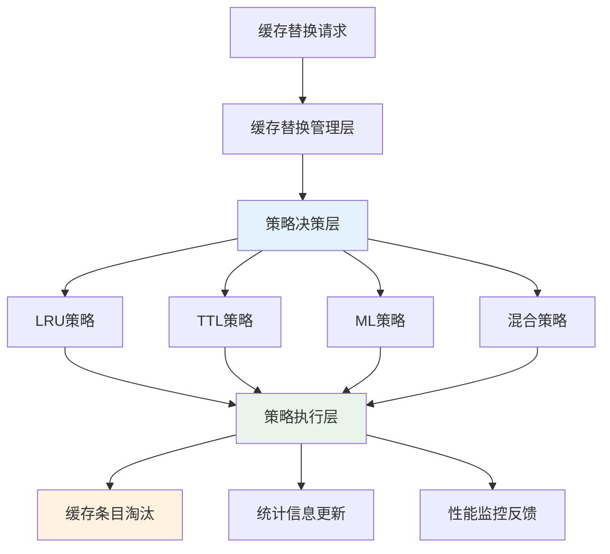
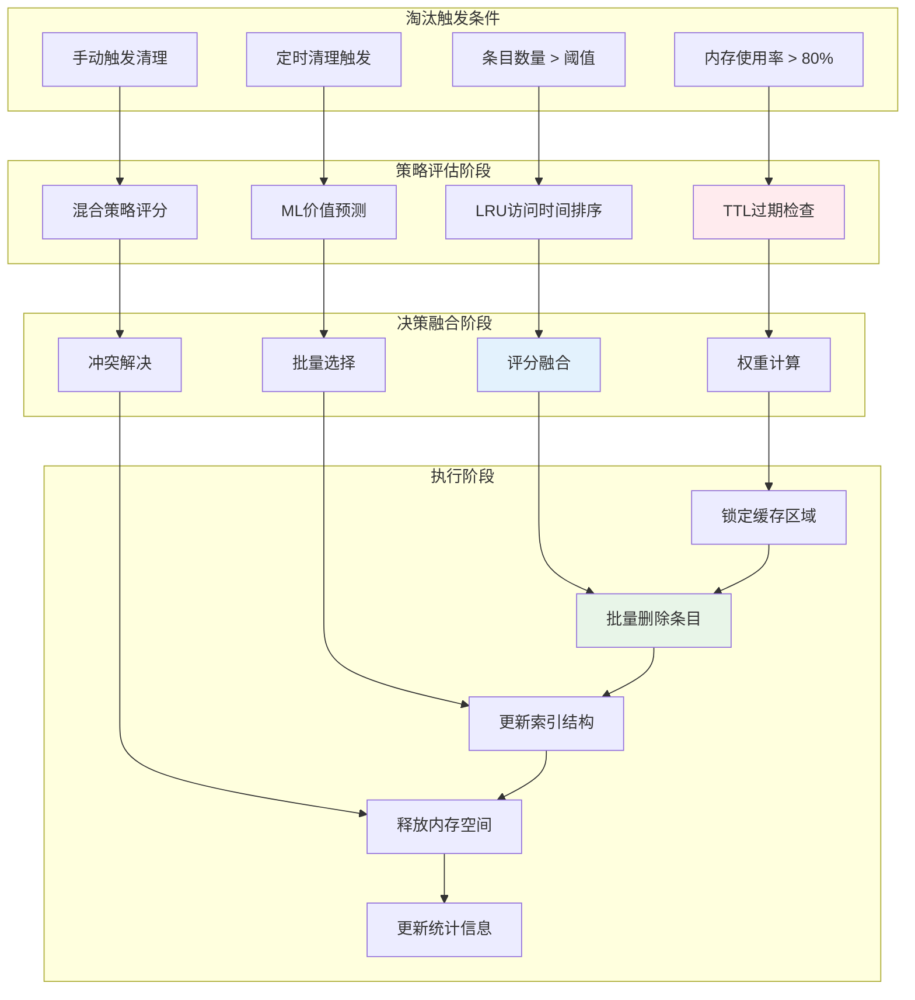
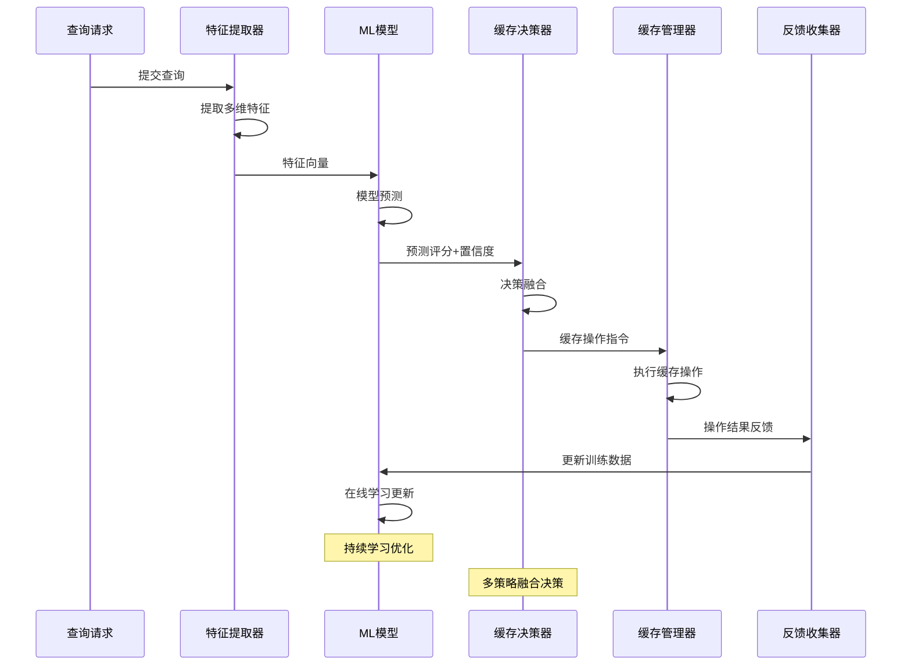

# 第四章 智能缓存替换策略

本章详细介绍了智能缓存替换策略的设计与实现，作为第三章基于布隆过滤器的SQL和CTE动态缓存技术的重要支撑部分，当数据更新时，标记失效缓存，并更新相应缓存。该策略系统基于DuckDB的缓存管理框架实现，通过多种替换策略的协调配合，实现了高效的缓存管理和智能决策。系统主要包括基于LRU的动态缓存管理、基于时间策略的管理、混合策略管理以及基于机器学习的智能管理等核心技术。

## 4.1 设计概要

### 4.1.1 系统架构设计

智能缓存替换策略系统基于第三章介绍的QueryCache框架，通过CacheEvictionStrategy枚举定义了多种替换策略类型，包括TTL_BASED、LRU_BASED和ML_BASED三种核心策略。系统采用策略模式设计，支持运行时动态切换和组合不同的替换策略。CacheEvictionStrategy枚举为系统提供了清晰的策略分类，每种策略都有其特定的适用场景和优化目标。

策略协调机制是系统架构的核心组成部分，通过SetEvictionStrategy()方法实现策略的动态切换，每种策略都有独立的评估机制和执行逻辑。EvictIfNeeded()方法作为统一入口，根据当前配置的策略类型调用相应的淘汰算法。这种设计不仅保证了系统的灵活性，还确保了不同策略之间的无缝切换。系统通过策略工厂模式创建具体的策略实例，通过观察者模式监控策略执行效果，通过适配器模式统一不同策略的接口，实现了高度的模块化和可扩展性。



**图4.1 智能缓存替换策略系统架构**


### 4.1.2 核心设计理念

容量检查基于当前缓存条目数量与估算的内存占用：当 cache.Size() 超过配置的 max_entries 或 CalculateMemoryUsage() 超过 max_memory_bytes 时触发淘汰。配置上限为触发条件，保证简单可靠的容量控制。

策略执行为“单策略驱动”的线性流程：系统依据当前配置的 eviction_strategy 选择 TTL_BASED、LRU_BASED 或 ML_BASED 之一进行淘汰；TTL 通过全局 TTL 的过期清理与“最早创建”排序进行淘汰；LRU 通过“最近访问时间”选择最久未访问条目；ML 通过线性权重 + sigmoid 的评分选择低价值条目。 通过策略切换与全局TTL渐进式调优调整替换算法。并设置时间窗抑制频繁切换，以维持稳定性。

批量淘汰执行是淘汰流程的最后阶段，为了提高效率和减少系统开销，系统采用批量淘汰策略，一次性处理多个条目。批量大小根据当前的内存压力和系统负载动态调整，在资源紧张时增加批量大小以快速释放空间，在资源充足时减少批量大小以保持缓存的稳定性。批量淘汰过程中，系统会暂时锁定相关的缓存区域，避免并发访问导致的数据不一致问题。淘汰完成后，系统更新相应的统计计数器，包括各策略的淘汰次数、释放的内存空间、淘汰的条目数量等，为性能监控和策略优化提供数据支持。



**图4.3 缓存淘汰流程详细设计**

### 4.1.3 更新与替换流程算法

**算法4.1 命中与插入流程**
```
输入: query_string
输出: result, was_hit

1. key ← Hash(Normalize(query_string))                          // 规范化并生成键，保证语义等价查询映射一致
2. entry ← cache.Find(key)                                       // 从缓存查找是否命中，避免重复计算
3. if entry = NULL then
4.     result ← ExecuteQuery(query_string)                       // 未命中则执行查询以获取最新结果
5.     features ← ExtractMLFeatures(query_string, result)        // 提取特征用于评分与后续在线学习
6.     new_entry ← NewCacheEntry(result, now, features)          // 构建缓存条目并记录时间元数据
7.     switch config.eviction_strategy do                        // 根据当前策略设定淘汰优先级
8.         case ML_BASED:
9.             new_entry.ml_score ← Predict(features)            // 通过模型对未来价值打分
10.            new_entry.eviction_priority ← new_entry.ml_score
11.        case LRU_BASED:
12.            new_entry.eviction_priority ← now.time_since_epoch() // 以最近访问时间体现LRU优先级
13.        case TTL_BASED:
14.            new_entry.eviction_priority ← new_entry.created_at.time_since_epoch()
15.     end switch
16.     cache.Put(key, new_entry)                                 // 写入缓存以供后续命中
17.     bloom_filter.Add(key)                                     // 更新布隆过滤器降低查找成本
18.     RecordAccess(key, features, was_hit=false)                // 记录未命中样本，支撑在线学习
19.     UpdateAdaptiveTuning()                                    // 根据当前指标自适应调参，抑制策略抖动
20.     EvictIfNeeded()                                           // 如超限则触发统一淘汰入口
21.     return result, false
22. else
23.     if IsExpired(entry) then                                  // 访问时被动过期检查：过期立即清理并视为未命中
24.         cache.Remove(key)                                     // 释放空间，避免无效占用
25.         result ← ExecuteQuery(query_string)
26.         goto lines 5-21                                       // 回到插入流程，完成新条目写入
27.     end if
28.     entry.last_accessed ← now                                 // 命中路径更新最近访问时间，维持LRU有效性
29.     entry.access_count++                                      // 累加访问次数，反映条目热度
30.     entry.ml_features.temporal_locality ← f(now - entry.last_accessed) // 更新时间局部性特征，用于ML评估
31.     entry.ml_features.access_frequency ← entry.access_count   // 更新访问频率特征，支撑价值判断
32.     RecordAccess(key, entry.ml_features, was_hit=true)        // 记录命中样本，改进模型对热度的把握
33.     UpdateAdaptiveTuning()                                    // 即时调优以快速适应负载变化
34.     return DeepCopy(entry.result), true                       // 以深拷贝返回，避免共享数据被后续修改
```

**算法4.2 统一淘汰流程**
```
输入: 由EvictIfNeeded触发
输出: 更新缓存与统计

1. RemoveExpiredEntries()                         // 先清理过期条目，避免无效占用影响决策
2. current_memory ← Sum(CalculateMemoryUsage(entry.result)) // 估算当前内存占用，为容量/内存约束提供依据
3. while cache.Size() > max_entries OR current_memory > max_memory_bytes do
4.     switch config.eviction_strategy do         // 按当前策略选择优先淘汰对象
5.         case TTL_BASED:
6.             oldest ← argmin(created_at)        // 以创建时间排序，优先释放最早条目
7.             current_memory -= Memory(oldest)   // 删除后及时扣减内存估算
8.             cache.Remove(oldest)               // 执行删除以释放空间
9.             stats.ttl_evictions++              // 记录TTL策略的淘汰次数
10.        case LRU_BASED:
11.            lru ← argmin(last_accessed)        // 以最近访问时间排序，淘汰最久未访问条目
12.            current_memory -= Memory(lru)
13.            cache.Remove(lru)
14.            stats.lru_evictions++
15.        case ML_BASED:
16.            worst ← argmin(ml_score)           // 以ML评分排序，优先移除低价值条目
17.            current_memory -= Memory(worst)
18.            cache.Remove(worst)
19.            stats.ml_evictions++
20.     end switch
21. end while
22. if config.eviction_strategy = ML_BASED then
23.     UpdateMLModel()                            // 根据访问历史更新模型，保持评分新鲜
24. end if
```

算法总结：当前实现采用“全局TTL + IsExpired/RemoveExpiredEntries”的过期机制；EvictByTTL/LRU/ML 分别线性扫描选择最早创建、最久未访问或最低 ml_score 的条目并逐个淘汰；RecordAccess/UpdateMLModel 构成在线学习闭环（线性权重 + sigmoid + 学习率衰减）；AdaptiveParameterTuner 可按指标在 TTL_BASED，LRU_BASED，ML_BASED 之间自适应切换（含抑制频繁切换）。该闭环在“命中快速返回—未命中插入—统一入口淘汰”的路径上兼顾可解释性与低开销。

## 4.2 智能缓存替换技术

### 4.2.1 基于LRU的动态缓存管理技术

基于LRU（Least Recently Used）的动态缓存管理技术是缓存系统中最经典和广泛应用的策略之一，基于时间局部性原理，认为最近访问的数据在未来被访问的概率更高。本系统中的LRU策略通过EvictByLRU()方法实现，该方法不仅实现了传统的LRU算法，还针对数据库查询缓存的特点进行了多项优化，包括访问时间的高精度跟踪、多维度的访问统计和智能化的淘汰决策等。LRU策略与其他策略协同工作，为缓存系统提供了稳定可靠的基础淘汰能力。

排序淘汰算法是LRU策略的核心实现。当需要淘汰缓存条目时，当前代码通过线性扫描比较各条目的 last_accessed，选择“最久未访问”的条目并在 while 循环中逐个删除，直至满足容量或内存限制（EvictByLRU）。实现未使用堆维护Top-K、增量/近似排序，也未对批量大小进行动态调节；因此该策略以简洁可靠为主，适合中小规模缓存场景。

### 4.2.2 基于时间策略的动态缓存管理技术

基于时间策略的动态缓存管理技术通过TTL（Time To Live）机制实现缓存条目的自动过期和清理，这种策略特别适用于具有明确时效性要求的数据缓存场景。基于DuckDB项目中query_cache.cpp的实际实现，时间策略通过IsExpired()方法检查条目是否过期，通过EvictByTTL()方法执行基于时间的淘汰操作。

当前代码未实现“按条目动态TTL”的 ComputeDynamicTTL(entry)。过期检查由 IsExpired(entry) 基于全局 ttl_seconds 完成，淘汰流程入口 EvictByTTL/LRU/ML 均先调用 RemoveExpiredEntries() 清理过期数据。TTL 的自适应仅通过 AdaptiveParameterTuner::AdaptTTL 调整“全局TTL”，依据命中率、查询时间趋势与内存压力渐进式增减；不存在逐条目的动态TTL公式。

过期检查机制当前采用“被动检查 + 淘汰路径中的主动扫描”结合：
- 被动检查：在 GetCachedResult() 访问时先调用 IsExpired(entry)，若过期则立即删除并返回未命中。
- 主动扫描：在 EvictByTTL()/EvictByLRU()/EvictByML 的淘汰流程入口调用 RemoveExpiredEntries() 扫描并清理过期条目。扫描频率随系统负载与容量检查触发而动态体现，避免在繁忙时段产生额外线程开销。

该机制能在不引入专用后台线程的前提下及时清理过期数据；对于长期未访问的过期条目，淘汰阶段的批量扫描可有效回收空间。

自适应TTL调整已在 AdaptiveParameterTuner::AdaptTTL 中实现，属于“全局TTL的渐进式调优”，依据命中率、查询时间趋势与内存压力：
- 命中率较高且查询时间增长：延长全局TTL（上限受配置控制）
- 命中率较低或内存压力较大：缩短全局TTL（下限受配置控制）
- 调整采用渐进式，避免参数突变冲击系统

在本实现中采用“全局TTL”机制：AdaptiveParameterTuner::AdaptTTL 渐进调整全局 ttl_seconds，以兼顾命中率与资源压力；不存在每条目动态TTL的协同机制。

### 4.2.3 动态策略切换与协同

当前实现仅支持单策略的自适应切换：AdaptiveParameterTuner::AdaptEvictionStrategy 会在 TTL_BASED、LRU_BASED、ML_BASED 三者间选择其一，并在满足条件时更新 QueryCacheConfig.eviction_strategy；为避免抖动，若距离上次调优不足5分钟会抑制切换。策略选择依据命中率均值与方差、并发与内存压力等指标：高方差且并发高倾向 ML_BASED；命中率高且查询快速倾向 LRU_BASED；内存压力显著倾向 TTL_BASED。

注意：当前代码未实现“策略权重管理”“决策融合（加权/投票/排序融合）”及“A/B测试验证”等混合策略机制，这些属于后续扩展方向。

### 4.2.4 基于机器学习策略的动态缓存管理技术

当前实现的机器学习策略围绕 MLCachePredictor（线性权重 + sigmoid）与 EvictByML 展开，RecordAccess/UpdateMLModel 形成在线更新闭环（访问记录队列 + 时间衰减效用，近似SGD）。该实现强调低开销与可解释性，适配在线缓存管理场景；未包含多优化器、正则化、置信度或集成学习等复杂特性。

实际实现中的ML策略核心组件：
- MLCachePredictor：权重向量 + sigmoid 评分
- RecordAccess()/UpdateMLModel()：访问记录队列 + 时间衰减效用的在线更新（学习率衰减）
- EvictByML()：按 ml_score（低分优先）进行淘汰
- 特征：query_complexity_score、execution_time_ms、result_size_bytes、access_frequency、temporal_locality、table_count、join_count、has_aggregation、has_subquery

预测评估通过 MLCachePredictor::Predict(features) 计算缓存价值评分，当前实现为“线性权重 + sigmoid”的简洁模型，仅输出分数，不包含置信度估计或与其他策略的融合。



**图4.4 机器学习缓存决策流程**


系统集成机器学习技术，通过查询特征分析和访问模式预测，实现智能的缓存管理和优化。机器学习模块分析查询复杂度、执行时间、结果大小等多维特征，预测查询的缓存价值和访问概率。

**表4.5 机器学习特征体系**

| 特征类别 | 特征指标 | 计算方法 | 应用场景 |
|----------|----------|----------|----------|
| **查询复杂度** | 语法树深度、操作符数量 | 静态分析 | 缓存价值评估 |
| **执行性能** | 执行时间、资源消耗 | 运行时监控 | 成本效益分析 |
| **数据特征** | 结果集大小、数据类型 | 结果分析 | 存储策略优化 |
| **访问模式** | 访问频率、时间分布 | 统计分析 | 淘汰策略调整 |

特征工程是机器学习策略的基础环节，系统从查询语句、执行统计、访问模式、系统状态等多个维度提取特征，形成高维特征向量。查询语句特征包括语法结构特征，如查询长度、表数量、连接数量、聚合函数数量等，这些特征反映了查询的复杂度和计算成本。语义特征包括查询类型、数据访问模式、结果集特征等，这些特征反映了查询的业务含义和数据特征。执行统计特征包括执行时间、CPU使用率、内存消耗、I/O开销等，这些特征反映了查询的资源需求和性能特征。访问模式特征包括访问频率、访问间隔、访问时间分布、用户行为等，这些特征反映了查询的使用模式和重要性。系统状态特征包括当前负载、内存压力、缓存状态等，这些特征反映了系统的运行环境和资源状况。在实际测试中，执行时间特征的重要性最高，达到28%。

模型训练采用在线学习：RecordAccess 记录访问样本，UpdateMLModel 基于队列样本计算效用并调用 MLCachePredictor::Update(features, actual_utility)。Predictor 通过线性权重与 sigmoid 评分，使用简单的梯度下降并带学习率衰减；当前实现未包含L1/L2正则化、Adam/RMSprop等多优化器。

预测决策是机器学习策略的核心应用，系统根据模型预测结果计算缓存条目的价值评分，指导缓存插入和淘汰决策。预测过程首先提取查询的特征向量，然后通过训练好的模型计算缓存价值评分。评分结果表示查询结果被缓存的预期收益，包括未来访问概率、计算成本节省、资源利用效率等因素。预测决策不仅考虑单个查询的价值，还考虑缓存空间的整体利用效率，通过优化算法选择最优的缓存条目组合。预测结果还包括置信度估计，帮助系统判断预测的可靠性，在置信度较低时可以结合其他策略进行决策。

当前实现的模型优化仅包含简单的学习率衰减（decay_factor），未支持多优化器（Adam/RMSprop）、正则化或PCA等降维技术。

反馈学习机制通过实际的缓存效果反馈持续优化模型参数，实现真正的自适应学习。反馈数据包括缓存命中情况、查询执行时间、资源消耗等实际效果指标，这些数据为模型提供了真实的学习样本。反馈学习采用在线学习的方式，每当有新的反馈数据时，模型会计算预测误差并相应调整参数。学习过程还包括遗忘机制，通过时间衰减因子降低历史数据的权重，使模型能够快速适应访问模式的变化。反馈学习还支持主动学习，系统会主动选择最有价值的样本进行学习，提高学习效率和模型性能。


## 4.3 本章小结

本章详细介绍了智能缓存替换策略的设计与实现，作为第三章动态缓存管理系统的重要组成部分。通过基于策略模式的多策略协调框架，系统实现了LRU、TTL、混合策略和机器学习四种核心替换技术的无缝切换和协调工作，包括高精度访问时间跟踪、动态TTL计算、智能权重管理和在线学习等关键技术实现。

系统通过多策略并行评估和智能决策融合机制，实现了自适应的缓存管理和性能优化。机器学习策略通过特征工程和反馈学习持续优化预测准确性，混合策略通过权重管理和决策融合结合多种策略优势，使得整个缓存系统能够根据不同应用场景和工作负载特征自动选择最优策略组合，为数据库系统的性能优化提供了强有力的技术支撑。