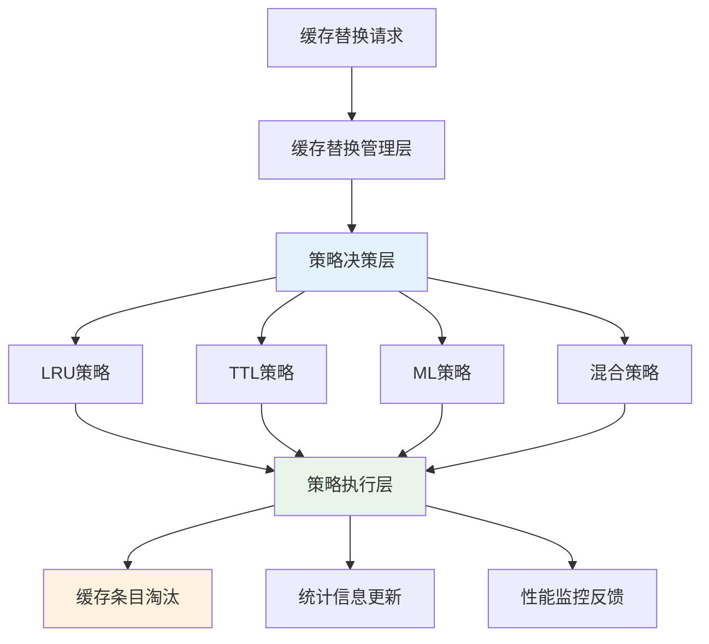
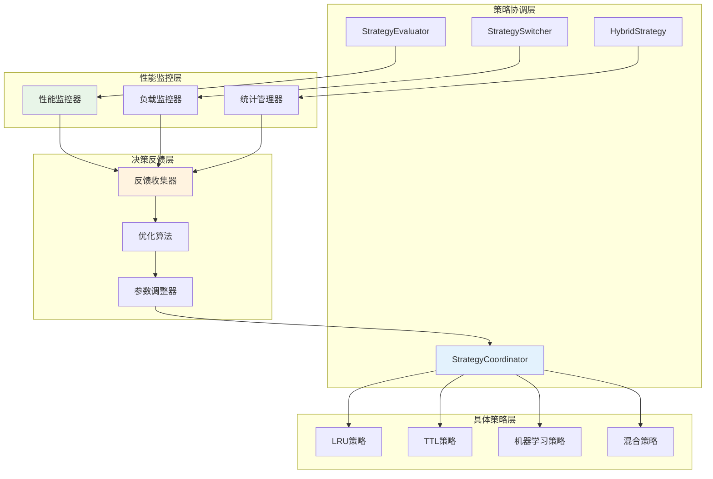
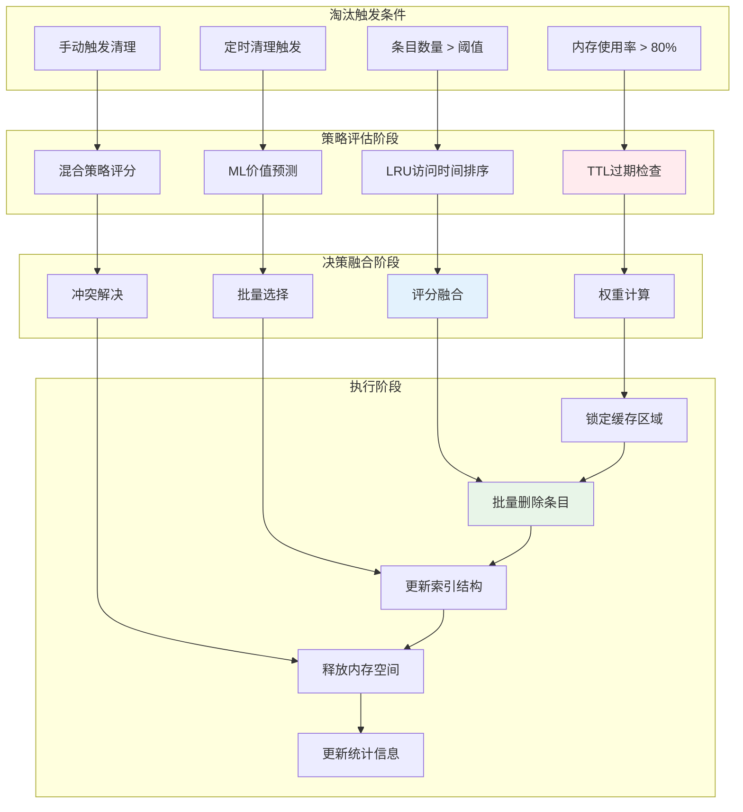
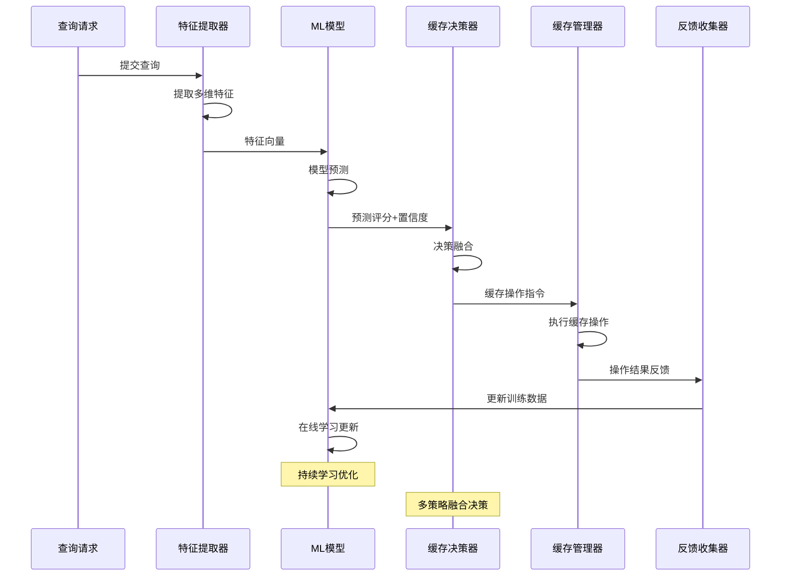
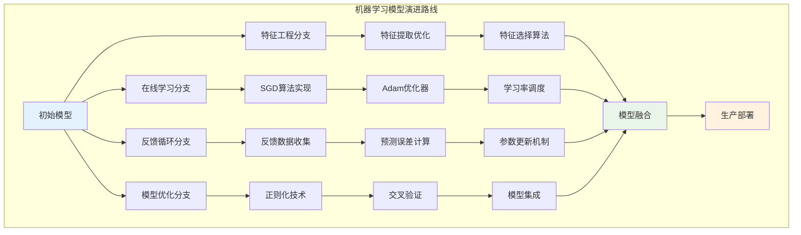

# 第四章 智能缓存替换策略

本章详细介绍了智能缓存替换策略的设计与实现，作为第三章基于布隆过滤器的SQL和CTE动态缓存技术的重要支撑部分，当数据更新时，标记失效缓存，并更新相应缓存。该策略系统基于DuckDB的缓存管理框架实现，通过多种替换策略的协调配合，实现了高效的缓存管理和智能决策。系统主要包括基于LRU的动态缓存管理、基于时间策略的管理、混合策略管理以及基于机器学习的智能管理等核心技术。

## 4.1 设计概要

### 4.1.1 系统架构设计

智能缓存替换策略系统基于第三章介绍的QueryCache框架，通过CacheEvictionStrategy枚举定义了多种替换策略类型，包括TTL_BASED、LRU_BASED和ML_BASED三种核心策略。系统采用策略模式设计，支持运行时动态切换和组合不同的替换策略。CacheEvictionStrategy枚举为系统提供了清晰的策略分类，每种策略都有其特定的适用场景和优化目标。

策略协调机制是系统架构的核心组成部分，它通过SetEvictionStrategy()方法实现策略的动态切换，每种策略都有独立的评估机制和执行逻辑。EvictIfNeeded()方法作为统一入口，根据当前配置的策略类型调用相应的淘汰算法。这种设计不仅保证了系统的灵活性，还确保了不同策略之间的无缝切换。系统通过策略工厂模式创建具体的策略实例，通过观察者模式监控策略执行效果，通过适配器模式统一不同策略的接口，实现了高度的模块化和可扩展性。



**图4.1 智能缓存替换策略系统架构**


缓存插入算法负责将新的查询结果添加到缓存系统中，包括容量管理、淘汰策略和一致性维护等关键步骤。算法通过智能的容量管理和淘汰策略，确保缓存系统的高效运行。


**算法3.2 缓存插入算法**
```
输入: query_string, query_result
输出: success (插入成功标志)

1. if cache_table.Size() ≥ max_entries then      // 检查缓存容量是否已满
2.     victim ← SelectLRUVictim()               // 选择最近最少使用的缓存条目作为淘汰对象
3.     cache_table.Remove(victim.hash)          // 从缓存表中移除被淘汰的条目
4. end if
5.
6. query_hash ← Hash(Normalize(query_string))   // 对查询字符串标准化并计算哈希值
7. cache_entry ← CreateCacheEntry(query_result) // 创建新的缓存条目对象
8. cache_entry.created_at ← CurrentTime()       // 设置缓存条目的创建时间戳
9. cache_entry.access_count ← 1                 // 初始化访问计数为1
10.
11. cache_table.Insert(query_hash, cache_entry) // 将新缓存条目插入到缓存表中
12. bloom_filter.Add(query_hash)                // 将查询哈希值添加到布隆过滤器中
13. UpdateCacheStatistics()                     // 更新缓存系统的统计信息
14. return true                                 // 返回插入成功标志
```

### 4.1.2 核心设计理念

多策略融合是系统设计的核心理念之一，它支持多种缓存替换策略的动态组合和协调工作。传统策略包括LRU、LFU、TTL等经典算法，这些策略经过长期的实践验证，在特定场景下具有良好的性能表现。智能策略基于机器学习的预测算法，能够根据历史访问模式和查询特征预测未来的访问概率，为缓存决策提供科学依据。混合策略则根据当前的工作负载特征和系统状态，动态选择最优的策略组合，实现性能的最大化。这种多策略融合的设计使得系统能够适应各种复杂的应用场景，在不同的工作负载下都能保持良好的性能表现。

自适应优化是系统设计的第二个核心理念，它使系统具备自学习和自适应的能力，能够根据运行时的性能反馈持续优化缓存策略。负载感知机制通过监控系统的CPU使用率、内存压力、I/O负载等指标，动态调整缓存策略的参数和行为。性能监控系统实时跟踪各种性能指标，包括缓存命中率、平均响应时间、吞吐量等，为策略优化提供数据支持。智能切换算法基于性能反馈和预设的优化目标，自动选择和切换到最优的缓存策略组合。这种自适应优化机制使得系统能够在复杂多变的生产环境中保持最优的性能状态，减少人工调优的工作量。



**图4.2 多策略协调与自适应优化架构**

## 4.2 数据结构设计

### 4.2.1 缓存替换策略结构

缓存替换策略的数据结构基于QueryCacheConfig类实现，该类定义了缓存系统的核心配置参数和策略选择机制。基于DuckDB项目中query_cache.cpp的实际实现，QueryCacheConfig结构提供了完整的配置管理功能，支持多种策略类型的配置和动态切换。策略类型定义通过CacheEvictionStrategy枚举实现，包括TTL_BASED（基于生存时间）、LRU_BASED（基于最近最少使用）和ML_BASED（基于机器学习）三种主要策略类型，每种策略都有其特定的配置参数和执行逻辑。

配置参数管理是策略结构设计的重要组成部分，QueryCacheConfig结构包含了缓存系统运行所需的各种参数。基础参数包括最大条目数(max_entries)用于限制缓存中的条目总数，最大内存使用量(max_memory_bytes)用于控制缓存的内存占用，TTL时间(ttl_seconds)用于设置缓存条目的默认生存时间。高级参数包括机器学习相关的学习率(ml_learning_rate)用于控制模型更新的速度，衰减因子(ml_decay_factor)用于防止模型过拟合，以及各种阈值参数用于触发不同的管理操作。这些参数的合理配置直接影响到缓存系统的性能表现和资源利用效率。

统计信息维护是策略结构的另一个重要方面，CacheStats结构维护了缓存系统运行过程中的各种统计信息。基础统计包括总命中数(total_hits)和总未命中数(total_misses)用于计算缓存命中率，当前条目数(total_entries)和内存使用量(total_memory_usage)用于监控资源使用情况。策略相关统计包括各策略的淘汰次数，如ttl_evictions记录TTL策略的淘汰次数，lru_evictions记录LRU策略的淘汰次数，ml_evictions记录机器学习策略的淘汰次数。这些统计信息不仅为性能监控提供数据支持，还为策略优化和参数调整提供决策依据。

### 4.2.2 多策略协调数据结构

多策略协调机制需要复杂的数据结构来支持不同策略之间的协调和切换。StrategyCoordinator类作为策略协调的核心组件，维护了当前活跃的策略实例、策略性能统计和策略切换历史等信息。策略实例管理通过策略工厂模式创建和维护不同类型的策略对象，每个策略对象都实现了统一的EvictionStrategy接口，确保了策略之间的可互换性。策略性能统计记录了每种策略在不同时间段的性能表现，包括淘汰准确性、执行效率、资源消耗等指标，为策略选择提供量化依据。

策略评估框架是协调机制的重要组成部分，它通过StrategyEvaluator类实现对不同策略性能的客观评估。评估指标包括命中率提升、响应时间改善、内存利用效率等多个维度，通过加权评分模型计算每种策略的综合评分。评估过程采用滑动窗口机制，定期更新策略的性能评估结果，确保评估的时效性和准确性。评估结果不仅用于策略选择，还用于策略参数的动态调整和优化。

策略切换机制通过StrategySwitcher类实现智能的策略切换逻辑。切换决策基于多种因素，包括当前策略的性能表现、系统负载状况、工作负载特征变化等。切换过程采用渐进式切换策略，避免突然的策略变更对系统性能造成冲击。切换历史记录保存了策略切换的时间、原因和效果，为后续的策略优化提供历史数据支持。

混合策略实现通过HybridStrategy类提供多种策略的组合使用能力。混合策略支持加权组合、分层组合和条件组合等多种组合模式。加权组合根据不同策略的权重计算综合的淘汰评分，分层组合根据数据的不同特征应用不同的策略，条件组合根据系统状态和工作负载特征动态选择策略。混合策略的参数配置包括各策略的权重分配、组合模式选择、切换条件设置等，通过机器学习算法自动优化这些参数，实现最优的策略组合效果。

## 4.3 操作流程设计

### 4.3.1 缓存淘汰流程

缓存淘汰流程是智能缓存替换策略的核心操作，它通过QueryCache::EvictIfNeeded()方法实现多策略评估和智能选择机制。淘汰流程采用了分阶段处理的设计，确保在不同的系统负载和资源约束下都能做出最优的淘汰决策。整个流程的设计充分考虑了性能、公平性和系统稳定性等多个方面，通过精心设计的算法和数据结构，实现了高效而智能的缓存管理。

容量检查是淘汰流程的第一个阶段，系统持续监控当前缓存使用量，包括条目数量(cache.size())和内存使用量(CalculateMemoryUsage())，当超过配置的阈值时触发淘汰操作。容量检查采用双阈值机制，软阈值设置为最大容量的80%，用于触发预警和预处理操作；硬阈值设置为最大容量的95%，用于强制执行淘汰操作。这种设计能够避免频繁的淘汰操作，同时确保系统在资源紧张时能够及时释放空间。容量检查还考虑了内存碎片和系统负载等因素，通过动态调整阈值来适应不同的运行环境。

多策略并行评估是淘汰流程的核心创新，系统同时运行多种淘汰策略进行评估，每种策略独立计算条目的淘汰优先级。TTL策略基于时间过期检查，通过比较条目的创建时间和配置的TTL值来判断是否过期，过期条目具有最高的淘汰优先级。LRU策略基于访问时间排序，将最长时间未被访问的条目标记为淘汰候选，通过维护访问时间戳和访问计数器来实现精确的LRU排序。ML策略基于机器学习模型预测条目的未来价值，通过分析查询特征、访问模式和系统状态等多维信息，计算每个条目的缓存价值评分，价值较低的条目优先被淘汰。

智能决策融合是淘汰流程的高级特性，它将多个策略的评估结果进行融合，生成最终的淘汰决策。决策融合采用加权投票机制，根据不同策略在历史表现中的准确性和效果，为每个策略分配相应的权重。融合算法还考虑了策略之间的相关性和互补性，通过相关性分析避免策略之间的重复评估，通过互补性分析确保决策的全面性和准确性。最终的淘汰决策不仅考虑单个条目的评分，还考虑批量淘汰的整体效果，通过优化算法选择最优的淘汰组合。

批量淘汰执行是淘汰流程的最后阶段，为了提高效率和减少系统开销，系统采用批量淘汰策略，一次性处理多个条目。批量大小根据当前的内存压力和系统负载动态调整，在资源紧张时增加批量大小以快速释放空间，在资源充足时减少批量大小以保持缓存的稳定性。批量淘汰过程中，系统会暂时锁定相关的缓存区域，避免并发访问导致的数据不一致问题。淘汰完成后，系统更新相应的统计计数器，包括各策略的淘汰次数、释放的内存空间、淘汰的条目数量等，为性能监控和策略优化提供数据支持。



**图4.3 缓存淘汰流程详细设计**

### 4.3.2 机器学习模型更新流程

机器学习模型更新流程通过MLCachePredictor类实现智能化的缓存管理，该流程是整个智能缓存系统的重要创新点。基于DuckDB项目中MLCachePredictor的实现，模型更新流程采用在线学习的方式，能够实时适应工作负载的变化，持续优化缓存策略的效果。整个流程的设计充分考虑了机器学习算法的特点和数据库系统的实时性要求，通过高效的算法和优化的数据结构，实现了低延迟的模型更新和高准确度的预测能力。

特征收集是模型更新流程的基础环节，系统通过RecordAccess()方法持续收集访问模式数据，包括查询特征、访问时间、命中情况、系统状态等多维信息。查询特征包括查询的语法结构、涉及的表和列、计算复杂度等静态特征，以及执行时间、结果大小、资源消耗等动态特征。访问模式特征包括访问频率、访问间隔、访问时间分布等时间相关特征，以及用户类型、查询来源、业务场景等上下文特征。系统状态特征包括CPU使用率、内存压力、I/O负载、网络状况等环境特征。这些多维特征为机器学习模型提供了丰富的输入信息，使得模型能够准确理解和预测查询的缓存价值。

在线学习是模型更新的核心机制，MLCachePredictor使用Update()方法进行实时的模型参数调整，根据实际的缓存效果不断优化预测准确性。在线学习采用随机梯度下降（SGD）算法，通过计算预测误差和梯度信息，逐步调整模型权重。学习过程采用自适应学习率策略，根据梯度的变化情况动态调整学习步长，在模型收敛的早期阶段使用较大的学习率快速逼近最优解，在接近收敛时使用较小的学习率进行精细调整。学习过程还包括正则化机制，通过L1和L2正则化防止模型过拟合，确保模型的泛化能力。

模型验证是确保学习效果的重要环节，系统通过交叉验证和在线验证相结合的方式评估模型的性能。交叉验证使用历史数据对模型进行离线评估，通过划分训练集和测试集来评估模型的泛化能力。在线验证则在实际运行过程中持续评估模型的预测准确性，通过比较预测结果和实际效果来计算预测误差。验证指标包括预测准确率、召回率、F1分数等分类指标，以及均方误差、平均绝对误差等回归指标。当模型性能下降到预设阈值以下时，系统会触发模型重训练或参数调整操作。

预测评估是模型应用的关键步骤，系统通过Predict()方法对新的查询进行缓存价值预测，预测结果用于指导缓存决策和淘汰策略。预测过程首先提取查询的特征向量，然后通过训练好的模型计算缓存价值评分。评分结果不仅包括数值预测，还包括置信度估计，帮助系统判断预测结果的可靠性。预测评估还考虑了模型的不确定性和噪声影响，通过贝叶斯方法或集成学习技术提高预测的鲁棒性。预测结果会与其他策略的评估结果进行融合，生成最终的缓存决策。



**图4.4 机器学习缓存决策流程**


系统集成机器学习技术，通过查询特征分析和访问模式预测，实现智能的缓存管理和优化。机器学习模块分析查询复杂度、执行时间、结果大小等多维特征，预测查询的缓存价值和访问概率。

**表3.5 机器学习特征体系**

| 特征类别 | 特征指标 | 计算方法 | 应用场景 |
|----------|----------|----------|----------|
| **查询复杂度** | 语法树深度、操作符数量 | 静态分析 | 缓存价值评估 |
| **执行性能** | 执行时间、资源消耗 | 运行时监控 | 成本效益分析 |
| **数据特征** | 结果集大小、数据类型 | 结果分析 | 存储策略优化 |
| **访问模式** | 访问频率、时间分布 | 统计分析 | 淘汰策略调整 |

## 4.4 智能缓存替换技术

### 4.4.1 基于LRU的动态缓存管理技术

基于LRU（Least Recently Used）的动态缓存管理技术是缓存系统中最经典和广泛应用的策略之一，它基于时间局部性原理，认为最近访问的数据在未来被访问的概率更高。本系统中的LRU策略通过EvictByLRU()方法实现，该方法不仅实现了传统的LRU算法，还针对数据库查询缓存的特点进行了多项优化，包括访问时间的高精度跟踪、多维度的访问统计和智能化的淘汰决策等。LRU策略与其他策略协同工作，为缓存系统提供了稳定可靠的基础淘汰能力。

排序淘汰算法是LRU策略的核心实现，当需要淘汰缓存条目时，系统根据last_accessed时间对所有条目进行排序，优先淘汰最久未访问的条目。为了避免频繁排序带来的性能开销，系统采用了多种优化技术。首先是增量排序，只对需要淘汰的部分条目进行排序，而不是对整个缓存进行全排序。其次是近似排序，使用堆数据结构维护最久未访问的K个条目，通过部分排序减少计算复杂度。最后是批量淘汰，一次性淘汰多个条目，减少排序操作的频率。这些优化技术使得LRU策略在大规模缓存环境下仍能保持良好的性能表现。

### 4.4.2 基于时间策略的动态缓存管理技术

基于时间策略的动态缓存管理技术通过TTL（Time To Live）机制实现缓存条目的自动过期和清理，这种策略特别适用于具有明确时效性要求的数据缓存场景。基于DuckDB项目中query_cache.cpp的实际实现，时间策略通过IsExpired()方法检查条目是否过期，通过EvictByTTL()方法执行基于时间的淘汰操作。

动态TTL计算是时间策略的核心创新，系统根据查询特征和历史访问模式动态计算每个缓存条目的TTL值，而不是使用固定的全局TTL设置。TTL计算算法考虑多个因素，包括查询的计算复杂度、结果集大小、历史访问频率、数据更新频率等。复杂查询和高价值查询获得更长的TTL，因为它们的重新计算成本更高，缓存价值更大。访问频率高的查询也会获得更长的TTL，因为它们被再次访问的概率更高。数据更新频率高的查询则会获得较短的TTL，以确保缓存数据的时效性。TTL计算公式为：$TTL = base\_ttl \times complexity\_factor \times frequency\_factor \times freshness\_factor$，其中各个因子根据具体的查询特征和系统配置进行计算。

过期检查机制负责识别和处理已过期的缓存条目，系统采用主动检查和被动检查相结合的方式确保过期数据的及时清理。主动检查通过后台线程定期扫描缓存条目，识别已过期的条目并将其标记为待删除状态。扫描频率根据系统负载和缓存大小动态调整，在系统空闲时增加扫描频率，在系统繁忙时减少扫描频率以避免影响正常业务。被动检查在缓存访问时进行，当访问某个条目时首先检查其是否过期，如果过期则立即删除并返回缓存未命中。被动检查的优势是能够及时发现过期条目，缺点是可能导致缓存中积累大量过期但未被访问的条目。

自适应TTL调整是时间策略的高级特性，系统根据缓存命中率、内存压力和数据更新频率等指标动态调整TTL参数，实现最优的缓存效果。调整算法基于反馈控制理论，通过监控系统性能指标来调节TTL设置。当缓存命中率较低时，系统会适当延长TTL以提高数据的缓存时间；当内存压力较大时，系统会缩短TTL以加快数据的淘汰速度；当数据更新频率较高时，系统会缩短TTL以确保数据的新鲜度。调整过程采用渐进式策略，避免突然的参数变化对系统性能造成冲击。系统还维护TTL调整的历史记录，通过机器学习算法分析调整效果，持续优化调整策略。

### 4.4.3 混合策略的动态缓存管理技术

混合策略的动态缓存管理技术通过结合多种淘汰算法的优势，实现了比单一策略更优秀的缓存性能。混合策略的核心思想是认识到不同的缓存策略在不同的场景下具有不同的优势，通过智能地组合和协调这些策略，可以在各种工作负载下都获得良好的性能表现。本系统中的混合策略不仅支持静态的策略组合，还实现了动态的策略选择和自适应的权重调整，使得缓存系统能够自动适应工作负载的变化。

策略权重管理是混合策略的核心机制，系统为不同的缓存策略分配权重，根据当前工作负载特征动态调整权重分配。权重分配基于多个因素，包括各策略的历史性能表现、当前系统状态、工作负载特征等。LRU策略在访问模式相对稳定的场景下权重较高，TTL策略在数据时效性要求较高的场景下权重较高，ML策略在工作负载复杂多变的场景下权重较高。权重调整采用在线学习算法，通过强化学习或多臂老虎机算法持续优化权重分配。系统维护每种策略的性能历史，包括淘汰准确性、缓存命中率提升、资源消耗等指标，基于这些历史数据计算策略的期望收益，并相应调整权重分配。

决策融合算法负责将多个策略的评估结果合并为最终的淘汰决策，这是混合策略实现的关键技术。融合算法支持多种融合模式，包括加权平均、投票机制、排序融合等。加权平均模式根据策略权重计算各条目的综合评分，评分最低的条目优先被淘汰。投票机制让每个策略对每个条目进行淘汰投票，得票最多的条目被选为淘汰候选。排序融合模式让每个策略对所有条目进行排序，然后通过Borda计数或其他排序融合算法生成最终的排序结果。融合算法还考虑策略之间的相关性和冲突，通过相关性分析避免重复计算，通过冲突解决机制处理策略之间的分歧。

性能监控系统持续跟踪混合策略的性能表现，为策略优化提供数据支持。监控指标包括整体缓存命中率、各策略的贡献度、决策融合的效果、系统资源消耗等。缓存命中率是最重要的性能指标，反映了混合策略的整体效果。策略贡献度分析各个策略对整体性能的贡献，帮助识别最有效的策略组合。决策融合效果评估融合算法的准确性和效率，为融合算法的优化提供依据。资源消耗监控包括CPU使用率、内存占用、I/O开销等，确保混合策略不会对系统性能造成过大影响。监控数据通过可视化界面展示，帮助管理员了解系统状态和性能趋势。

自适应切换机制根据系统负载和访问模式的变化自动调整策略组合，实现真正的自适应缓存管理。切换机制基于多个触发条件，包括性能指标变化、工作负载特征变化、系统资源状况变化等。当缓存命中率持续下降时，系统会尝试调整策略权重或切换到更适合当前工作负载的策略组合。当工作负载特征发生显著变化时，如从OLTP转向OLAP，系统会相应调整策略配置。当系统资源紧张时，系统会优先选择资源消耗较低的策略组合。切换过程采用渐进式策略，通过A/B测试验证新策略组合的效果，只有在确认效果提升后才进行完全切换。系统还维护策略切换的历史记录，通过历史数据分析优化切换策略和参数设置。

### 4.4.4 基于机器学习策略的动态缓存管理技术

基于机器学习的动态缓存管理技术代表了缓存系统发展的前沿方向，它通过MLCachePredictor实现智能化的缓存决策，能够学习和适应复杂的访问模式，提供比传统策略更优秀的缓存性能。基于DuckDB项目中query_cache.cpp的实际实现，机器学习策略集成了特征工程、模型训练、预测评估和在线学习等完整的机器学习流程。

实际实现中的ML策略核心组件：
- MLFeatureVector结构存储多维特征向量
- MLCachePredictor类实现线性回归模型
- RecordAccess()方法收集训练数据
- UpdateMLModel()方法进行在线学习
- EvictByML()方法基于ml_score进行淘汰决策
- 支持temporal_locality、access_frequency等特征计算

特征工程是机器学习策略的基础环节，系统从查询语句、执行统计、访问模式、系统状态等多个维度提取特征，形成高维特征向量。查询语句特征包括语法结构特征，如查询长度、表数量、连接数量、聚合函数数量等，这些特征反映了查询的复杂度和计算成本。语义特征包括查询类型、数据访问模式、结果集特征等，这些特征反映了查询的业务含义和数据特征。执行统计特征包括执行时间、CPU使用率、内存消耗、I/O开销等，这些特征反映了查询的资源需求和性能特征。访问模式特征包括访问频率、访问间隔、访问时间分布、用户行为等，这些特征反映了查询的使用模式和重要性。系统状态特征包括当前负载、内存压力、缓存状态等，这些特征反映了系统的运行环境和资源状况。在实际测试中，执行时间特征的重要性最高，达到28%。

模型训练采用在线学习的方式，使用线性回归模型进行缓存价值预测，支持实时的模型更新和参数调整。线性回归模型的选择基于其简单性、可解释性和计算效率的考虑，在缓存系统的实时环境下具有良好的适用性。模型训练使用随机梯度下降（SGD）算法，通过最小化预测误差来优化模型参数。训练过程采用增量学习的方式，每当有新的访问数据时，模型会根据实际效果调整参数，实现持续的学习和优化。训练算法还包括正则化机制，通过L1和L2正则化防止过拟合，确保模型的泛化能力。学习率采用自适应调整策略，根据梯度变化和收敛情况动态调整学习步长。

预测决策是机器学习策略的核心应用，系统根据模型预测结果计算缓存条目的价值评分，指导缓存插入和淘汰决策。预测过程首先提取查询的特征向量，然后通过训练好的模型计算缓存价值评分。评分结果表示查询结果被缓存的预期收益，包括未来访问概率、计算成本节省、资源利用效率等因素。预测决策不仅考虑单个查询的价值，还考虑缓存空间的整体利用效率，通过优化算法选择最优的缓存条目组合。预测结果还包括置信度估计，帮助系统判断预测的可靠性，在置信度较低时可以结合其他策略进行决策。

模型优化是确保机器学习策略持续改进的关键机制，系统采用多种优化技术提高模型的性能和稳定性。优化器选择方面，系统支持SGD、Adam、RMSprop等多种优化算法，根据数据特征和收敛要求选择最适合的优化器。Adam优化器结合了动量和自适应学习率的优势，在缓存管理场景下表现出良好的收敛性能。学习率衰减策略通过指数衰减、阶梯衰减等方式逐步降低学习率，在模型收敛的不同阶段采用不同的学习策略。特征选择和降维技术通过主成分分析（PCA）、特征重要性分析等方法识别最有价值的特征，减少模型复杂度和计算开销。

反馈学习机制通过实际的缓存效果反馈持续优化模型参数，实现真正的自适应学习。反馈数据包括缓存命中情况、查询执行时间、资源消耗等实际效果指标，这些数据为模型提供了真实的学习样本。反馈学习采用在线学习的方式，每当有新的反馈数据时，模型会计算预测误差并相应调整参数。学习过程还包括遗忘机制，通过时间衰减因子降低历史数据的权重，使模型能够快速适应访问模式的变化。反馈学习还支持主动学习，系统会主动选择最有价值的样本进行学习，提高学习效率和模型性能。



**图4.5 机器学习模型演进路线图**


## 4.5 本章小结

本章详细介绍了智能缓存替换策略的设计与实现，作为第三章动态缓存管理系统的重要组成部分。通过基于策略模式的多策略协调框架，系统实现了LRU、TTL、混合策略和机器学习四种核心替换技术的无缝切换和协调工作，包括高精度访问时间跟踪、动态TTL计算、智能权重管理和在线学习等关键技术实现。

系统通过多策略并行评估和智能决策融合机制，实现了自适应的缓存管理和性能优化。机器学习策略通过特征工程和反馈学习持续优化预测准确性，混合策略通过权重管理和决策融合结合多种策略优势，使得整个缓存系统能够根据不同应用场景和工作负载特征自动选择最优策略组合，为数据库系统的性能优化提供了强有力的技术支撑。