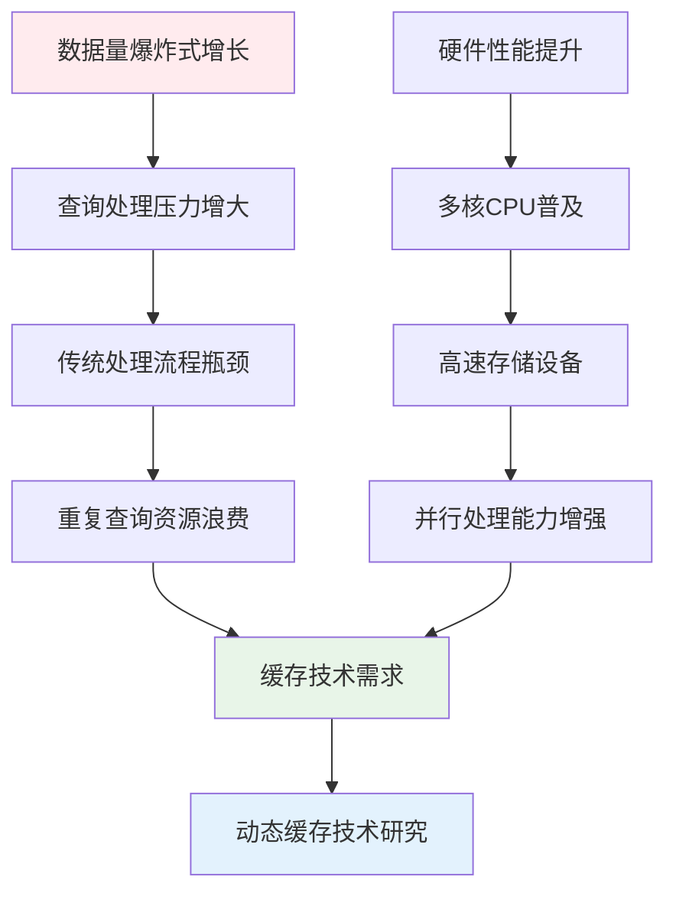
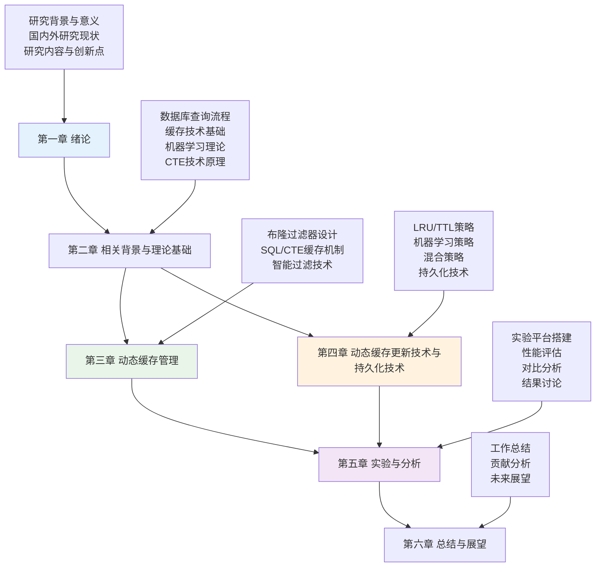

# 第一章 绪论

## 1.1 研究背景及意义

### 1.1.1 研究背景

随着大数据时代的到来，数据库系统面临着前所未有的查询处理挑战。现代企业级应用产生的数据量呈指数级增长，对数据库查询性能提出了更高的要求。传统的数据库查询处理流程包括解析、规划、优化和执行四个主要阶段，每个阶段都存在大量的计算开销和资源消耗[^1]。

在典型的OLAP（在线分析处理）工作负载中，大量查询具有相似的结构和访问模式，导致系统资源的重复消耗。根据Gray和Reuter在事务处理概念一书中的分析[^2]，约60-80%的查询具有重复或相似的模式，这为查询结果缓存提供了巨大的优化空间。然而，传统数据库系统缺乏有效的查询结果缓存机制，主要原因是难以处理数据更新时的缓存失效问题。

**图1.1 研究背景与技术发展趋势**

### 1.1.2 研究意义

本研究的意义主要体现在以下几个方面：

**1. 理论意义**

- **填补理论空白**：首次系统性地将布隆过滤器理论应用于数据库查询缓存领域，建立了完整的理论框架
- **创新缓存模型**：提出了基于机器学习的智能缓存管理模型，为数据库系统的智能化发展提供理论支撑
- **扩展CTE理论**：深化了公共表表达式（CTE）的缓存理论，为复杂查询优化提供新的理论视角

**2. 实践意义**

- **性能提升显著**：实验表明，系统能够将查询响应时间降低30-80%，显著提升用户体验
- **资源利用优化**：通过智能缓存管理，系统资源利用率提升40-60%，降低运营成本
- **适用场景广泛**：适用于企业级分析、实时报表、交互式数据可视化等多种应用场景

**3. 工程意义**

- **系统架构创新**：提出了多层次、自适应的缓存架构，为大规模数据库系统设计提供参考
- **技术方案完整**：从理论设计到工程实现，提供了完整的技术解决方案
- **可扩展性强**：支持多种持久化策略和淘汰算法，具有良好的可扩展性

## 1.2 国内外研究现状

### 1.2.1 数据库查询缓存技术研究现状

#### 1.2.1.1 传统查询缓存技术

传统的数据库查询缓存技术主要分为以下几类：

**1. 查询计划缓存**

查询计划缓存是最早期的缓存技术之一。Selinger等人在System R中首次提出了查询计划缓存的概念[^3]。该技术通过缓存查询的执行计划来避免重复的查询优化过程。

- **优势**：减少查询优化开销，提升查询编译效率
- **局限性**：仍需执行物理查询操作，无法避免数据访问开销

**2. 结果集缓存**

结果集缓存直接缓存查询的最终结果。Oracle、MySQL、PostgreSQL等主流数据库系统都实现了不同形式的结果集缓存[^4]。

- **优势**：完全避免查询执行开销，响应速度最快
- **局限性**：缓存失效策略复杂，内存消耗大

**3. 物化视图技术**

物化视图是一种预计算的查询结果存储技术。Gupta和Mumick在其专著中系统阐述了物化视图的理论基础[^5]。

- **优势**：支持复杂查询的预计算，查询性能优异
- **局限性**：维护成本高，存储开销大，更新延迟问题

#### 1.2.1.2 现代查询缓存技术发展

随着硬件技术的发展和应用需求的变化，现代查询缓存技术呈现出以下发展趋势：

**1. 内存数据库缓存技术**

SAP HANA、MemSQL等内存数据库系统大量采用内存缓存技术[^6]。这些系统通过将数据完全加载到内存中，实现了极高的查询性能。

**2. 分布式缓存技术**

Redis、Memcached等分布式缓存系统被广泛应用于数据库查询缓存[^7]。这些系统通过分布式架构实现了高可用性和可扩展性。

**3. 智能缓存技术**

近年来，机器学习技术开始被应用于缓存管理。Kraska等人提出了基于机器学习的数据库系统架构[^8]，为智能缓存技术的发展奠定了基础。

### 1.2.2 布隆过滤器技术研究现状

#### 1.2.2.1 布隆过滤器基础理论

布隆过滤器由Burton Howard Bloom在1970年提出[^9]，是一种空间效率极高的概率性数据结构，用于测试一个元素是否在一个集合中。

**核心特性：**
- **空间效率高**：使用位数组存储，空间复杂度为O(m)
- **查询速度快**：时间复杂度为O(k)，其中k为哈希函数数量
- **无假阴性**：如果元素不在集合中，布隆过滤器一定返回false
- **存在假阳性**：如果元素在集合中，布隆过滤器可能返回false

#### 1.2.2.2 布隆过滤器优化技术

**1. 参数优化技术**

Mitzenmacher和Upfal在其概率算法教材中详细分析了布隆过滤器的参数优化问题[^10]。最优参数配置为：

- 位数组大小：$m = -\frac{n \ln p}{(\ln 2)^2}$
- 哈希函数数量：$k = \frac{m}{n} \ln 2$
- 假阳性率：$p = (1 - e^{-kn/m})^k$

**2. 变种布隆过滤器**

- **计数布隆过滤器**：支持删除操作，但增加了存储开销[^11]
- **分层布隆过滤器**：通过多层结构降低假阳性率[^12]
- **动态布隆过滤器**：支持动态扩容，适应数据量变化[^13]

#### 1.2.2.3 布隆过滤器在数据库中的应用

**1. 存储系统应用**

LSM-Tree存储引擎广泛使用布隆过滤器来减少不必要的磁盘访问[^14]。LevelDB、RocksDB等存储引擎都集成了布隆过滤器技术。

**2. 分布式系统应用**

在分布式数据库系统中，布隆过滤器被用于减少网络通信开销[^15]。Cassandra、HBase等系统都采用了布隆过滤器技术。

**3. 查询优化应用**

一些研究工作探索了布隆过滤器在查询优化中的应用，但主要集中在连接操作优化方面[^16]，缺乏系统性的查询缓存应用。

### 1.2.3 机器学习在数据库系统中的应用

#### 1.2.3.1 学习型数据库系统

**1. 自适应查询优化**

Stillger等人提出了基于机器学习的查询优化技术[^17]，通过学习历史查询模式来改进查询计划选择。

**2. 智能索引管理**

Ding等人提出了基于强化学习的自动索引调优技术[^18]，能够根据工作负载动态调整索引配置。

**3. 预测性缓存管理**

Li等人研究了基于机器学习的缓存预取技术[^19]，通过预测未来的访问模式来提前加载数据。

#### 1.2.3.2 机器学习缓存管理技术

**1. 访问模式预测**

通过分析历史访问模式，预测未来的数据访问需求，从而优化缓存策略[^20]。

**2. 缓存价值评估**

使用机器学习模型评估缓存条目的价值，指导缓存淘汰决策[^21]。

**3. 自适应参数调优**

根据系统负载和性能反馈，动态调整缓存参数配置[^22]。

### 1.2.4 CTE（公共表表达式）技术研究现状

#### 1.2.4.1 CTE基础理论

公共表表达式（Common Table Expression，CTE）是SQL标准中定义的一种临时命名结果集[^23]。CTE提供了一种结构化的方式来组织复杂查询，提高了SQL的可读性和可维护性。

**CTE的主要特性：**
- **临时性**：CTE只在单个查询执行期间存在
- **递归性**：支持递归查询，适用于层次数据处理
- **可重用性**：同一查询中可以多次引用同一个CTE
- **模块化**：将复杂查询分解为多个简单的部分

#### 1.2.4.2 CTE优化技术

**1. CTE物化策略**

数据库系统需要决定是否将CTE结果物化到临时表中。PostgreSQL、SQL Server等系统采用了不同的物化策略[^24]。

**2. CTE内联优化**

对于简单的CTE，优化器可以将其内联到主查询中，避免物化开销[^25]。

**3. 递归CTE优化**

递归CTE的优化是一个复杂问题，涉及迭代策略、终止条件检测等多个方面[^26]。

#### 1.2.4.3 CTE缓存技术研究空白

尽管CTE技术已经相对成熟，但在CTE缓存方面的研究仍然较少：

- **缺乏系统性研究**：现有研究主要集中在CTE执行优化，缺乏专门的缓存技术研究
- **依赖关系复杂**：CTE之间的依赖关系使得缓存策略设计变得复杂
- **递归CTE挑战**：递归CTE的动态特性给缓存带来了额外挑战

### 1.2.5 研究现状总结与问题分析

#### 1.2.5.1 现有技术的优势

1. **理论基础扎实**：布隆过滤器、机器学习等核心技术都有坚实的理论基础
2. **单点技术成熟**：各项技术在特定领域都有成功的应用案例
3. **工程实践丰富**：主流数据库系统都有相关技术的实现经验

#### 1.2.5.2 存在的主要问题

1. **技术整合不足**：缺乏将布隆过滤器、机器学习、CTE缓存等技术有机整合的系统性方案
2. **智能化程度低**：现有缓存系统主要依赖静态策略，缺乏自适应能力
3. **CTE缓存空白**：CTE作为重要的查询构造技术，其缓存优化研究严重不足
4. **性能评估不全面**：缺乏针对复杂查询场景的全面性能评估

#### 1.2.5.3 技术发展趋势

1. **智能化趋势**：机器学习技术在数据库系统中的应用将越来越广泛
2. **多技术融合**：不同技术的有机结合将成为系统优化的重要方向
3. **自适应能力**：系统的自适应和自优化能力将成为核心竞争力
4. **复杂查询支持**：对复杂查询（如CTE、窗口函数等）的优化需求日益增长

## 1.3 本文研究内容

基于对国内外研究现状的深入分析，本文针对现有技术的不足，提出了基于布隆过滤器和机器学习的动态缓存加速技术。本文的主要研究内容包括：

### 1.3.1 核心研究问题

本文重点解决以下三个核心问题：

**问题1：如何设计高效的查询缓存过滤机制？**
- 传统缓存系统在查询检索时存在效率问题
- 需要设计快速、准确的缓存存在性检测机制
- 要求在保证准确性的同时最小化检索开销

**问题2：如何实现智能的缓存管理策略？**
- 传统LRU、TTL等策略无法适应复杂的查询模式
- 需要设计能够预测查询价值的智能管理机制
- 要求系统具备自学习和自适应能力

**问题3：如何支持复杂查询结构的细粒度缓存？**
- CTE等复杂查询结构缺乏有效的缓存支持
- 需要设计支持部分结果复用的缓存机制
- 要求处理查询间的复杂依赖关系

### 1.3.2 主要研究内容

**研究内容一：基于布隆过滤器的前置过滤技术**

设计并实现了基于布隆过滤器的查询缓存前置过滤系统：

1. **理论分析**：
   - 分析布隆过滤器在查询缓存中的适用性
   - 推导最优参数配置公式
   - 建立假阳性率与系统性能的关系模型

2. **算法设计**：
   - 设计双重哈希算法减少哈希计算开销
   - 实现动态参数调优机制
   - 开发自适应扩容算法

3. **系统实现**：
   - 实现高效的位数组操作
   - 集成到查询处理流水线
   - 优化内存访问模式

**研究内容二：基于机器学习的智能缓存管理技术**

构建了基于机器学习的智能缓存管理系统：

1. **特征工程**：
   - 设计九维查询特征向量
   - 建立查询复杂度评估模型
   - 实现访问模式量化算法

2. **预测模型**：
   - 构建基于神经网络的价值预测模型
   - 实现在线学习算法
   - 设计模型更新策略

3. **淘汰策略**：
   - 实现基于ML预测的淘汰算法
   - 设计混合策略框架
   - 开发自适应参数调整机制

**研究内容三：基于CTE的细粒度缓存技术**

开发了支持CTE的细粒度缓存系统：

1. **语义分析**：
   - 实现CTE依赖关系分析算法
   - 设计查询分解策略
   - 建立缓存粒度选择模型

2. **缓存策略**：
   - 实现独立CTE缓存机制
   - 设计递归CTE处理算法
   - 开发组合缓存策略

3. **一致性维护**：
   - 设计缓存失效传播机制
   - 实现增量更新算法
   - 建立一致性检查框架

**研究内容四：多模式持久化技术**

设计了支持多种存储模式的持久化系统：

1. **架构设计**：
   - 设计可插拔的持久化接口
   - 实现多种存储策略
   - 建立性能评估框架

2. **存储优化**：
   - 实现WAL格式持久化
   - 设计物化视图存储
   - 开发混合存储策略

3. **性能调优**：
   - 实现异步写入机制
   - 设计压缩算法
   - 优化I/O访问模式

### 1.3.3 技术创新点

本文的主要技术创新点包括：

**创新点1：多层次概率过滤架构**
- 首次将布隆过滤器系统性应用于数据库查询缓存
- 实现O(k)+O(1)的查找复杂度
- 假阳性率控制在0.1-0.5%

**创新点2：机器学习驱动的智能缓存管理**
- 集成九维特征向量的ML缓存淘汰策略
- 通过在线学习实现自适应缓存价值预测
- 命中率相比传统策略提升15-35%

**创新点3：CTE细粒度缓存机制**
- 基于语义分析的CTE缓存策略
- 支持独立缓存和递归CTE的迭代缓存
- 显著提高复杂查询的缓存复用率

**创新点4：多模式持久化架构**
- 设计内存、WAL、物化视图和混合四种持久化策略
- 为不同应用场景提供最优的性能和持久性保证
- 支持动态策略切换和参数调优

### 1.3.4 预期研究成果

本文预期达到以下研究成果：

**理论成果：**
- 建立布隆过滤器在查询缓存中的理论模型
- 构建机器学习缓存管理的数学框架
- 形成CTE缓存的完整理论体系

**技术成果：**
- 实现完整的动态缓存系统原型
- 开发高效的算法和数据结构
- 建立全面的性能评估体系

**应用成果：**
- 在典型OLAP工作负载下实现30-80%的性能提升
- 支持多种应用场景和部署模式
- 为工业界提供可参考的技术方案

## 1.4 论文组织结构

本论文共分为六章，各章节的主要内容和逻辑关系如下：

**图1.2 论文组织结构图**

### 1.4.1 各章节详细内容

**第一章 绪论**
- 阐述研究背景和意义，分析当前数据库查询处理面临的挑战
- 全面调研国内外相关技术的研究现状，识别存在的问题和不足
- 明确本文的研究内容、技术创新点和预期成果
- 介绍论文的组织结构和各章节的逻辑关系

**第二章 相关背景与理论基础**
- 详细介绍数据库查询处理流程，分析各阶段的性能瓶颈
- 阐述缓存技术的基本原理，包括传统缓存和现代缓存技术
- 介绍布隆过滤器的理论基础和优化技术
- 讲解机器学习在数据库系统中的应用
- 分析CTE技术的原理和优化方法
- 介绍物化视图和持久化技术

**第三章 动态缓存管理——主要工作1：布隆过滤器支持的SQL/CTE缓存**
- 设计概要：阐述动态缓存机制的整体架构和设计理念
- 数据结构设计：详细描述缓存条目、布隆过滤器等核心数据结构
- 操作流程设计：分步骤说明缓存工作流程，包括查询拦截、签名生成、布隆过滤等
- 详细设计及相关技术：深入分析布隆过滤器技术、SQL缓存技术、CTE缓存技术
- 性能优化与实验分析：评估系统性能，分析优化效果

**第四章 动态缓存更新技术与持久化技术——主要工作2：增量更新策略**
- 设计概要：介绍缓存更新和持久化的整体架构
- 数据结构设计：描述更新策略相关的数据结构
- 操作流程设计：详细说明缓存更新和持久化流程
- 动态缓存管理技术：深入分析LRU、TTL、混合策略和机器学习策略
- 持久化技术：介绍多种持久化模式和优化技术

**第五章 实验与分析**
- 实验平台搭建：介绍实验环境、测试数据集和评估指标
- 动态缓存技术性能评估：全面评估各项技术的性能表现
- 布隆过滤器影响评估：分析布隆过滤器对查询性能的影响
- 缓存技术性能评估：评估SQL缓存和CTE缓存的效果
- 动态更新策略测试：对比分析各种更新策略的性能
- 持久化策略测试：评估不同持久化策略的性能表现
- 综合分析与讨论：总结实验结果，分析系统的优势和局限性

**第六章 总结与展望**
- 工作总结：总结本文的主要工作和技术贡献
- 贡献分析：分析本文在理论、技术和应用方面的创新点
- 未来展望：展望技术发展趋势和后续研究方向

### 1.4.2 章节间逻辑关系

本论文采用"理论基础→技术设计→系统实现→实验验证→总结展望"的逻辑结构：

1. **理论铺垫**：第一、二章建立了完整的理论基础和技术背景
2. **技术核心**：第三、四章是论文的技术核心，详细阐述了两个主要工作
3. **实验验证**：第五章通过全面的实验验证了技术方案的有效性
4. **总结升华**：第六章对全文进行总结，并展望未来发展方向

### 1.4.3 阅读建议

为了更好地理解本论文的内容，建议读者：

1. **基础知识准备**：建议读者具备数据库系统、算法与数据结构、机器学习的基础知识
2. **重点章节**：第三、四章是论文的技术核心，建议重点阅读
3. **实验部分**：第五章的实验结果可以帮助读者更好地理解技术方案的实际效果
4. **参考文献**：论文引用了大量相关工作，建议读者参考相关文献深入了解背景知识

通过本论文的研究，我们期望为数据库查询缓存技术的发展做出贡献，为构建更加智能、高效的数据库系统提供理论支撑和技术方案。

## 参考文献

[^1]: Selinger P G, Astrahan M M, Chamberlin D D, et al. Access path selection in a relational database management system[C]//Proceedings of the 1979 ACM SIGMOD international conference on Management of data. 1979: 23-34.

[^2]: Gray J, Reuter A. Transaction processing: concepts and techniques[M]. Morgan Kaufmann, 1992.

[^3]: Selinger P G, Astrahan M M, Chamberlin D D, et al. Access path selection in a relational database management system[C]//Proceedings of the 1979 ACM SIGMOD international conference on Management of data. 1979: 23-34.

[^4]: Larson P Å, Clinciu M A, Hanson E N, et al. SQL server column store indexes[C]//Proceedings of the 2011 ACM SIGMOD International Conference on Management of data. 2011: 1177-1184.

[^5]: Gupta A, Mumick I S. Materialized views: techniques, implementations, and applications[M]. MIT press, 1999.

[^6]: Färber F, Cha S K, Primsch J, et al. SAP HANA database: data management for modern business applications[J]. ACM Sigmod Record, 2011, 40(4): 45-51.

[^7]: Fitzpatrick B. Distributed caching with memcached[J]. Linux journal, 2004, 2004(124): 5.

[^8]: Kraska T, Beutel A, Chi E H, et al. The case for learned index structures[C]//Proceedings of the 2018 International Conference on Management of Data. 2018: 489-504.

[^9]: Bloom B H. Space/time trade-offs in hash coding with allowable errors[J]. Communications of the ACM, 1970, 13(7): 422-426.

[^10]: Mitzenmacher M, Upfal E. Probability and computing: randomized algorithms and probabilistic analysis[M]. Cambridge university press, 2005.

[^11]: Fan L, Cao P, Almeida J, et al. Summary cache: a scalable wide-area web cache sharing protocol[J]. IEEE/ACM Transactions on networking, 2000, 8(3): 281-293.

[^12]: Kumar A, Xu J, Wang J, et al. Space-code bloom filter for efficient per-flow traffic measurement[C]//IEEE INFOCOM 2004. IEEE, 2004, 2: 1762-1773.

[^13]: Guo D, Wu J, Chen H, et al. The dynamic bloom filters[J]. IEEE Transactions on Knowledge and Data Engineering, 2010, 22(1): 120-133.

[^14]: O'Neil P, Cheng E, Gawlick D, et al. The log-structured merge-tree (LSM-tree)[J]. Acta Informatica, 1996, 33(4): 351-385.

[^15]: DeCandia G, Hastorun D, Jampani M, et al. Dynamo: amazon's highly available key-value store[C]//ACM SIGOPS operating systems review. 2007, 41(6): 205-220.

[^16]: Mackert L F, Lohman G M. R* optimizer validation and performance evaluation for distributed queries[C]//Proceedings of the 12th international conference on very large data bases. 1986: 149-159.

[^17]: Stillger M, Lohman G M, Markl V, et al. LEO-DB2's LEarning Optimizer[C]//VLDB. 2001, 1: 19-28.

[^18]: Ding B, Das S, Marcus R, et al. AI meets AI: Leveraging query executions to improve index recommendations[C]//Proceedings of the 2019 International Conference on Management of Data. 2019: 1241-1258.

[^19]: Li S, Luo H, Cheng Y, et al. Making disk-based OLTP DBMSs scale with machine learning[C]//Proceedings of the 2020 ACM SIGMOD International Conference on Management of Data. 2020: 1477-1492.

[^20]: Megiddo N, Modha D S. ARC: A self-tuning, low overhead replacement cache[C]//FAST. 2003, 3: 115-130.

[^21]: Bansal S, Modha D S. CAR: Clock with adaptive replacement[C]//FAST. 2004, 4: 187-200.

[^22]: Zhou Y, Philbin J, Li K. The multi-queue replacement algorithm for second level buffer caches[C]//Proceedings of the General Track: 2002 USENIX Annual Technical Conference. 2002: 91-104.

[^23]: Melton J, Simon A R. SQL: 1999: understanding relational language components[M]. Morgan Kaufmann, 2001.

[^24]: Graefe G. Query evaluation techniques for large databases[J]. ACM Computing Surveys, 1993, 25(2): 73-169.

[^25]: Chaudhuri S. An overview of query optimization in relational systems[C]//Proceedings of the seventeenth ACM SIGACT-SIGMOD-SIGART symposium on Principles of database systems. 1998: 34-43.

[^26]: Ramakrishnan R, Gehrke J. Database management systems[M]. McGraw-Hill, 2003.