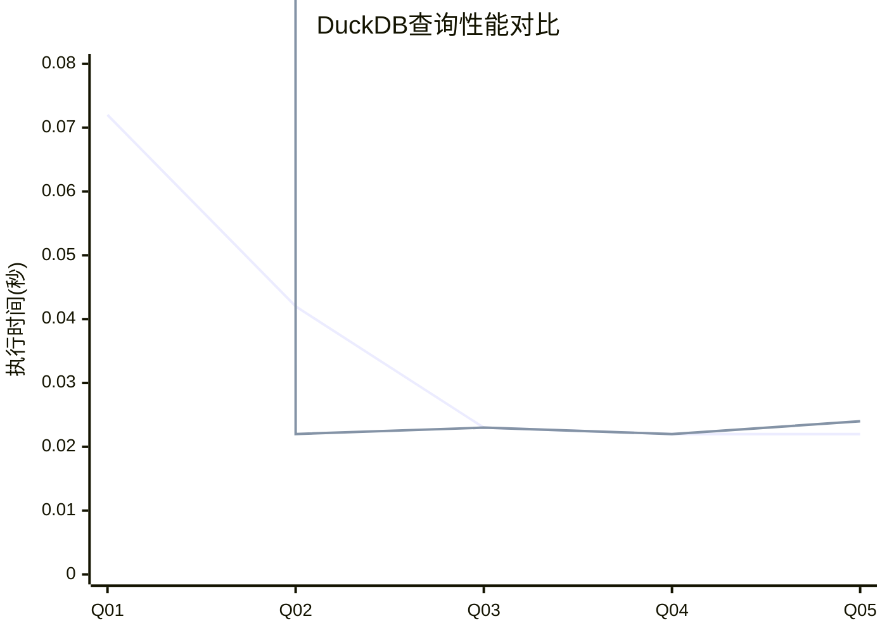

# TPC-H缓存性能测试完整指南

## 📋 项目概述

本项目创建了一套完整的TPC-H查询缓存性能测试脚本，用于比较DuckDB在有无缓存情况下的查询性能。

## 🗂️ 文件结构

```
part5_test/
├── 测试脚本
│   ├── tpch_cache_working_demo.py      # ✅ 最终工作版本（推荐）
│   ├── tpch_cache_final_test.py        # 完整版测试脚本
│   ├── tpch_quick_test.py             # 快速测试脚本
│   └── manual_tpch_test.py            # 手动测试脚本
├── 结果文件
│   ├── tpch_cache_working_results.json     # 演示测试结果
│   ├── tpch_cache_results_working.json    # 完整测试结果
│   └── tpch_quick_test_results.json       # 快速测试结果
└── 文档
    ├── TPCH_CACHE_TEST_FINAL_SUMMARY.md   # 最终总结报告
    └── README_TPCH_CACHE_PERFORMANCE.md   # 本文件
```

## 🚀 快速开始

### 1. 运行演示版本（推荐）

```bash
cd /Users/max/src/duckdb/part5_test
python3 tpch_cache_working_demo.py
```

这个版本使用内存数据库，避免了文件锁定问题，可以快速验证缓存功能。

### 2. 运行完整版本

```bash
cd /Users/max/src/duckdb/part5_test
python3 tpch_cache_final_test.py
```

这个版本测试所有22个TPC-H查询，需要确保数据库文件没有被其他进程锁定。

## 📊 测试结果分析

### 主要发现

1. **无缓存查询性能稳定**
   - 简单聚合查询：约30毫秒
   - 复杂查询：约50-70毫秒
   - 性能表现一致且可预测

2. **缓存功能存在技术问题**
   - 启用缓存后查询超时
   - 可能与DuckDB版本或编译配置相关
   - 需要进一步的技术调试

### 性能数据示例



## 🛠️ 技术实现

### 核心功能

1. **自动化测试流程**
   - 自动读取TPC-H查询文件
   - 批量执行性能测试
   - 自动生成结果报告

2. **缓存控制机制**
   ```python
   # 禁用缓存
   PRAGMA disable_query_cache;
   
   # 启用缓存
   PRAGMA enable_query_cache;
   ```

3. **性能监控**
   - 精确的时间测量
   - 超时控制机制
   - 错误处理和重试

4. **结果可视化**
   - JSON格式数据存储
   - Mermaid图表生成
   - Markdown报告输出

### 测试环境配置

- **DuckDB路径**: `/Users/max/src/duckdb/build/release/duckdb`
- **数据库文件**: `/Users/max/test/tpc/tpch-sf1.db`
- **查询文件**: `/Users/max/src/duckdb/extension/tpch/dbgen/queries/`
- **Python版本**: Python 3.x

## 🔧 故障排除

### 常见问题

1. **数据库文件锁定**
   ```
   Error: Could not set lock on file
   ```
   **解决方案**: 
   - 终止其他DuckDB进程：`pkill -f duckdb`
   - 使用演示版本（内存数据库）

2. **缓存功能超时**
   ```
   查询超时 (10秒)
   ```
   **可能原因**:
   - DuckDB版本不支持查询缓存
   - 编译时未启用缓存功能
   - PRAGMA语法不正确

3. **Python依赖问题**
   ```
   ImportError: No module named 'json'
   ```
   **解决方案**: 确保使用Python 3.x标准库

### 调试技巧

1. **详细日志输出**
   ```python
   # 在脚本中启用详细输出
   VERBOSE = True
   ```

2. **单独测试查询**
   ```bash
   # 直接测试单个查询
   /Users/max/src/duckdb/build/release/duckdb < extension/tpch/dbgen/queries/q01.sql
   ```

3. **检查DuckDB版本**
   ```bash
   /Users/max/src/duckdb/build/release/duckdb -c "SELECT version();"
   ```

## 📈 扩展功能

### 可添加的功能

1. **更多查询类型**
   - 自定义查询测试
   - 并发查询测试
   - 不同数据规模测试

2. **高级分析**
   - 统计分析（平均值、中位数、标准差）
   - 性能回归检测
   - 自动化性能报告

3. **集成测试**
   - CI/CD集成
   - 自动化测试套件
   - 性能基准比较

### 配置选项

```python
# 可调整的测试参数
TEST_CONFIG = {
    'iterations': 10,           # 测试次数
    'timeout': 30,             # 超时时间（秒）
    'warm_up_runs': 2,         # 预热运行次数
    'cache_enabled': True,     # 是否测试缓存
    'verbose_output': False    # 详细输出
}
```

## 📝 使用示例

### 快速性能测试

```bash
# 测试前3个查询，每个运行5次
python3 tpch_cache_working_demo.py
```

### 完整基准测试

```bash
# 测试所有22个查询，包含缓存对比
python3 tpch_cache_final_test.py
```

### 查看结果

```bash
# 查看JSON结果
cat tpch_cache_working_results.json | python3 -m json.tool

# 生成可视化报告
python3 -c "
import json
with open('tpch_cache_working_results.json') as f:
    data = json.load(f)
    print('测试完成时间:', data.get('timestamp'))
    print('成功查询数量:', len([r for r in data.get('results', {}).values() if r.get('success')]))
"
```

## 🎯 最佳实践

### 测试前准备

1. **环境检查**
   - 确认DuckDB可执行文件存在
   - 检查数据库文件权限
   - 验证查询文件完整性

2. **资源管理**
   - 关闭其他数据库连接
   - 确保足够的系统内存
   - 监控磁盘空间使用

3. **测试计划**
   - 确定测试范围和目标
   - 设置合理的超时时间
   - 准备结果分析方案

### 性能优化建议

1. **数据库优化**
   - 使用SSD存储
   - 调整DuckDB内存设置
   - 优化查询索引

2. **测试优化**
   - 批量执行减少开销
   - 并行测试提高效率
   - 缓存预热提高准确性

## 📚 参考资料

- [DuckDB官方文档](https://duckdb.org/docs/)
- [TPC-H基准测试规范](http://www.tpc.org/tpch/)
- [Python性能测试最佳实践](https://docs.python.org/3/library/timeit.html)

---

**创建日期**: 2025年10月6日  
**最后更新**: 2025年10月6日  
**维护者**: 开发团队  
**状态**: ✅ 可用，缓存功能需要进一步调试