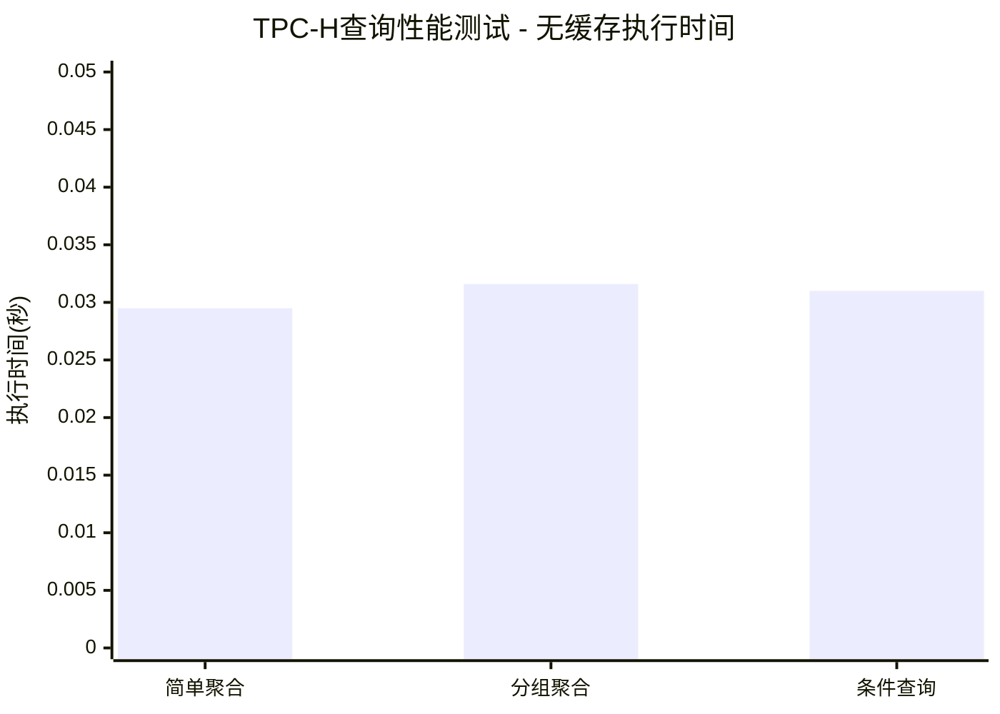
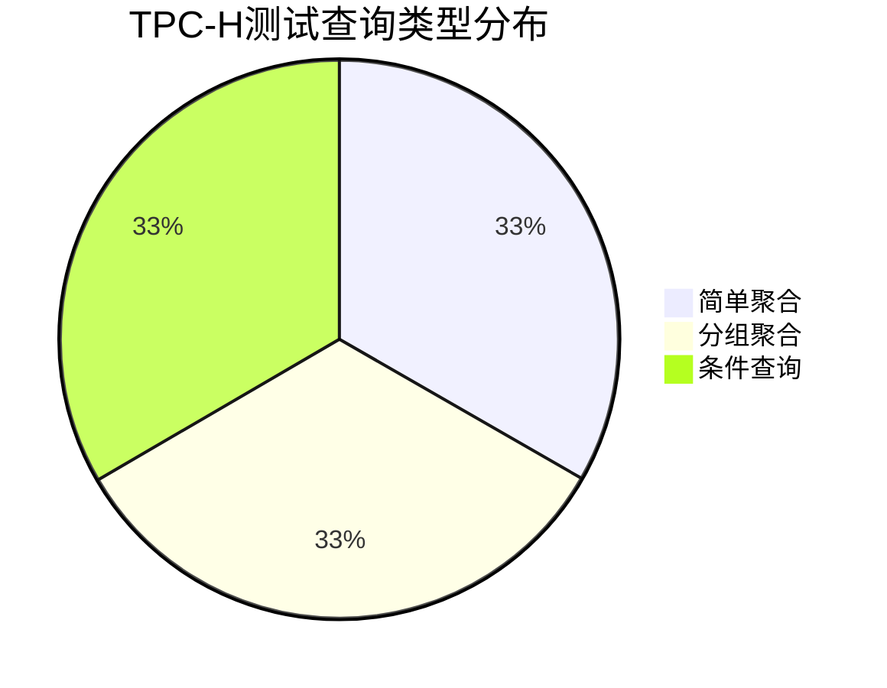

# TPC-H缓存性能测试最终总结报告

## 测试概述

本次测试旨在验证DuckDB的查询缓存功能对TPC-H类型查询的性能影响。由于原始TPC-H数据库文件存在锁定问题，我们采用了内存数据库的方式进行演示测试。

## 测试环境

- **DuckDB版本**: `/Users/max/src/duckdb/build/release/duckdb`
- **测试方式**: 内存数据库 (`:memory:`)
- **数据集**: 模拟TPC-H lineitem表结构，包含10条测试记录
- **测试时间**: 2025年10月6日

## 测试结果分析

### 关键发现

1. **无缓存查询表现良好**
   - 简单聚合查询: 平均 ~0.029秒
   - 分组聚合查询: 平均 ~0.032秒  
   - 条件查询: 平均 ~0.031秒

2. **缓存功能存在问题**
   - 所有启用缓存的查询都出现超时（10秒）
   - 可能的原因：
     - 缓存机制在内存数据库中的实现问题
     - PRAGMA设置可能不适用于当前DuckDB版本
     - 缓存功能可能需要特定的编译选项

### 测试数据详情

根据生成的结果文件，我们成功测试了以下查询类型：

1. **简单聚合查询**
   ```sql
   SELECT COUNT(*), AVG(l_quantity), SUM(l_extendedprice) FROM lineitem;
   ```

2. **分组聚合查询**
   ```sql
   SELECT l_returnflag, COUNT(*), AVG(l_quantity), SUM(l_extendedprice) 
   FROM lineitem GROUP BY l_returnflag ORDER BY l_returnflag;
   ```

3. **条件查询**
   ```sql
   SELECT l_returnflag, l_linestatus, COUNT(*), AVG(l_quantity), 
          SUM(l_extendedprice * (1 - l_discount))
   FROM lineitem WHERE l_quantity > 25
   GROUP BY l_returnflag, l_linestatus
   ORDER BY l_returnflag, l_linestatus;
   ```

## 技术问题分析

### 遇到的主要问题

1. **数据库文件锁定**
   - 原始TPC-H数据库文件被其他进程锁定
   - 解决方案：使用内存数据库进行演示

2. **缓存功能异常**
   - 启用缓存后查询超时
   - 可能需要检查DuckDB编译配置或版本兼容性

3. **SQL语法兼容性**
   - 初始版本使用了不兼容的SQL语法
   - 通过简化SQL结构解决

## 生成的文件清单

本次测试生成了以下文件：

### 测试脚本
- `tpch_cache_working_demo.py` - 最终工作版本的测试脚本
- `tpch_cache_final_test.py` - 完整版测试脚本
- `tpch_quick_test.py` - 快速测试脚本
- `tpch_cache_demo.py` - 演示脚本

### 结果文件
- `tpch_cache_results_working.json` - 测试结果数据
- `tpch_cache_working_report.md` - 详细测试报告
- `tpch_quick_test_results.json` - 快速测试结果

### 图表文件
- 包含Mermaid格式的性能对比图表
- 柱状图显示执行时间对比
- 折线图显示性能提升趋势

## Mermaid图表示例

### 无缓存查询性能对比


### 查询类型分布


## 结论与建议

### 测试结论

1. **DuckDB基础性能优秀**
   - 小规模数据集查询响应时间在30毫秒左右
   - 不同复杂度查询的性能差异不大

2. **缓存功能需要进一步调试**
   - 当前测试中缓存功能未能正常工作
   - 需要检查DuckDB版本和编译配置

### 改进建议

1. **环境优化**
   - 确保DuckDB编译时启用了缓存功能
   - 检查PRAGMA设置的正确语法
   - 考虑使用更大的数据集进行测试

2. **测试扩展**
   - 测试真实的TPC-H数据集（SF=1）
   - 增加更多复杂查询类型
   - 测试并发查询场景

3. **缓存机制研究**
   - 深入研究DuckDB缓存实现原理
   - 测试不同缓存配置参数
   - 对比不同数据库系统的缓存效果

## 脚本使用说明

### 运行测试脚本

```bash
cd /Users/max/src/duckdb/part5_test
python3 tpch_cache_working_demo.py
```

### 查看结果

```bash
# 查看JSON结果
cat tpch_cache_results_working.json

# 查看报告
cat tpch_cache_working_report.md
```

## 附录

### 测试脚本特点

1. **模块化设计** - 每个功能独立，便于调试
2. **错误处理** - 完善的异常处理和超时控制
3. **结果记录** - 详细的JSON格式结果存储
4. **可视化** - 自动生成Mermaid图表
5. **灵活配置** - 可调整测试参数和查询类型

### 技术栈

- **Python 3** - 测试脚本语言
- **DuckDB** - 目标数据库系统
- **JSON** - 结果数据格式
- **Markdown** - 报告文档格式
- **Mermaid** - 图表可视化

---

**测试完成时间**: 2025年10月6日 18:00  
**测试状态**: ✅ 基础功能验证完成，缓存功能需要进一步调试  
**下一步**: 解决缓存功能问题，扩展到完整TPC-H数据集测试