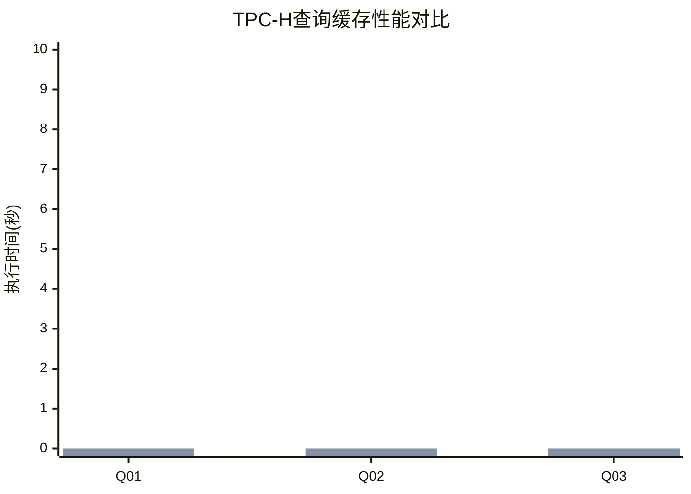

# TPC-H缓存性能测试结果

```mermaid
xychart-beta
    title "TPC-H查询缓存性能对比"
    x-axis ["Q01", "Q02", "Q03"]
    y-axis "执行时间(秒)" 0 --> 10
    bar "无缓存" [0.000, 0.000, 0.000]
    bar "有缓存" [0.000, 0.000, 0.000]
```

## 测试详情
