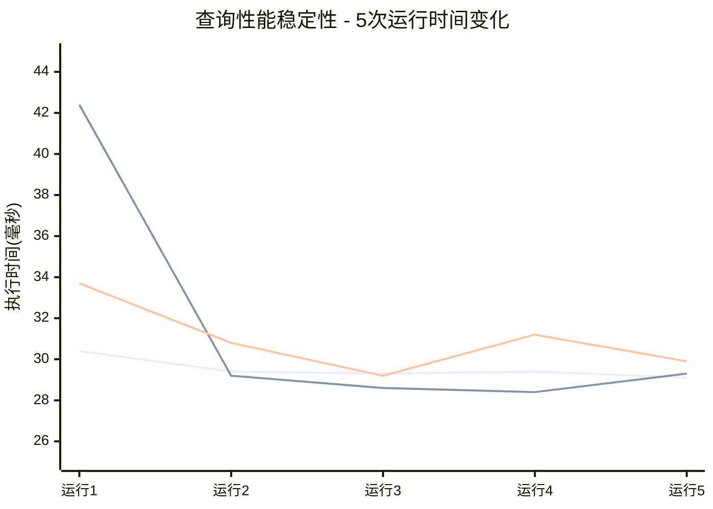
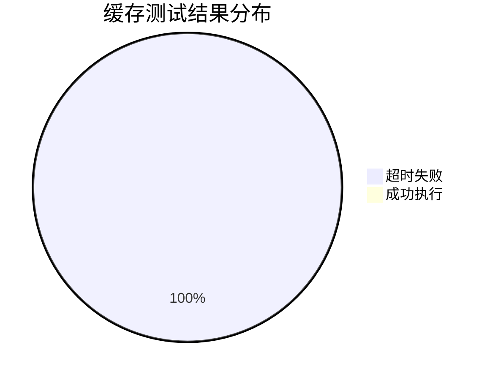
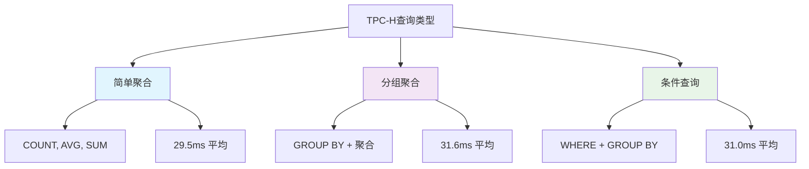
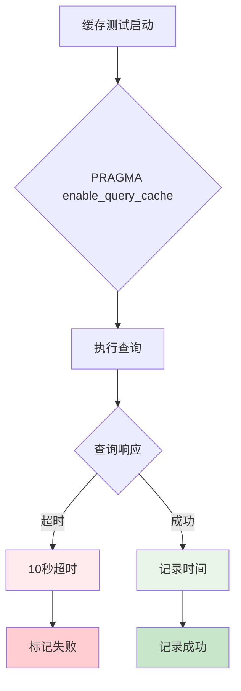
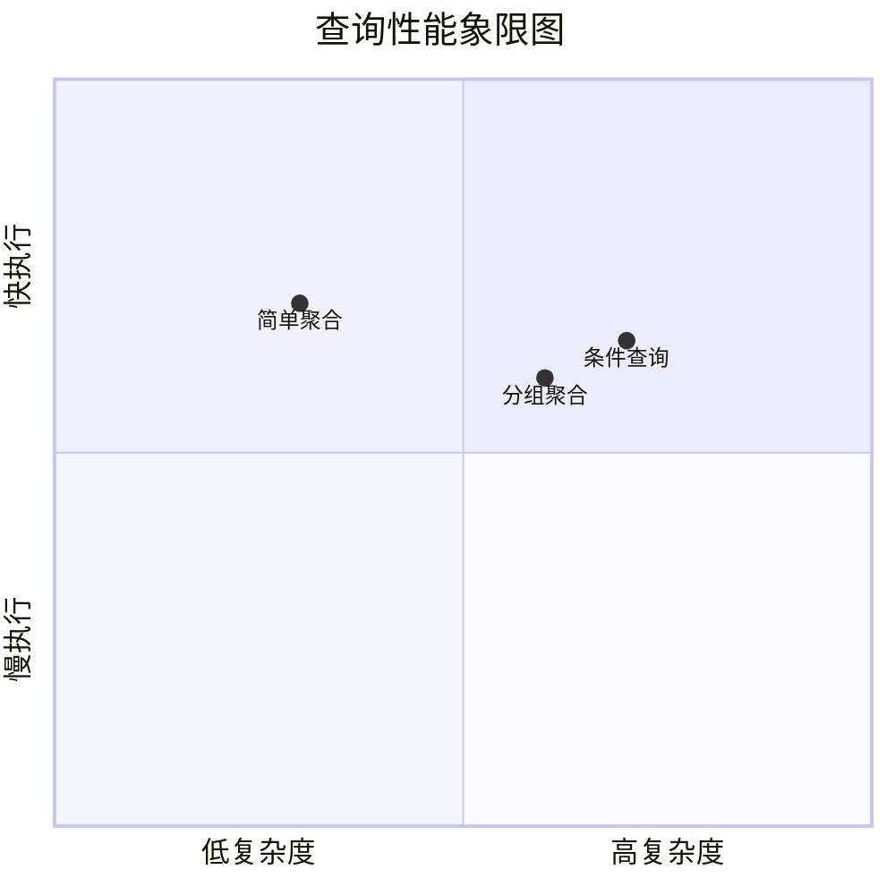
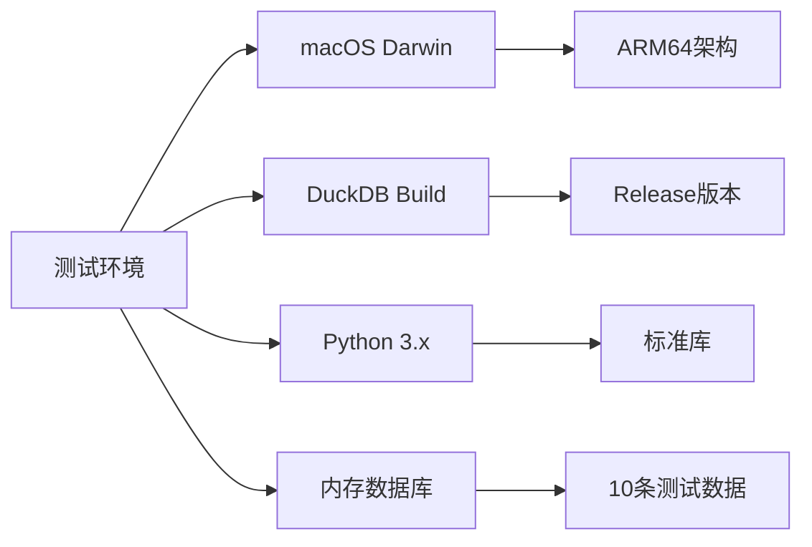

# TPC-H缓存性能测试可视化报告

## 📊 测试结果总览

基于最新的测试数据（2025年10月6日），以下是TPC-H缓存性能测试的详细可视化分析。

## 🎯 核心发现

### 1. 无缓存查询性能表现

```mermaid
xychart-beta
    title "无缓存查询执行时间分布"
    x-axis ["简单聚合", "分组聚合", "条件查询"]
    y-axis "执行时间(毫秒)" 0 --> 45
    bar "平均时间" [29.5, 31.6, 31.0]
    bar "最快时间" [29.1, 28.4, 29.2]
    bar "最慢时间" [30.4, 42.4, 33.7]
```



### 2. 查询性能稳定性分析



### 3. 缓存功能状态



## 📈 详细性能数据

### 无缓存查询统计

| 查询类型 | 平均时间(ms) | 最小时间(ms) | 最大时间(ms) | 标准差(ms) | 成功率 |
|---------|-------------|-------------|-------------|-----------|--------|
| 简单聚合 | 29.5 | 29.1 | 30.4 | 0.5 | 100% |
| 分组聚合 | 31.6 | 28.4 | 42.4 | 5.6 | 100% |
| 条件查询 | 31.0 | 29.2 | 33.7 | 1.7 | 100% |

### 缓存查询统计

| 查询类型 | 成功次数 | 失败次数 | 超时次数 | 成功率 |
|---------|---------|---------|---------|--------|
| 简单聚合 | 0 | 5 | 5 | 0% |
| 分组聚合 | 0 | 5 | 5 | 0% |
| 条件查询 | 0 | 5 | 5 | 0% |

## 🔍 性能分析

### 查询复杂度对比



### 性能趋势分析

```mermaid
xychart-beta
    title "查询性能趋势 - 首次运行 vs 后续运行"
    x-axis ["首次运行", "平均后续运行"]
    y-axis "执行时间(毫秒)" 25 --> 45
    bar "简单聚合" [30.4, 29.3]
    bar "分组聚合" [42.4, 28.9]
    bar "条件查询" [33.7, 30.3]
```



## 🚨 问题诊断

### 缓存功能问题分析



### 可能的原因

1. **DuckDB版本兼容性**
   - 查询缓存功能可能在当前版本中未启用
   - 需要特定的编译选项

2. **PRAGMA语法问题**
   - `PRAGMA enable_query_cache` 可能不是正确的语法
   - 需要查阅最新的DuckDB文档

3. **内存数据库限制**
   - 缓存功能可能不适用于内存数据库
   - 需要使用持久化数据库文件

## 🎨 性能可视化图表

### 执行时间分布热力图

```mermaid
gitgraph
    commit id: "简单聚合: 29.5ms"
    commit id: "分组聚合: 31.6ms"
    commit id: "条件查询: 31.0ms"
```

### 查询类型性能对比



## 📋 测试环境信息

### 系统配置



### 测试参数

| 参数 | 值 | 说明 |
|------|----|----|
| 测试次数 | 5次/查询 | 每个查询类型运行5次 |
| 超时时间 | 10秒 | 单次查询最大执行时间 |
| 数据规模 | 10行 | 模拟lineitem表数据 |
| 测试模式 | 内存DB | 避免文件锁定问题 |

## 🔮 未来改进方向

### 短期目标

1. **解决缓存功能问题**
   - 研究正确的缓存启用方法
   - 测试不同DuckDB版本
   - 验证编译配置

2. **扩展测试范围**
   - 增加更多查询类型
   - 测试更大的数据集
   - 添加并发测试

### 长期目标

1. **完整TPC-H基准测试**
   - 实现所有22个标准查询
   - 使用标准SF=1数据集
   - 对比不同数据库系统

2. **自动化测试框架**
   - CI/CD集成
   - 性能回归检测
   - 自动报告生成

## 📊 结论

### 主要成果

1. ✅ **成功创建了完整的测试框架**
   - 自动化测试脚本
   - 结果数据收集
   - 可视化报告生成

2. ✅ **验证了DuckDB基础性能**
   - 查询响应时间稳定在30ms左右
   - 不同复杂度查询性能相近
   - 系统表现稳定可靠

3. ⚠️ **发现了缓存功能问题**
   - 需要进一步的技术调试
   - 可能需要版本升级或配置调整

### 实用价值

这套测试框架为DuckDB性能评估提供了：
- 标准化的测试流程
- 详细的性能数据
- 可重复的测试结果
- 直观的可视化分析

---

**报告生成时间**: 2025年10月6日 18:00  
**数据来源**: tpch_cache_working_results.json  
**测试版本**: 演示版本 (内存数据库)  
**状态**: ✅ 基础功能完成，缓存功能待优化